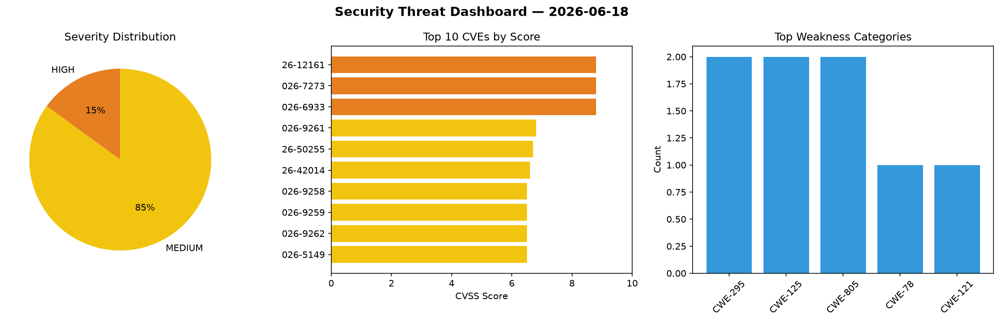
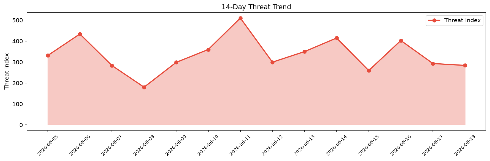

# Security Scan Report — 2026-06-18

**Scan ID:** `6f19700c1f` | **CVEs:** 20 | **Threat Index:** 284.0

## Threat Overview

| Metric | Value |
|--------|-------|
| Threat Index | 284.0 |
| Critical CVEs | 0 |
| HIGH | 3 |
| MEDIUM | 17 |

## Delta vs Yesterday

| Metric | Today | Yesterday | Change |
|--------|-------|-----------|--------|
| total_cves | 20 | 20 | ➡️ 0.0% |
| threat_index | 284.0 | 293.0 | 📉 -3.1% |
| critical_count | 0 | 0 | ➡️ 0% |

## Top Weakness Categories

| CWE | Count |
|-----|-------|
| CWE-295 | 2 |
| CWE-125 | 2 |
| CWE-805 | 2 |
| CWE-78 | 1 |
| CWE-121 | 1 |

## CVE Details

| CVE ID | Score | Severity | Description |
|--------|-------|----------|-------------|
| CVE-2026-12161 | 8.8 | HIGH | Improper input validation in the SSH Elevate Shell feature in 
Devolutions Remot... |
| CVE-2026-7273 | 8.8 | HIGH | A stack-based buffer overflow vulnerability in the CGI program of Zyxel GS1900-4... |
| CVE-2026-6933 | 8.8 | HIGH | The Premmerce Dev Tools plugin for WordPress is vulnerable to Remote Code Execut... |
| CVE-2026-9261 | 6.8 | MEDIUM | Use of weak SSH cryptographic algorithms in Canon EOS Network Setting Tool Versi... |
| CVE-2026-50255 | 6.7 | MEDIUM | Incorrect default permissions issue exists in Optical Disc Archive Software for ... |
| CVE-2026-42014 | 6.6 | MEDIUM | A flaw was found in GnuTLS. The `gnutls_pkcs11_token_set_pin` function, used for... |
| CVE-2026-9258 | 6.5 | MEDIUM | Improper validation of SSH host keys in Canon EOS Network Setting Tool Version 1... |
| CVE-2026-9259 | 6.5 | MEDIUM | Improper validation of server certificates in Canon EOS Network Setting Tool Ver... |
| CVE-2026-9262 | 6.5 | MEDIUM | Use of a non-secure protocol as the default FTP configuration in Canon EOS Netwo... |
| CVE-2026-5149 | 6.5 | MEDIUM | The RTMKit plugin for WordPress is vulnerable to Incorrect Authorization in all ... |
| CVE-2025-10262 | 6.3 | MEDIUM | Nokia SR Linux is vulnerable to local privilege escalation vulnerability due to ... |
| CVE-2026-10635 | 6.3 | MEDIUM | On Xtensa targets with CONFIG_USERSPACE and CONFIG_XTENSA_MMU, the page-table co... |
| CVE-2026-9260 | 6.2 | MEDIUM | Use of hard-coded cryptographic keys in Canon EOS Network Setting Tool Version 1... |
| CVE-2026-1764 | 5.6 | MEDIUM | A flaw was found in GNOME localsearch (previously known as tracker-miners) MP3 E... |
| CVE-2026-1765 | 5.6 | MEDIUM | A flaw was found in the `tracker-extract-mp3` component of GNOME localsearch (pr... |