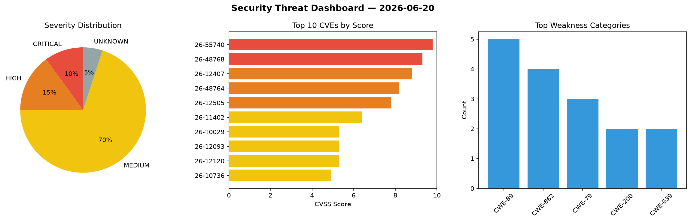
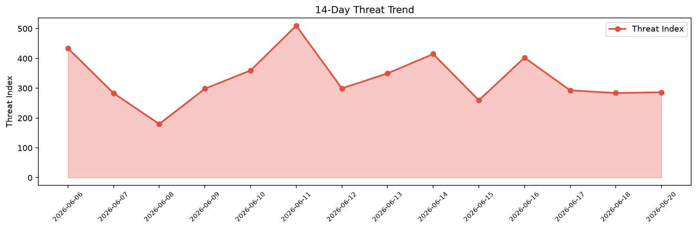

# Security Scan Report — 2026-06-20

**Scan ID:** `2804d585e9` | **CVEs:** 20 | **Threat Index:** 286.4

## Threat Overview

| Metric | Value |
|--------|-------|
| Threat Index | 286.4 |
| Critical CVEs | 2 |
| CRITICAL | 2 |
| HIGH | 3 |
| MEDIUM | 14 |
| UNKNOWN | 1 |

## Top Weakness Categories

| CWE | Count |
|-----|-------|
| CWE-89 | 5 |
| CWE-862 | 4 |
| CWE-79 | 3 |
| CWE-200 | 2 |
| CWE-639 | 2 |

## CVE Details

| CVE ID | Score | Severity | Description |
|--------|-------|----------|-------------|
| CVE-2026-55740 | 9.8 | CRITICAL | Nur-Alam39 bus-ticket (no released versions; latest commit 459cabdbeb99c00225b26... |
| CVE-2026-48768 | 9.3 | CRITICAL | TypeBot is a chatbot builder tool. In versions 3.16.1 and earlier, POST /api/blo... |
| CVE-2026-12407 | 8.8 | HIGH | The E2Pdf – Export Pdf Tool for WordPress plugin for WordPress is vulnerable to ... |
| CVE-2026-48764 | 8.2 | HIGH | TypeBot is a chatbot builder tool. In versions prior to 3.17.2, SSRF validation ... |
| CVE-2026-12505 | 7.8 | HIGH | A flaw was found in the cifs-utils package where the cifs.upcall helper fails to... |
| CVE-2026-11402 | 6.4 | MEDIUM | The Services Section Block – Showcase Service Details in Grid or Columns plugin ... |
| CVE-2026-10029 | 5.3 | MEDIUM | The Event Koi Lite – Events Calendar, Event Management, RSVP, and Tickets plugin... |
| CVE-2026-12093 | 5.3 | MEDIUM | The Simple Membership plugin for WordPress is vulnerable to authorization bypass... |
| CVE-2026-12120 | 5.3 | MEDIUM | The FireBox Popups – Increase Sales and Grow Your Email List plugin for WordPres... |
| CVE-2026-10736 | 4.9 | MEDIUM | The Tutor LMS – eLearning and online course solution plugin for WordPress is vul... |
| CVE-2026-11360 | 4.9 | MEDIUM | The Advanced Order Export For WooCommerce plugin for WordPress is vulnerable to ... |
| CVE-2026-11776 | 4.9 | MEDIUM | The Form Maker by 10Web – Mobile-Friendly Drag & Drop Contact Form Builder plugi... |
| CVE-2026-11777 | 4.9 | MEDIUM | The Form Maker by 10Web – Mobile-Friendly Drag & Drop Contact Form Builder plugi... |
| CVE-2026-11358 | 4.4 | MEDIUM | The Orbit Fox: Duplicate Page, Menu Icons, SVG Support, Cookie Notice, Custom Fo... |
| CVE-2026-10023 | 4.3 | MEDIUM | The Dokan: AI Powered WooCommerce Multivendor Marketplace Solution – Build Your ... |