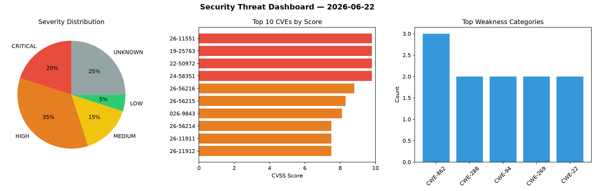
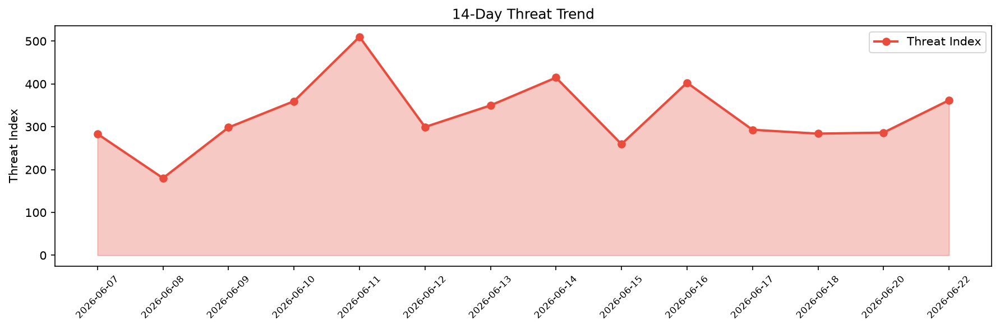

# Security Scan Report — 2026-06-22

**Scan ID:** `37a6066323` | **CVEs:** 20 | **Threat Index:** 398.4

## Threat Overview

| Metric | Value |
|--------|-------|
| Threat Index | 398.4 |
| Critical CVEs | 5 |
| CRITICAL | 5 |
| HIGH | 7 |
| MEDIUM | 3 |
| LOW | 1 |
| UNKNOWN | 4 |

## Top Weakness Categories

| CWE | Count |
|-----|-------|
| CWE-862 | 3 |
| CWE-288 | 2 |
| CWE-94 | 2 |
| CWE-269 | 2 |
| CWE-22 | 2 |

## CVE Details

| CVE ID | Score | Severity | Description |
|--------|-------|----------|-------------|
| CVE-2026-11551 | 9.8 | CRITICAL | The Branda plugin for WordPress is vulnerable to privilege escalation via accoun... |
| CVE-2019-25763 | 9.8 | CRITICAL | WordPress Ultimate Addons for Beaver Builder 1.2.4.1 contains an authentication ... |
| CVE-2022-50972 | 9.8 | CRITICAL | WooCommerce 7.1.0 contains a remote code execution vulnerability that allows att... |
| CVE-2024-58351 | 9.8 | CRITICAL | Flowise before 2.1.4 allows configuration to be injected into the Chainflow duri... |
| CVE-2026-9265 | 9.1 | CRITICAL | Crypt::OpenSSL::PKCS12 versions before 1.96 for Perl permits a heap OOB read in ... |
| CVE-2026-56216 | 8.8 | HIGH | Capgo before 12.128.2 contains a scope escalation vulnerability in the POST /fun... |
| CVE-2026-56215 | 8.3 | HIGH | Capgo before 12.128.12 allows authenticated users to modify their mutable public... |
| CVE-2026-9843 | 8.1 | HIGH | The Database for Contact Form 7, WPforms, Elementor forms plugin for WordPress i... |
| CVE-2026-56214 | 7.5 | HIGH | Capgo before 12.128.2 contains an information disclosure vulnerability in Supaba... |
| CVE-2026-11911 | 7.5 | HIGH | The Simple File List plugin for WordPress is vulnerable to arbitrary file deleti... |
| CVE-2026-11912 | 7.5 | HIGH | The Simple File List plugin for WordPress is vulnerable to arbitrary file modifi... |
| CVE-2020-37255 | 7.5 | HIGH | WordPress Time Capsule Plugin 1.21.16 contains an authentication bypass vulnerab... |
| CVE-2026-12119 | 6.5 | MEDIUM | The Simple File List plugin for WordPress is vulnerable to unauthorized file ope... |
| CVE-2025-71331 | 6.1 | MEDIUM | Flowise before 3.0.8 contains a cross-site scripting (XSS) vulnerability caused ... |
| CVE-2026-56213 | 5.3 | MEDIUM | Capgo before 12.128.2 contains an authorization bypass vulnerability in the publ... |