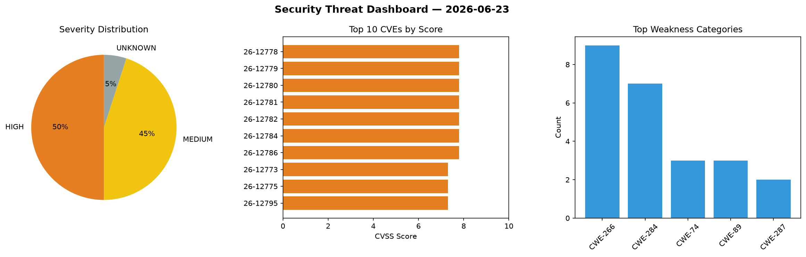
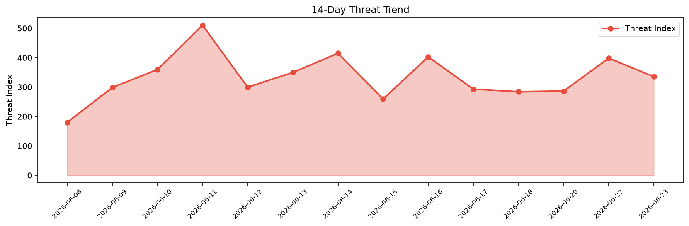

# Security Scan Report — 2026-06-23

**Scan ID:** `7b7074909f` | **CVEs:** 20 | **Threat Index:** 335.3

## Threat Overview

| Metric | Value |
|--------|-------|
| Threat Index | 335.3 |
| Critical CVEs | 0 |
| HIGH | 10 |
| MEDIUM | 9 |
| UNKNOWN | 1 |

## Delta vs Yesterday

| Metric | Today | Yesterday | Change |
|--------|-------|-----------|--------|
| total_cves | 20 | 20 | ➡️ 0.0% |
| threat_index | 335.3 | 398.4 | 📉 -15.8% |
| critical_count | 0 | 5 | 📉 -100.0% |

## Top Weakness Categories

| CWE | Count |
|-----|-------|
| CWE-266 | 9 |
| CWE-284 | 7 |
| CWE-74 | 3 |
| CWE-89 | 3 |
| CWE-287 | 2 |

## CVE Details

| CVE ID | Score | Severity | Description |
|--------|-------|----------|-------------|
| CVE-2026-12778 | 7.8 | HIGH | A vulnerability has been found in AOMEI Partition Assistant up to 10.10.1. This ... |
| CVE-2026-12779 | 7.8 | HIGH | A vulnerability was found in AOMEI Dynamic Disk Manager up to 10.10.1. This issu... |
| CVE-2026-12780 | 7.8 | HIGH | A vulnerability was determined in AOMEI Backupper up to 8.3.0. Impacted is an un... |
| CVE-2026-12781 | 7.8 | HIGH | A vulnerability was identified in EaseUS Partition Master up to 14.5. The affect... |
| CVE-2026-12782 | 7.8 | HIGH | A security flaw has been discovered in EaseUS Partition Master up to 14.5. The i... |
| CVE-2026-12784 | 7.8 | HIGH | A weakness has been identified in IM-Magic Partition Resizer up to 7.9.0. This a... |
| CVE-2026-12786 | 7.8 | HIGH | A vulnerability has been found in Ezbsystems UltraISO Premium Edition up to 9.76... |
| CVE-2026-12773 | 7.3 | HIGH | A weakness has been identified in BerriAI litellm up to 1.59.8. Affected is the ... |
| CVE-2026-12775 | 7.3 | HIGH | A vulnerability was detected in Montodel House-Rental-Management up to 90010017b... |
| CVE-2026-12795 | 7.3 | HIGH | A vulnerability was determined in BerriAI litellm up to 1.82.2. This affects the... |
| CVE-2026-12772 | 6.3 | MEDIUM | A security flaw has been discovered in BerriAI litellm up to 1.82.2. This impact... |
| CVE-2026-12774 | 6.3 | MEDIUM | A security vulnerability has been detected in BerriAI litellm up to 1.82.2. Affe... |
| CVE-2026-12776 | 6.3 | MEDIUM | A flaw has been found in Montodel House-Rental-Management up to 90010017b81265eb... |
| CVE-2026-12787 | 6.3 | MEDIUM | A vulnerability was found in zhilink 智互联(深圳)科技有限公司 ADP Application Developer Pla... |
| CVE-2026-12788 | 6.3 | MEDIUM | A vulnerability was determined in zhilink 智互联(深圳)科技有限公司 ADP Application Develope... |