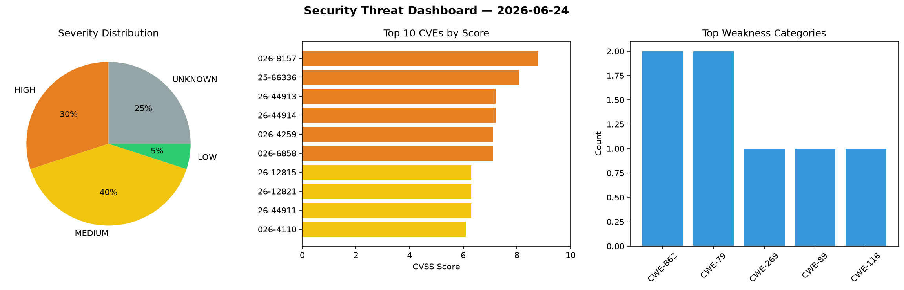
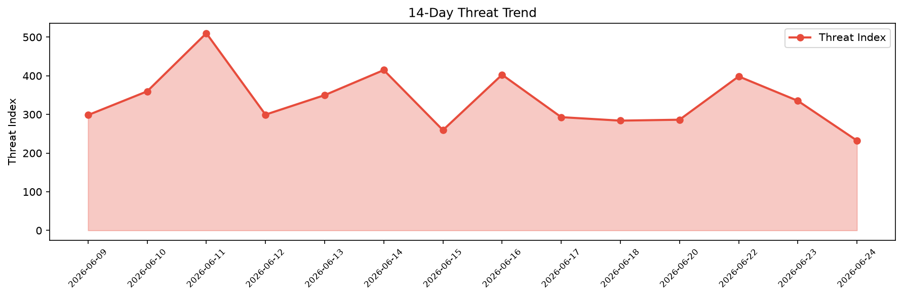

# Security Scan Report — 2026-06-24

**Scan ID:** `709d361c84` | **CVEs:** 20 | **Threat Index:** 232.4

## Threat Overview

| Metric | Value |
|--------|-------|
| Threat Index | 232.4 |
| Critical CVEs | 0 |
| HIGH | 6 |
| MEDIUM | 8 |
| LOW | 1 |
| UNKNOWN | 5 |

## Delta vs Yesterday

| Metric | Today | Yesterday | Change |
|--------|-------|-----------|--------|
| total_cves | 20 | 20 | ➡️ 0.0% |
| threat_index | 232.4 | 335.3 | 📉 -30.7% |
| critical_count | 0 | 0 | ➡️ 0% |

## Top Weakness Categories

| CWE | Count |
|-----|-------|
| CWE-862 | 2 |
| CWE-79 | 2 |
| CWE-269 | 1 |
| CWE-89 | 1 |
| CWE-116 | 1 |

## CVE Details

| CVE ID | Score | Severity | Description |
|--------|-------|----------|-------------|
| CVE-2026-8157 | 8.8 | HIGH | The Vitepos  WordPress plugin before 3.4.2 does not properly restrict the roles ... |
| CVE-2025-66336 | 8.1 | HIGH | Apache Doris MCP Server contains a SQL injection vulnerability in a metadata que... |
| CVE-2026-44913 | 7.2 | HIGH | Improper escaping of database table names in the CaptureChangeMySQL Processor in... |
| CVE-2026-44914 | 7.2 | HIGH | Apache NiFi 1.12.0 through 2.9.0 are missing authorization when replacing Proces... |
| CVE-2026-4259 | 7.1 | HIGH | The ultimate-woocommerce-auction-pro WordPress plugin through 2.4.5 does not san... |
| CVE-2026-6858 | 7.1 | HIGH | The Transbank Webpay WordPress plugin before 1.14.0 does not sanitize and escape... |
| CVE-2026-12815 | 6.3 | MEDIUM | A vulnerability has been found in coollabsio coolify 4.0.0. Impacted is an unkno... |
| CVE-2026-12821 | 6.3 | MEDIUM | A vulnerability was determined in FlowiseAI Flowise up to 3.1.2. The impacted el... |
| CVE-2026-44911 | 6.3 | MEDIUM | Authorization handling for component configuration verification requests in Apac... |
| CVE-2026-4110 | 6.1 | MEDIUM | The ultimate-woocommerce-auction-pro WordPress plugin through 2.4.5 does not san... |
| CVE-2025-62198 | 5.4 | MEDIUM | An authenticated user can perform XSS.

This issue affects Apache Atlas versions... |
| CVE-2026-12822 | 5.3 | MEDIUM | A vulnerability was identified in langflow-ai langflow up to 1.9.3. This affects... |
| CVE-2026-10530 | 5.3 | MEDIUM | The Pie Register  WordPress plugin before 3.8.4.10 does not use sufficiently ran... |
| CVE-2026-7859 | 5.3 | MEDIUM | The Motors  WordPress plugin before 1.4.110 does not have proper authorisation a... |
| CVE-2026-12823 | 3.3 | LOW | A security flaw has been discovered in Browserbase up to 20260526. This impacts ... |