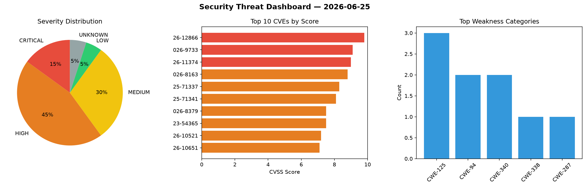
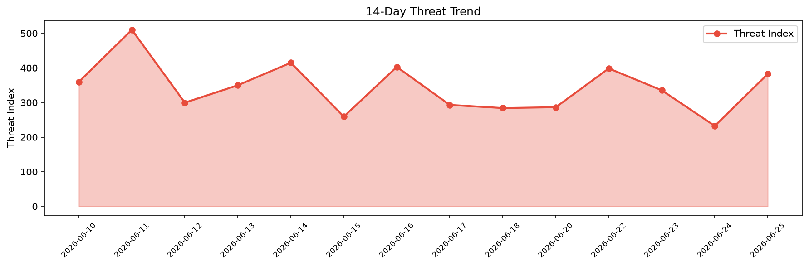

# Security Scan Report — 2026-06-25

**Scan ID:** `20eec00eb2` | **CVEs:** 20 | **Threat Index:** 382.4

## Threat Overview

| Metric | Value |
|--------|-------|
| Threat Index | 382.4 |
| Critical CVEs | 3 |
| CRITICAL | 3 |
| HIGH | 9 |
| MEDIUM | 6 |
| LOW | 1 |
| UNKNOWN | 1 |

## Delta vs Yesterday

| Metric | Today | Yesterday | Change |
|--------|-------|-----------|--------|
| total_cves | 20 | 20 | ➡️ 0.0% |
| threat_index | 382.4 | 232.4 | 📈 64.5% |
| critical_count | 3 | 0 | ➡️ 0% |

## Top Weakness Categories

| CWE | Count |
|-----|-------|
| CWE-125 | 3 |
| CWE-94 | 2 |
| CWE-340 | 2 |
| CWE-338 | 1 |
| CWE-287 | 1 |

## CVE Details

| CVE ID | Score | Severity | Description |
|--------|-------|----------|-------------|
| CVE-2026-12866 | 9.8 | CRITICAL | All versions of the package expr-eval are vulnerable to Code Execution via the t... |
| CVE-2026-9733 | 9.1 | CRITICAL | Mojolicious::Plugin::Web::Auth::OAuth2 versions through 0.17 for Perl have an in... |
| CVE-2026-11374 | 9.0 | CRITICAL | In ManageEngine ADSelfService Plus, RecoveryManager Plus, M365 Manager Plus, and... |
| CVE-2026-8163 | 8.8 | HIGH | The Infility Global WordPress plugin before 2.15.19 does not properly sanitize a... |
| CVE-2025-71337 | 8.3 | HIGH | Flowise before 3.0.10 (affected versions 3.0.7 and earlier) contains an unverifi... |
| CVE-2025-71341 | 8.1 | HIGH | picklescan before 0.0.29 fails to detect the profile.Profile.runctx function whe... |
| CVE-2026-8379 | 7.5 | HIGH | The Frontend File Manager Plugin WordPress plugin through 23.6 does not properly... |
| CVE-2023-54365 | 7.5 | HIGH | Traefik before 2.10.5 and 3.0.0-beta4 is affected by a denial-of-service vulnera... |
| CVE-2026-10521 | 7.2 | HIGH | An high privileged remote attacker can access a hidden configuration method, tha... |
| CVE-2026-10651 | 7.1 | HIGH | A malformed Bluetooth Classic SDP attribute can trigger a reachable assertion in... |
| CVE-2026-10658 | 7.1 | HIGH | A missing length validation in the Zephyr Bluetooth Host ISO receive path can be... |
| CVE-2026-8172 | 7.1 | HIGH | The Simple Basic Contact Form WordPress plugin through 20250114 does not escape ... |
| CVE-2026-7842 | 6.8 | MEDIUM | The Infility Global Infility Global WordPress plugin before 2.15.20 for WordPres... |
| CVE-2026-8378 | 5.4 | MEDIUM | The Frontend File Manager Plugin WordPress plugin through 23.6 does not sanitise... |
| CVE-2026-55655 | 5.0 | MEDIUM | A flaw was found in OpenSSH. A local unprivileged attacker on a Linux client hos... |