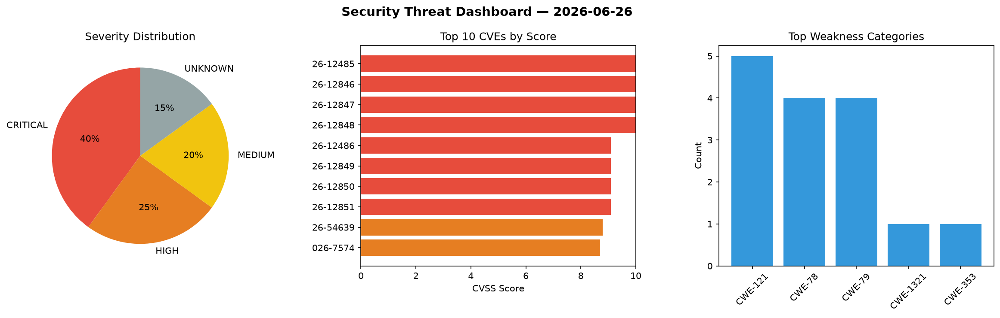
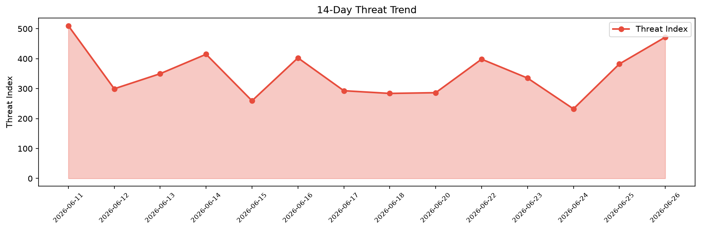

# Security Scan Report — 2026-06-26

**Scan ID:** `39d5ea380b` | **CVEs:** 20 | **Threat Index:** 471.9

## Threat Overview

| Metric | Value |
|--------|-------|
| Threat Index | 471.9 |
| Critical CVEs | 8 |
| CRITICAL | 8 |
| HIGH | 5 |
| MEDIUM | 4 |
| UNKNOWN | 3 |

## Delta vs Yesterday

| Metric | Today | Yesterday | Change |
|--------|-------|-----------|--------|
| total_cves | 20 | 20 | ➡️ 0.0% |
| threat_index | 471.9 | 382.4 | 📈 23.4% |
| critical_count | 8 | 3 | 📈 166.7% |

## Top Weakness Categories

| CWE | Count |
|-----|-------|
| CWE-121 | 5 |
| CWE-78 | 4 |
| CWE-79 | 4 |
| CWE-1321 | 1 |
| CWE-353 | 1 |

## CVE Details

| CVE ID | Score | Severity | Description |
|--------|-------|----------|-------------|
| CVE-2026-12485 | 10.0 | CRITICAL | GV-I/O Box 4E is a smart embedded device with 4 input and 4 relays output that c... |
| CVE-2026-12846 | 10.0 | CRITICAL | GV-I/O Box 4E is a smart embedded device with 4 input and 4 relays output that c... |
| CVE-2026-12847 | 10.0 | CRITICAL | GV-I/O Box 4E is a smart embedded device with 4 input and 4 relays output that c... |
| CVE-2026-12848 | 10.0 | CRITICAL | GV-I/O Box 4E is a smart embedded device with 4 input and 4 relays output that c... |
| CVE-2026-12486 | 9.1 | CRITICAL | Multiple OS command injection vulnerabilities exist in the libNetSetObj.so funct... |
| CVE-2026-12849 | 9.1 | CRITICAL | Multiple OS command injection vulnerabilities exist in the libNetSetObj.so funct... |
| CVE-2026-12850 | 9.1 | CRITICAL | Multiple OS command injection vulnerabilities exist in the libNetSetObj.so funct... |
| CVE-2026-12851 | 9.1 | CRITICAL | Multiple OS command injection vulnerabilities exist in the libNetSetObj.so funct... |
| CVE-2026-54639 | 8.8 | HIGH | Style Dictionary, a build system for creating cross-platform styles, has a proto... |
| CVE-2026-7574 | 8.7 | HIGH | Anthropic Claude Desktop Cowork VM image handling (confirmed across v1.1348.0 th... |
| CVE-2026-3652 | 7.2 | HIGH | The ARForms plugin for WordPress is vulnerable to Stored Cross-Site Scripting vi... |
| CVE-2026-10091 | 7.2 | HIGH | The Email JavaScript Cloak plugin for WordPress is vulnerable to Stored Cross-Si... |
| CVE-2026-10092 | 7.2 | HIGH | The Cincopa video and media plug-in plugin for WordPress is vulnerable to Stored... |
| CVE-2026-9539 | 6.5 | MEDIUM | An out-of-bounds heap read and integer underflow in the TCP urgent data handling... |
| CVE-2026-11614 | 6.4 | MEDIUM | The Xpro Addons — 140+ Widgets for Elementor plugin for WordPress is vulnerable ... |