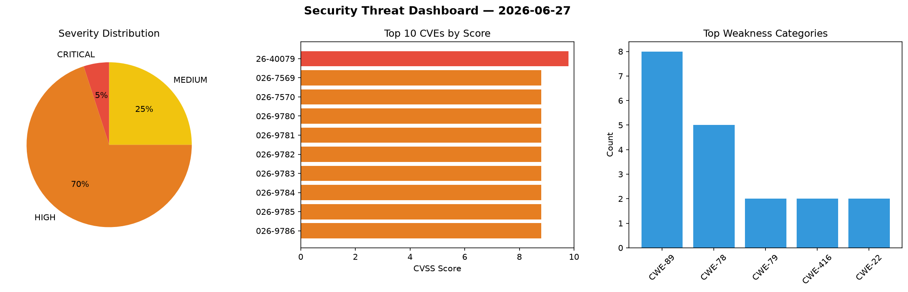
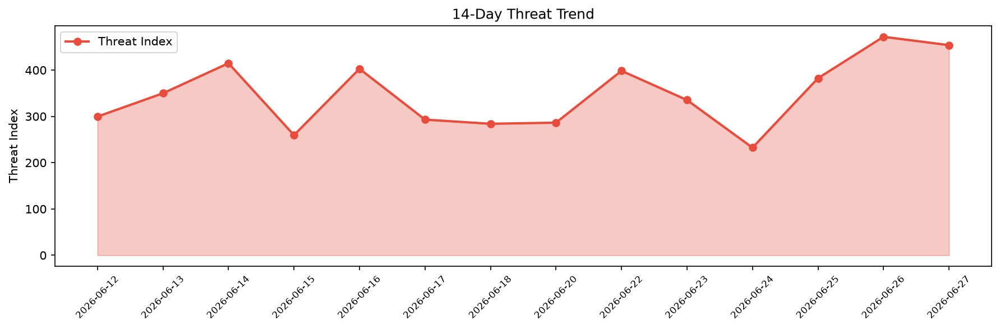

# Security Scan Report — 2026-06-27

**Scan ID:** `e89502b6cf` | **CVEs:** 20 | **Threat Index:** 453.9

## Threat Overview

| Metric | Value |
|--------|-------|
| Threat Index | 453.9 |
| Critical CVEs | 1 |
| CRITICAL | 1 |
| HIGH | 14 |
| MEDIUM | 5 |

## Delta vs Yesterday

| Metric | Today | Yesterday | Change |
|--------|-------|-----------|--------|
| total_cves | 20 | 20 | ➡️ 0.0% |
| threat_index | 453.9 | 471.9 | 📉 -3.8% |
| critical_count | 1 | 8 | 📉 -87.5% |

## Top Weakness Categories

| CWE | Count |
|-----|-------|
| CWE-89 | 8 |
| CWE-78 | 5 |
| CWE-79 | 2 |
| CWE-416 | 2 |
| CWE-22 | 2 |

## CVE Details

| CVE ID | Score | Severity | Description |
|--------|-------|----------|-------------|
| CVE-2026-40079 | 9.8 | CRITICAL | Cacti is an open source performance and fault management framework. Versions 1.2... |
| CVE-2026-7569 | 8.8 | HIGH | Quest NetVault Backup viewclient Cross-Site Scripting Authentication Bypass Vuln... |
| CVE-2026-7570 | 8.8 | HIGH | Quest NetVault Backup NVBUDashboard SQL Injection Remote Code Execution Vulnerab... |
| CVE-2026-9780 | 8.8 | HIGH | Quest NetVault Backup addclient3 Cross-Site Scripting Authentication Bypass Vuln... |
| CVE-2026-9781 | 8.8 | HIGH | Quest NetVault Backup NVBURASDevice SQL Injection Remote Code Execution Vulnerab... |
| CVE-2026-9782 | 8.8 | HIGH | Quest NetVault Backup NVBUDeviceDrive SQL Injection Remote Code Execution Vulner... |
| CVE-2026-9783 | 8.8 | HIGH | Quest NetVault Backup NVBURemovableMedia SQL Injection Remote Code Execution Vul... |
| CVE-2026-9784 | 8.8 | HIGH | Quest NetVault Backup NVBULibraryPort SQL Injection Remote Code Execution Vulner... |
| CVE-2026-9785 | 8.8 | HIGH | Quest NetVault Backup NVBULibrarySlot SQL Injection Remote Code Execution Vulner... |
| CVE-2026-9786 | 8.8 | HIGH | Quest NetVault Backup NVBUDashboard SQL Injection Remote Code Execution Vulnerab... |
| CVE-2026-9787 | 8.8 | HIGH | Quest NetVault Backup NVBULogDaemon Command Injection Remote Code Execution Vuln... |
| CVE-2026-9155 | 8.8 | HIGH | OS Command Injection vulnerability in Rapid7 InsightConnect Sed Plugin on Linux ... |
| CVE-2026-39951 | 7.6 | HIGH | Cacti is an open source performance and fault management framework. Versions 1.2... |
| CVE-2026-57589 | 7.4 | HIGH | sys/kern/sysv_sem.c in OpenBSD through 7.9 has a use-after-free allowing local p... |
| CVE-2026-9154 | 7.1 | HIGH | Arbitrary File Write vulnerability in Rapid7 InsightConnect Sed Plugin on Linux ... |