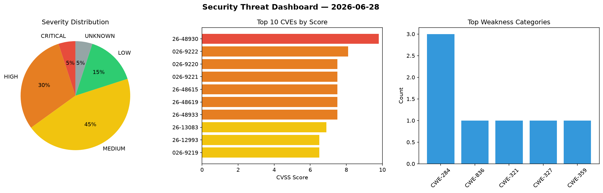
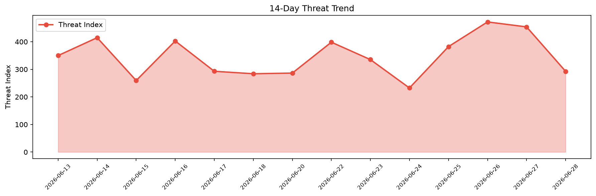

# Security Scan Report — 2026-06-28

**Scan ID:** `3ff96e671f` | **CVEs:** 20 | **Threat Index:** 292.8

## Threat Overview

| Metric | Value |
|--------|-------|
| Threat Index | 292.8 |
| Critical CVEs | 1 |
| CRITICAL | 1 |
| HIGH | 6 |
| MEDIUM | 9 |
| LOW | 3 |
| UNKNOWN | 1 |

## Delta vs Yesterday

| Metric | Today | Yesterday | Change |
|--------|-------|-----------|--------|
| total_cves | 20 | 20 | ➡️ 0.0% |
| threat_index | 292.8 | 453.9 | 📉 -35.5% |
| critical_count | 1 | 1 | ➡️ 0.0% |

## Top Weakness Categories

| CWE | Count |
|-----|-------|
| CWE-284 | 3 |
| CWE-836 | 1 |
| CWE-321 | 1 |
| CWE-327 | 1 |
| CWE-359 | 1 |

## CVE Details

| CVE ID | Score | Severity | Description |
|--------|-------|----------|-------------|
| CVE-2026-48930 | 9.8 | CRITICAL | A flaw in Node.js TLS hostname handling can cause Embedded-nul hostnames can lea... |
| CVE-2026-9222 | 8.1 | HIGH | Setracker2 Android Companion App com.tgelec.setracker versions 3.1.5 and prior o... |
| CVE-2026-9220 | 7.5 | HIGH | Setracker2 Android Companion App com.tgelec.setracker versions 3.1.5 and prior e... |
| CVE-2026-9221 | 7.5 | HIGH | The Setracker2 Android Companion App (com.tgelec.setracker) versions 3.1.5 and e... |
| CVE-2026-48615 | 7.5 | HIGH | A flaw in Node.js proxy tunnel error handling could expose proxy credentials in ... |
| CVE-2026-48619 | 7.5 | HIGH | A flaw in Node.js HTTP/2 client allows a server to send an unlimited number of O... |
| CVE-2026-48933 | 7.5 | HIGH | A flaw in Node.js WebCrypto implementation can crash the process if the input of... |
| CVE-2026-13083 | 6.9 | MEDIUM | A flaw was found in the Pen Drive report generator. Cluster-sourced data is rend... |
| CVE-2026-12993 | 6.5 | MEDIUM | A flaw was found in Apicurio Registry. The DocumentBuilderAccessor correctly blo... |
| CVE-2026-9219 | 6.5 | MEDIUM | Setracker2 Android Companion App com.tgelec.setracker versions 3.1.5 and prior h... |
| CVE-2026-13226 | 6.5 | MEDIUM | The Groundhogg — CRM, Newsletters, and Marketing Automation plugin for WordPress... |
| CVE-2026-48618 | 6.5 | MEDIUM | A flaw in Node.js TLS hostname handling can cause Node.js unicode dot separator ... |
| CVE-2026-13318 | 6.4 | MEDIUM | A server-side request forgery (SSRF) flaw was found in KubeVirt's virt-api port-... |
| CVE-2026-48928 | 5.4 | MEDIUM | A inconsistency in Node.js hostname matching can cause a trust-policy bypass in ... |
| CVE-2026-48934 | 4.3 | MEDIUM | A flaw in Node.js TLS host verification can cause an attacker to bypass certific... |