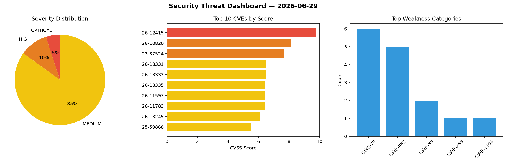
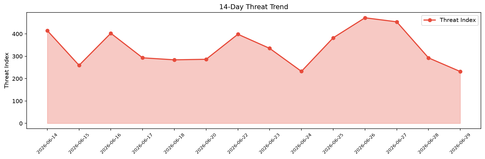

# Security Scan Report — 2026-06-29

**Scan ID:** `8d8e2f0da0` | **CVEs:** 20 | **Threat Index:** 231.7

## Threat Overview

| Metric | Value |
|--------|-------|
| Threat Index | 231.7 |
| Critical CVEs | 1 |
| CRITICAL | 1 |
| HIGH | 1 |
| MEDIUM | 16 |
| UNKNOWN | 2 |

## Delta vs Yesterday

| Metric | Today | Yesterday | Change |
|--------|-------|-----------|--------|
| total_cves | 20 | 20 | ➡️ 0.0% |
| threat_index | 231.7 | 292.8 | 📉 -20.9% |
| critical_count | 1 | 1 | ➡️ 0.0% |

## Top Weakness Categories

| CWE | Count |
|-----|-------|
| CWE-79 | 6 |
| CWE-862 | 5 |
| CWE-89 | 2 |
| CWE-269 | 1 |
| CWE-1104 | 1 |

## CVE Details

| CVE ID | Score | Severity | Description |
|--------|-------|----------|-------------|
| CVE-2026-12415 | 9.8 | CRITICAL | The Invoice Generator plugin for WordPress is vulnerable to privilege escalation... |
| CVE-2023-37524 | 7.7 | HIGH | HCL Traveler for Microsoft Outlook (HTMO) is susceptible to vulnerabilities due ... |
| CVE-2026-13331 | 6.5 | MEDIUM | The Groundhogg — CRM, Newsletters, and Marketing Automation plugin for WordPress... |
| CVE-2026-13333 | 6.5 | MEDIUM | The Groundhogg — CRM, Newsletters, and Marketing Automation plugin for WordPress... |
| CVE-2026-13335 | 6.4 | MEDIUM | The CodePeople Post Map for Google Maps plugin for WordPress is vulnerable to St... |
| CVE-2026-11597 | 6.4 | MEDIUM | The Surbma / Infusionsoft Shortcode plugin for WordPress is vulnerable to Stored... |
| CVE-2026-11783 | 6.4 | MEDIUM | The Dokan: AI Powered WooCommerce Multivendor Marketplace Solution – Build Your ... |
| CVE-2026-13245 | 6.1 | MEDIUM | The MaxButtons – Create buttons plugin for WordPress is vulnerable to Reflected ... |
| CVE-2025-59868 | 5.5 | MEDIUM | HCL Traveler for Microsoft Outlook (HTMO) is susceptible to a sensitive data exp... |
| CVE-2026-12404 | 5.3 | MEDIUM | The NEX-Forms – Ultimate Forms Plugin for WordPress plugin for WordPress is vuln... |
| CVE-2026-12432 | 5.3 | MEDIUM | The WP Full Stripe Free plugin for WordPress is vulnerable to Missing Authorizat... |
| CVE-2026-11356 | 4.4 | MEDIUM | The Ivory Search – WordPress Search Plugin plugin for WordPress is vulnerable to... |
| CVE-2026-12399 | 4.4 | MEDIUM | The Gutenverse – WordPress Blocks, Page Builder & Site Editor plugin for WordPre... |
| CVE-2026-13422 | 4.3 | MEDIUM | The HD Quiz plugin for WordPress is vulnerable to Cross-Site Request Forgery in ... |
| CVE-2026-11364 | 4.3 | MEDIUM | The Product Specifications for WooCommerce plugin for WordPress is vulnerable to... |