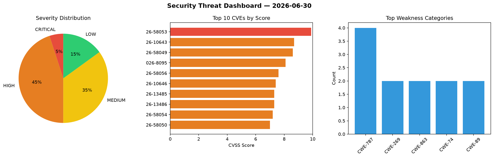
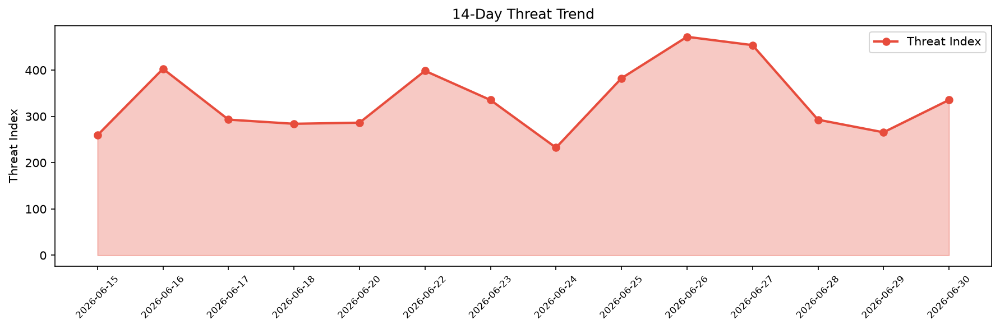

# Security Scan Report — 2026-06-30

**Scan ID:** `faa14aaf35` | **CVEs:** 20 | **Threat Index:** 335.5

## Threat Overview

| Metric | Value |
|--------|-------|
| Threat Index | 335.5 |
| Critical CVEs | 1 |
| CRITICAL | 1 |
| HIGH | 9 |
| MEDIUM | 7 |
| LOW | 3 |

## Delta vs Yesterday

| Metric | Today | Yesterday | Change |
|--------|-------|-----------|--------|
| total_cves | 20 | 20 | ➡️ 0.0% |
| threat_index | 335.5 | 265.6 | 📈 26.3% |
| critical_count | 1 | 1 | ➡️ 0.0% |

## Top Weakness Categories

| CWE | Count |
|-----|-------|
| CWE-787 | 4 |
| CWE-269 | 2 |
| CWE-863 | 2 |
| CWE-74 | 2 |
| CWE-89 | 2 |

## CVE Details

| CVE ID | Score | Severity | Description |
|--------|-------|----------|-------------|
| CVE-2026-58053 | 9.9 | CRITICAL | Gitea act_runner with the Docker backend (through act 0.262.0) passes a workflow... |
| CVE-2026-10643 | 8.7 | HIGH | Zephyr's IP socket recvmsg() implementation (subsys/net/lib/sockets/sockets_inet... |
| CVE-2026-58049 | 8.6 | HIGH | FFmpeg's RASC video decoder (decode_dlta in libavcodec/rasc.c) performs 32-bit r... |
| CVE-2026-8095 | 8.1 | HIGH | The Frontend File Manager Plugin plugin for WordPress is vulnerable to Authentic... |
| CVE-2026-58056 | 7.6 | HIGH | RustDesk gates incoming control messages on per-capability flags rather than on ... |
| CVE-2026-10646 | 7.4 | HIGH | Zephyr's BSD-sockets getaddrinfo() implementation (subsys/net/lib/sockets/getadd... |
| CVE-2026-13485 | 7.3 | HIGH | A vulnerability was found in SourceCodester Class and Exam Timetabling System 1.... |
| CVE-2026-13486 | 7.3 | HIGH | A vulnerability was determined in SourceCodester Class and Exam Timetabling Syst... |
| CVE-2026-58054 | 7.2 | HIGH | MyBB 1.8.40 does not restrict which usergroup a limited Admin Control Panel user... |
| CVE-2026-58050 | 7.0 | HIGH | libssh2 through 1.11.1 reads an attacker-controlled 32-bit attribute count from ... |
| CVE-2026-58051 | 6.5 | MEDIUM | libssh2 through 1.11.1 grows its publickey list with SSH2_REALLOC but does not z... |
| CVE-2026-58058 | 6.5 | MEDIUM | Nmap through 7.99 does not keep the IPv6 extension-header walk within the captur... |
| CVE-2026-10593 | 6.5 | MEDIUM | The Zephyr Bluetooth LE Audio Basic Audio Profile (BAP) unicast client mishandle... |
| CVE-2026-58055 | 5.4 | MEDIUM | nghttp2's nghttpx proxy through 1.69.0 forwards an HTTP/1.1 Upgrade request that... |
| CVE-2026-58057 | 5.0 | MEDIUM | Flowise before 3.1.3 validates Custom MCP stdio environment variables against a ... |