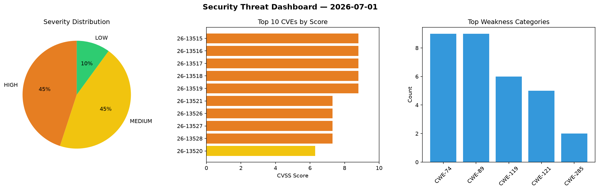
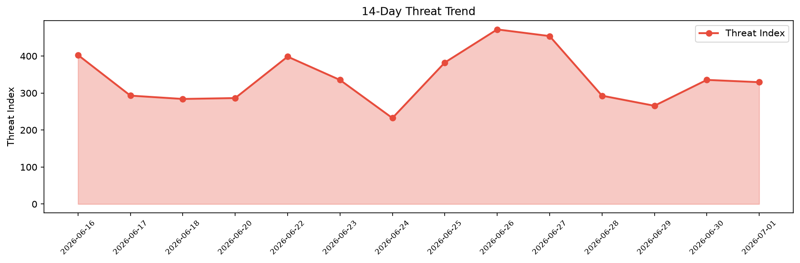

# Security Scan Report — 2026-07-01

**Scan ID:** `b77a986a76` | **CVEs:** 20 | **Threat Index:** 329.3

## Threat Overview

| Metric | Value |
|--------|-------|
| Threat Index | 329.3 |
| Critical CVEs | 0 |
| HIGH | 9 |
| MEDIUM | 9 |
| LOW | 2 |

## Delta vs Yesterday

| Metric | Today | Yesterday | Change |
|--------|-------|-----------|--------|
| total_cves | 20 | 20 | ➡️ 0.0% |
| threat_index | 329.3 | 335.5 | 📉 -1.8% |
| critical_count | 0 | 1 | 📉 -100.0% |

## Top Weakness Categories

| CWE | Count |
|-----|-------|
| CWE-74 | 9 |
| CWE-89 | 9 |
| CWE-119 | 6 |
| CWE-121 | 5 |
| CWE-285 | 2 |

## CVE Details

| CVE ID | Score | Severity | Description |
|--------|-------|----------|-------------|
| CVE-2026-13515 | 8.8 | HIGH | A security vulnerability has been detected in Tenda JD12L 16.03.53.23. Impacted ... |
| CVE-2026-13516 | 8.8 | HIGH | A vulnerability was detected in Tenda JD12L 16.03.53.23. The affected element is... |
| CVE-2026-13517 | 8.8 | HIGH | A flaw has been found in Tenda JD12L 16.03.53.23. The impacted element is the fu... |
| CVE-2026-13518 | 8.8 | HIGH | A vulnerability has been found in Tenda JD12L 16.03.53.23. This affects the func... |
| CVE-2026-13519 | 8.8 | HIGH | A vulnerability was found in Tenda JD12L 16.03.53.23. This impacts the function ... |
| CVE-2026-13521 | 7.3 | HIGH | A vulnerability was identified in SourceCodester Class and Exam Timetabling Syst... |
| CVE-2026-13526 | 7.3 | HIGH | A flaw has been found in SourceCodester Class and Exam Timetabling System 1.0. I... |
| CVE-2026-13527 | 7.3 | HIGH | A vulnerability has been found in SourceCodester Class and Exam Timetabling Syst... |
| CVE-2026-13528 | 7.3 | HIGH | A vulnerability was found in YunaiV/zhijiantianya ruoyi-vue-pro up to 2026.04-jd... |
| CVE-2026-13520 | 6.3 | MEDIUM | A vulnerability was determined in itsourcecode Hospital Management System 1.0. A... |
| CVE-2026-13525 | 6.3 | MEDIUM | A vulnerability was detected in CodeAstro Human Resource Management System 1.0. ... |
| CVE-2026-13530 | 6.3 | MEDIUM | A vulnerability was identified in itsourcecode Hospital Management System 1.0. T... |
| CVE-2026-13531 | 6.3 | MEDIUM | A security flaw has been discovered in itsourcecode Hospital Management System 1... |
| CVE-2026-13532 | 6.3 | MEDIUM | A weakness has been identified in itsourcecode Hospital Management System 1.0. A... |
| CVE-2026-13524 | 5.6 | MEDIUM | A security vulnerability has been detected in CherryHQ cherry-studio up to 1.9.6... |