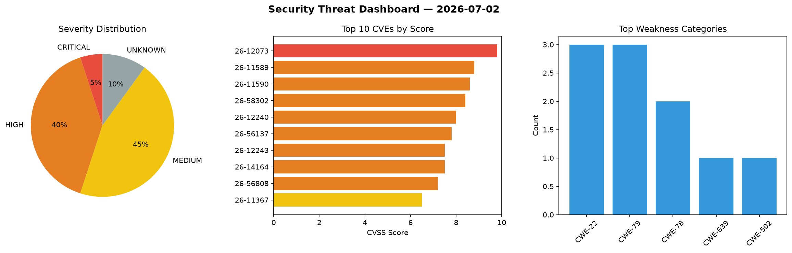
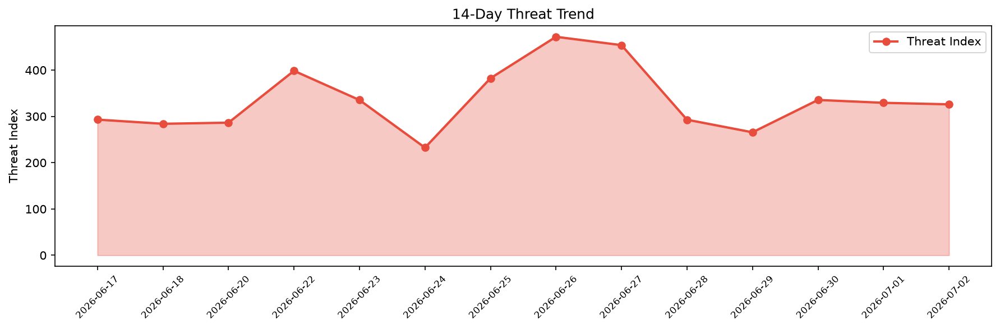

# Security Scan Report — 2026-07-02

**Scan ID:** `fbd78b1516` | **CVEs:** 20 | **Threat Index:** 326.0

## Threat Overview

| Metric | Value |
|--------|-------|
| Threat Index | 326.0 |
| Critical CVEs | 1 |
| CRITICAL | 1 |
| HIGH | 8 |
| MEDIUM | 9 |
| UNKNOWN | 2 |

## Delta vs Yesterday

| Metric | Today | Yesterday | Change |
|--------|-------|-----------|--------|
| total_cves | 20 | 20 | ➡️ 0.0% |
| threat_index | 326.0 | 329.3 | 📉 -1.0% |
| critical_count | 1 | 0 | ➡️ 0% |

## Top Weakness Categories

| CWE | Count |
|-----|-------|
| CWE-22 | 3 |
| CWE-79 | 3 |
| CWE-78 | 2 |
| CWE-639 | 1 |
| CWE-502 | 1 |

## CVE Details

| CVE ID | Score | Severity | Description |
|--------|-------|----------|-------------|
| CVE-2026-12073 | 9.8 | CRITICAL | The ProfileGrid – User Profiles, Groups and Communities plugin for WordPress is ... |
| CVE-2026-11589 | 8.8 | HIGH | The WP Support Plus Responsive Ticket System WordPress plugin through 9.1.2 does... |
| CVE-2026-11590 | 8.6 | HIGH | The WP Support Plus Responsive Ticket System WordPress plugin through 9.1.2 does... |
| CVE-2026-58302 | 8.4 | HIGH | rtapi_app in linuxcnc-uspace in LinuxCNC before 2.9.9 allows privilege escalatio... |
| CVE-2026-12240 | 8.0 | HIGH | The Export User Data plugin for WordPress is vulnerable to arbitrary file deleti... |
| CVE-2026-56137 | 7.8 | HIGH | RPG MAKER MV and MZ provided by Gotcha Gotcha Games Inc. contain an OS command i... |
| CVE-2026-12243 | 7.5 | HIGH | NLTK version 3.9.4 is vulnerable to a path traversal attack due to an incomplete... |
| CVE-2026-14164 | 7.5 | HIGH | A double free issue has been identified in libarchive's RAR5 reader. During pars... |
| CVE-2026-56808 | 7.2 | HIGH | DGM3103SCT provided by AVTECH Security Corporation contains an OS command inject... |
| CVE-2026-11367 | 6.5 | MEDIUM | The PixMagix – WordPress Image Editor plugin for WordPress is vulnerable to Dire... |
| CVE-2026-56809 | 6.1 | MEDIUM | Multiple laser printers and MFPs (multifunction printers) which implement Ricoh ... |
| CVE-2026-14160 | 5.9 | MEDIUM | Time-of-check time-of-use (TOCTOU) race condition vulnerability in Samsung Open ... |
| CVE-2026-11581 | 5.9 | MEDIUM | The Kali Forms — Contact Form & Drag-and-Drop Builder WordPress plugin before 2.... |
| CVE-2026-12349 | 5.3 | MEDIUM | The Premium Addons for KingComposer plugin for WordPress is vulnerable to unauth... |
| CVE-2026-9576 | 4.9 | MEDIUM | The Fluent Booking  WordPress plugin before 2.1.2 does not verify ownership of t... |