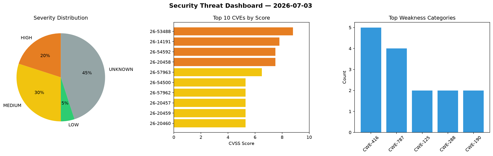
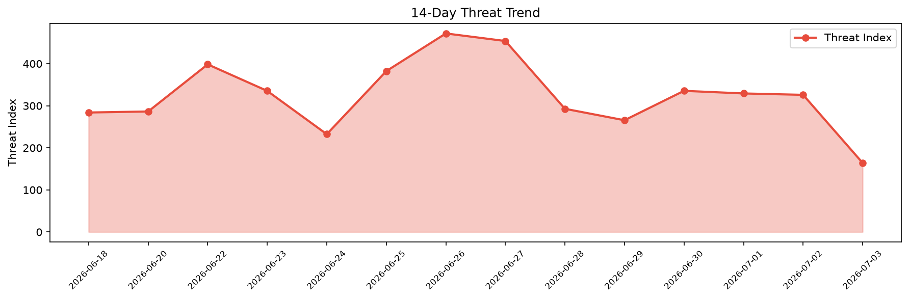

# Security Scan Report — 2026-07-03

**Scan ID:** `f6b35c494a` | **CVEs:** 20 | **Threat Index:** 164.1

## Threat Overview

| Metric | Value |
|--------|-------|
| Threat Index | 164.1 |
| Critical CVEs | 0 |
| HIGH | 4 |
| MEDIUM | 6 |
| LOW | 1 |
| UNKNOWN | 9 |

## Delta vs Yesterday

| Metric | Today | Yesterday | Change |
|--------|-------|-----------|--------|
| total_cves | 20 | 20 | ➡️ 0.0% |
| threat_index | 164.1 | 326.0 | 📉 -49.7% |
| critical_count | 0 | 1 | 📉 -100.0% |

## Top Weakness Categories

| CWE | Count |
|-----|-------|
| CWE-416 | 5 |
| CWE-787 | 4 |
| CWE-125 | 2 |
| CWE-288 | 2 |
| CWE-190 | 2 |

## CVE Details

| CVE ID | Score | Severity | Description |
|--------|-------|----------|-------------|
| CVE-2026-53488 | 8.8 | HIGH | containerd is an open-source container runtime. In versions prior to 1.7.33, 2.3... |
| CVE-2026-14191 | 7.8 | HIGH | An out-of-bounds heap write exists in the RAR5 recovery-volume (.rev) parser in ... |
| CVE-2026-54592 | 7.5 | HIGH | Oj (Optimized JSON) is a JSON parser and Object marshaller packaged as a Ruby ge... |
| CVE-2026-20458 | 7.5 | HIGH | In Modem, there is a possible memory corruption due to a missing bounds check. T... |
| CVE-2026-57963 | 6.5 | MEDIUM | An attacker who can send HTML chat messages (via Matrix or XMPP) can inject arbi... |
| CVE-2026-54500 | 5.3 | MEDIUM | Oj (Optimized JSON) is a JSON parser and Object marshaller packaged as a Ruby ge... |
| CVE-2026-57962 | 5.3 | MEDIUM | A malicious LDAP server, which a Thunderbird user is configured to query for add... |
| CVE-2026-20457 | 5.3 | MEDIUM | In Modem, there is a possible system crash due to improper input validation. Thi... |
| CVE-2026-20459 | 5.3 | MEDIUM | In Modem, there is a possible system crash due to improper input validation. Thi... |
| CVE-2026-20460 | 5.3 | MEDIUM | In Modem, there is a possible information disclosure due to improper input valid... |
| CVE-2026-41579 | 3.3 | LOW | runc is a CLI tool for spawning and running containers according to the OCI spec... |
| CVE-2026-54502 | 0.0 | UNKNOWN | Oj (Optimized JSON) is a JSON parser and Object marshaller packaged as a Ruby ge... |
| CVE-2026-54896 | 0.0 | UNKNOWN | Oj (Optimized JSON) is a JSON parser and Object marshaller packaged as a Ruby ge... |
| CVE-2026-54897 | 0.0 | UNKNOWN | Oj (Optimized JSON) is a JSON parser and Object marshaller packaged as a Ruby ge... |
| CVE-2026-54898 | 0.0 | UNKNOWN | Oj (Optimized JSON) is a JSON parser and Object marshaller packaged as a Ruby ge... |