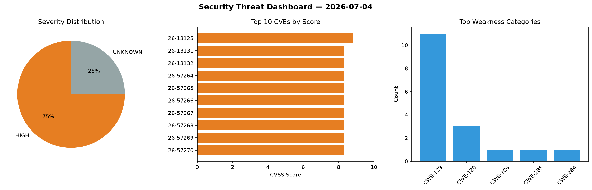
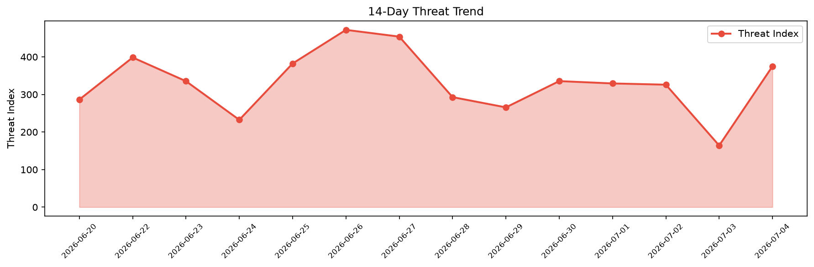

# Security Scan Report — 2026-07-04

**Scan ID:** `46cde8ec31` | **CVEs:** 20 | **Threat Index:** 375.0

## Threat Overview

| Metric | Value |
|--------|-------|
| Threat Index | 375.0 |
| Critical CVEs | 0 |
| HIGH | 15 |
| UNKNOWN | 5 |

## Delta vs Yesterday

| Metric | Today | Yesterday | Change |
|--------|-------|-----------|--------|
| total_cves | 20 | 20 | ➡️ 0.0% |
| threat_index | 375.0 | 164.1 | 📈 128.5% |
| critical_count | 0 | 0 | ➡️ 0% |

## Top Weakness Categories

| CWE | Count |
|-----|-------|
| CWE-129 | 11 |
| CWE-120 | 3 |
| CWE-306 | 1 |
| CWE-285 | 1 |
| CWE-284 | 1 |

## CVE Details

| CVE ID | Score | Severity | Description |
|--------|-------|----------|-------------|
| CVE-2026-13125 | 8.8 | HIGH | GeoWebPlayer (also called "Web Plugin" in the GV-VMS documentation and "WS Playe... |
| CVE-2026-13131 | 8.3 | HIGH | GeoWebPlayer (also called "Web Plugin" in the GV-VMS documentation and "WS Playe... |
| CVE-2026-13132 | 8.3 | HIGH | GeoWebPlayer (also called "Web Plugin" in the GV-VMS documentation and "WS Playe... |
| CVE-2026-57264 | 8.3 | HIGH | GeoWebPlayer (also called "Web Plugin" in the GV-VMS documentation and "WS Playe... |
| CVE-2026-57265 | 8.3 | HIGH | GeoWebPlayer (also called "Web Plugin" in the GV-VMS documentation and "WS Playe... |
| CVE-2026-57266 | 8.3 | HIGH | GeoWebPlayer (also called "Web Plugin" in the GV-VMS documentation and "WS Playe... |
| CVE-2026-57267 | 8.3 | HIGH | GeoWebPlayer (also called "Web Plugin" in the GV-VMS documentation and "WS Playe... |
| CVE-2026-57268 | 8.3 | HIGH | GeoWebPlayer (also called "Web Plugin" in the GV-VMS documentation and "WS Playe... |
| CVE-2026-57269 | 8.3 | HIGH | GeoWebPlayer (also called "Web Plugin" in the GV-VMS documentation and "WS Playe... |
| CVE-2026-57270 | 8.3 | HIGH | GeoWebPlayer (also called "Web Plugin" in the GV-VMS documentation and "WS Playe... |
| CVE-2026-57271 | 8.3 | HIGH | GeoWebPlayer (also called "Web Plugin" in the GV-VMS documentation and "WS Playe... |
| CVE-2026-57272 | 8.3 | HIGH | GeoWebPlayer (also called "Web Plugin" in the GV-VMS documentation and "WS Playe... |
| CVE-2026-57273 | 8.3 | HIGH | GeoWebPlayer (also called "Web Plugin" in the GV-VMS documentation and "WS Playe... |
| CVE-2026-57274 | 8.3 | HIGH | GeoWebPlayer (also called "Web Plugin" in the GV-VMS documentation and "WS Playe... |
| CVE-2026-57275 | 8.3 | HIGH | GeoWebPlayer (also called "Web Plugin" in the GV-VMS documentation and "WS Playe... |