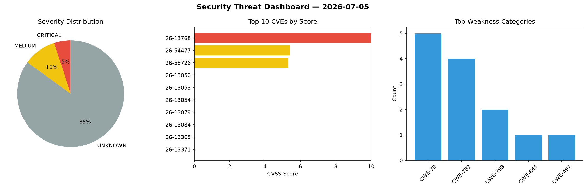
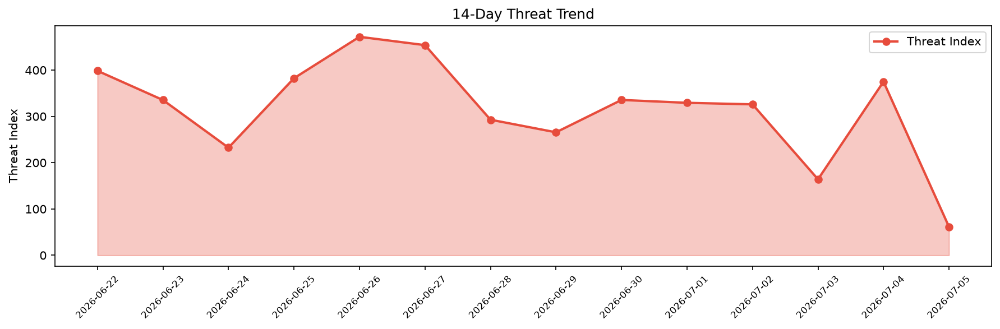

# Security Scan Report — 2026-07-05

**Scan ID:** `4f69f72b5b` | **CVEs:** 20 | **Threat Index:** 61.4

## Threat Overview

| Metric | Value |
|--------|-------|
| Threat Index | 61.4 |
| Critical CVEs | 1 |
| CRITICAL | 1 |
| MEDIUM | 2 |
| UNKNOWN | 17 |

## Delta vs Yesterday

| Metric | Today | Yesterday | Change |
|--------|-------|-----------|--------|
| total_cves | 20 | 20 | ➡️ 0.0% |
| threat_index | 61.4 | 375.0 | 📉 -83.6% |
| critical_count | 1 | 0 | ➡️ 0% |

## Top Weakness Categories

| CWE | Count |
|-----|-------|
| CWE-79 | 5 |
| CWE-787 | 4 |
| CWE-798 | 2 |
| CWE-644 | 1 |
| CWE-497 | 1 |

## CVE Details

| CVE ID | Score | Severity | Description |
|--------|-------|----------|-------------|
| CVE-2026-13768 | 10.0 | CRITICAL | Gardyn devices expose a privileged iothubowner key. Access to this key will allo... |
| CVE-2026-54477 | 5.4 | MEDIUM | The admin panel lacks standard security headers, enabling clickjacking and cross... |
| CVE-2026-55726 | 5.3 | MEDIUM | The Azure Blob Storage container used for Gardyn device logs is publicly listabl... |
| CVE-2026-13050 | 0.0 | UNKNOWN | An Out-of-bounds Write vulnerability in WatchGuard Fireware OS networkd process ... |
| CVE-2026-13053 | 0.0 | UNKNOWN | An Out-of-bounds Write vulnerability in WatchGuard Fireware OS's CLI could allow... |
| CVE-2026-13054 | 0.0 | UNKNOWN | A path traversal vulnerability in the WatchGuard Fireware OS Management Web UI a... |
| CVE-2026-13079 | 0.0 | UNKNOWN | A local privilege escalation vulnerability in the WatchGuard Mobile VPN with SSL... |
| CVE-2026-13084 | 0.0 | UNKNOWN | A null pointer dereference vulnerability in WatchGuard Fireware OS may allow a r... |
| CVE-2026-13368 | 0.0 | UNKNOWN | WatchGuard Fireware OS contains a race condition leading to a use-after-free vul... |
| CVE-2026-13371 | 0.0 | UNKNOWN | An authenticated administrator can trigger a denial-of-service condition in the ... |
| CVE-2026-13373 | 0.0 | UNKNOWN | Improper Neutralization of Input During Web Page Generation (XSS or 'Cross-site ... |
| CVE-2026-13374 | 0.0 | UNKNOWN | Improper Neutralization of Input During Web Page Generation (XSS or 'Cross-site ... |
| CVE-2026-13375 | 0.0 | UNKNOWN | Improper Neutralization of Input During Web Page Generation (XSS or 'Cross-site ... |
| CVE-2026-13376 | 0.0 | UNKNOWN | Improper Neutralization of Input During Web Page Generation (XSS or 'Cross-site ... |
| CVE-2026-13377 | 0.0 | UNKNOWN | Improper Neutralization of Input During Web Page Generation (XSS or 'Cross-site ... |