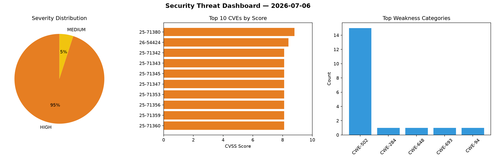
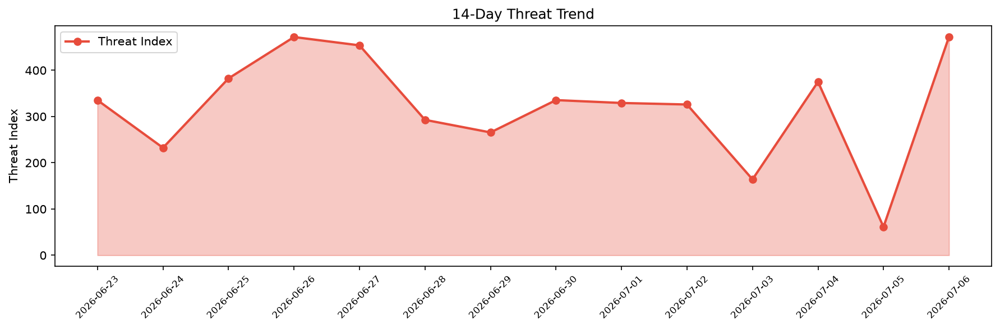

# Security Scan Report — 2026-07-06

**Scan ID:** `a706be8ccd` | **CVEs:** 20 | **Threat Index:** 472.4

## Threat Overview

| Metric | Value |
|--------|-------|
| Threat Index | 472.4 |
| Critical CVEs | 0 |
| HIGH | 19 |
| MEDIUM | 1 |

## Delta vs Yesterday

| Metric | Today | Yesterday | Change |
|--------|-------|-----------|--------|
| total_cves | 20 | 20 | ➡️ 0.0% |
| threat_index | 472.4 | 61.4 | 📈 669.4% |
| critical_count | 0 | 1 | 📉 -100.0% |

## Top Weakness Categories

| CWE | Count |
|-----|-------|
| CWE-502 | 15 |
| CWE-284 | 1 |
| CWE-648 | 1 |
| CWE-693 | 1 |
| CWE-94 | 1 |

## CVE Details

| CVE ID | Score | Severity | Description |
|--------|-------|----------|-------------|
| CVE-2025-71380 | 8.8 | HIGH | The Execute Command node in n8n allows authenticated users to execute arbitrary ... |
| CVE-2026-54424 | 8.4 | HIGH | An Incorrect Use of Privileged APIs vulnerability in Unity Parsec on Windows hos... |
| CVE-2025-71342 | 8.1 | HIGH | picklescan before 0.0.30 fails to detect malicious pickle files using idlelib.ru... |
| CVE-2025-71343 | 8.1 | HIGH | picklescan before 0.0.30 fails to detect malicious pickle files that exploit lib... |
| CVE-2025-71345 | 8.1 | HIGH | picklescan before 0.0.30 fails to detect malicious pickle files that invoke torc... |
| CVE-2025-71347 | 8.1 | HIGH | picklescan before 0.0.33 fails to detect malicious pickle files using numpy.f2py... |
| CVE-2025-71353 | 8.1 | HIGH | picklescan before 0.0.28 fails to detect malicious pickle files that exploit tor... |
| CVE-2025-71356 | 8.1 | HIGH | picklescan before 0.0.28 fails to detect malicious torch.fx.experimental.symboli... |
| CVE-2025-71359 | 8.1 | HIGH | picklescan before 0.0.29 fails to detect malicious pickle payloads that utilize ... |
| CVE-2025-71360 | 8.1 | HIGH | picklescan before 0.0.29 fails to detect malicious pickle files using idlelib.ca... |
| CVE-2025-71362 | 8.1 | HIGH | picklescan before 0.0.33 fails to detect unsafe deserialization when numpy.f2py.... |
| CVE-2025-71364 | 8.1 | HIGH | picklescan before 0.0.30 fails to detect the asyncio.unix_events._UnixSubprocess... |
| CVE-2025-71366 | 8.1 | HIGH | picklescan before 0.0.28 fails to detect malicious torch.utils.bottleneck.__main... |
| CVE-2025-71367 | 8.1 | HIGH | picklescan before 0.0.34 fails to detect _operator.attrgetter function calls in ... |
| CVE-2025-71369 | 8.1 | HIGH | picklescan before 0.0.28 fails to detect malicious pickle files that use torch.u... |