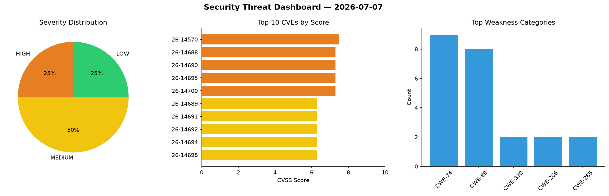
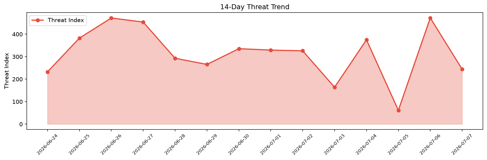

# Security Scan Report — 2026-07-07

**Scan ID:** `f6e3274bf9` | **CVEs:** 20 | **Threat Index:** 244.0

## Threat Overview

| Metric | Value |
|--------|-------|
| Threat Index | 244.0 |
| Critical CVEs | 0 |
| HIGH | 5 |
| MEDIUM | 10 |
| LOW | 5 |

## Delta vs Yesterday

| Metric | Today | Yesterday | Change |
|--------|-------|-----------|--------|
| total_cves | 20 | 20 | ➡️ 0.0% |
| threat_index | 244.0 | 472.4 | 📉 -48.3% |
| critical_count | 0 | 0 | ➡️ 0% |

## Top Weakness Categories

| CWE | Count |
|-----|-------|
| CWE-74 | 9 |
| CWE-89 | 8 |
| CWE-330 | 2 |
| CWE-266 | 2 |
| CWE-285 | 2 |

## CVE Details

| CVE ID | Score | Severity | Description |
|--------|-------|----------|-------------|
| CVE-2026-14570 | 7.5 | HIGH | Crypt::DSA versions before 1.22 for Perl draw the DSA signing nonce and private ... |
| CVE-2026-14688 | 7.3 | HIGH | A vulnerability was identified in itsourcecode Online Hotel Management System 1.... |
| CVE-2026-14690 | 7.3 | HIGH | A weakness has been identified in SourceCodester Multi-Vendor Online Grocery Man... |
| CVE-2026-14695 | 7.3 | HIGH | A vulnerability was found in SourceCodester Multi-Vendor Online Grocery Manageme... |
| CVE-2026-14700 | 7.3 | HIGH | A security vulnerability has been detected in code-projects Internship Managemen... |
| CVE-2026-14689 | 6.3 | MEDIUM | A security flaw has been discovered in CodeAstro Apartment Visitor Management Sy... |
| CVE-2026-14691 | 6.3 | MEDIUM | A security vulnerability has been detected in SourceCodester Multi-Vendor Online... |
| CVE-2026-14692 | 6.3 | MEDIUM | A vulnerability was detected in SourceCodester Multi-Vendor Online Grocery Manag... |
| CVE-2026-14694 | 6.3 | MEDIUM | A vulnerability has been found in SourceCodester Multi-Vendor Online Grocery Man... |
| CVE-2026-14698 | 6.3 | MEDIUM | A security flaw has been discovered in SourceCodester Syllabus-Aligned Learning ... |
| CVE-2026-14701 | 6.3 | MEDIUM | A vulnerability was detected in code-projects Internship Management System 1.0. ... |
| CVE-2026-14703 | 6.3 | MEDIUM | A vulnerability has been found in itsourcecode Hospital Management System 1.0. A... |
| CVE-2026-14693 | 5.4 | MEDIUM | A flaw has been found in SourceCodester Multi-Vendor Online Grocery Management S... |
| CVE-2026-14687 | 5.3 | MEDIUM | A vulnerability was determined in 666ghj BettaFish up to 1.2.1. Impacted is the ... |
| CVE-2026-14704 | 4.3 | MEDIUM | A vulnerability was found in stephen-kruger bluebox up to 4.5.12. Affected by th... |