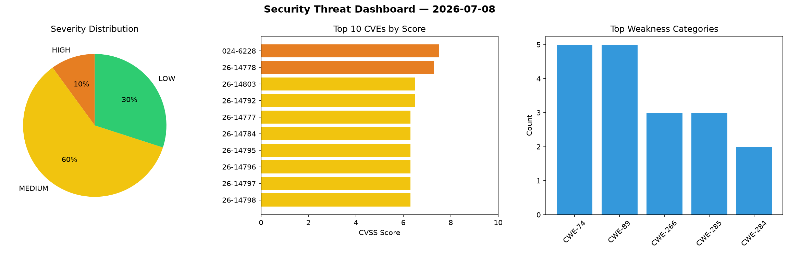
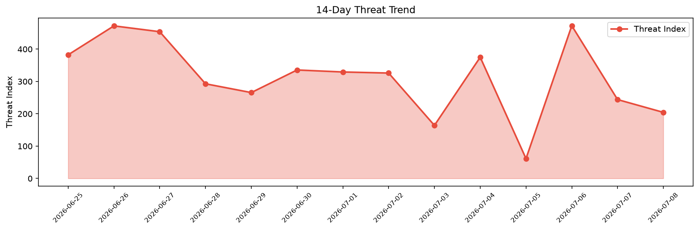

# Security Scan Report — 2026-07-08

**Scan ID:** `70ab1bfb6b` | **CVEs:** 20 | **Threat Index:** 204.4

## Threat Overview

| Metric | Value |
|--------|-------|
| Threat Index | 204.4 |
| Critical CVEs | 0 |
| HIGH | 2 |
| MEDIUM | 12 |
| LOW | 6 |

## Delta vs Yesterday

| Metric | Today | Yesterday | Change |
|--------|-------|-----------|--------|
| total_cves | 20 | 20 | ➡️ 0.0% |
| threat_index | 204.4 | 244.0 | 📉 -16.2% |
| critical_count | 0 | 0 | ➡️ 0% |

## Top Weakness Categories

| CWE | Count |
|-----|-------|
| CWE-74 | 5 |
| CWE-89 | 5 |
| CWE-266 | 3 |
| CWE-285 | 3 |
| CWE-284 | 2 |

## CVE Details

| CVE ID | Score | Severity | Description |
|--------|-------|----------|-------------|
| CVE-2024-6228 | 7.5 | HIGH | The Notifications for Forms & WordPress Actions WordPress plugin before 2.6 does... |
| CVE-2026-14778 | 7.3 | HIGH | A security vulnerability has been detected in SourceCodester Onlne Examination &... |
| CVE-2026-14803 | 6.5 | MEDIUM | Mojo::JSON versions before 9.47 for Perl allow memory exhaustion via unbounded r... |
| CVE-2026-14792 | 6.5 | MEDIUM | A security vulnerability has been detected in Formbricks 5.0.0. This impacts an ... |
| CVE-2026-14777 | 6.3 | MEDIUM | A weakness has been identified in SourceCodester Onlne Examination & Learning Ma... |
| CVE-2026-14784 | 6.3 | MEDIUM | A vulnerability was identified in vxcontrol PentAGI up to 2.1.0. This affects an... |
| CVE-2026-14795 | 6.3 | MEDIUM | A vulnerability has been found in CodeAstro Apartment Visitor Management System ... |
| CVE-2026-14796 | 6.3 | MEDIUM | A vulnerability was found in CodeAstro Apartment Visitor Management System 1.0. ... |
| CVE-2026-14797 | 6.3 | MEDIUM | A vulnerability was determined in CodeAstro Apartment Visitor Management System ... |
| CVE-2026-14798 | 6.3 | MEDIUM | A vulnerability was identified in CodeAstro Apartment Visitor Management System ... |
| CVE-2026-14799 | 6.3 | MEDIUM | A security flaw has been discovered in CodeAstro Ecommerce Website 1.0. Impacted... |
| CVE-2026-14783 | 4.3 | MEDIUM | A vulnerability was determined in NousResearch hermes-agent 2026.5.29.2. The imp... |
| CVE-2026-14793 | 4.3 | MEDIUM | A vulnerability was detected in Craft CMS up to 4.18.0.1. Affected is the functi... |
| CVE-2026-14794 | 4.3 | MEDIUM | A flaw has been found in Craft CMS up to 4.18.0.1. Affected by this vulnerabilit... |
| CVE-2026-14791 | 3.5 | LOW | A weakness has been identified in crater-invoice-inc crater up to 6.0.6. This af... |