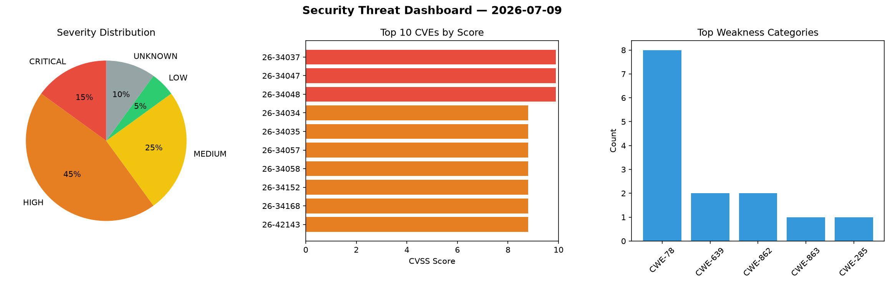
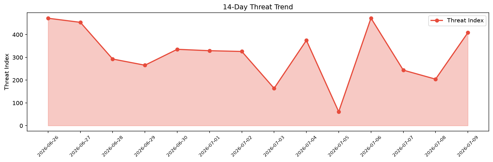

# Security Scan Report — 2026-07-09

**Scan ID:** `08aa2c88d2` | **CVEs:** 20 | **Threat Index:** 408.6

## Threat Overview

| Metric | Value |
|--------|-------|
| Threat Index | 408.6 |
| Critical CVEs | 3 |
| CRITICAL | 3 |
| HIGH | 9 |
| MEDIUM | 5 |
| LOW | 1 |
| UNKNOWN | 2 |

## Delta vs Yesterday

| Metric | Today | Yesterday | Change |
|--------|-------|-----------|--------|
| total_cves | 20 | 20 | ➡️ 0.0% |
| threat_index | 408.6 | 204.4 | 📈 99.9% |
| critical_count | 3 | 0 | ➡️ 0% |

## Top Weakness Categories

| CWE | Count |
|-----|-------|
| CWE-78 | 8 |
| CWE-639 | 2 |
| CWE-862 | 2 |
| CWE-863 | 1 |
| CWE-285 | 1 |

## CVE Details

| CVE ID | Score | Severity | Description |
|--------|-------|----------|-------------|
| CVE-2026-34037 | 9.9 | CRITICAL | Coolify is an open-source and self-hostable tool for managing servers, applicati... |
| CVE-2026-34047 | 9.9 | CRITICAL | Coolify is an open-source and self-hostable tool for managing servers, applicati... |
| CVE-2026-34048 | 9.9 | CRITICAL | Coolify is an open-source and self-hostable tool for managing servers, applicati... |
| CVE-2026-34034 | 8.8 | HIGH | Coolify is an open-source and self-hostable tool for managing servers, applicati... |
| CVE-2026-34035 | 8.8 | HIGH | Coolify is an open-source and self-hostable tool for managing servers, applicati... |
| CVE-2026-34057 | 8.8 | HIGH | Coolify is an open-source and self-hostable tool for managing servers, applicati... |
| CVE-2026-34058 | 8.8 | HIGH | Coolify is an open-source and self-hostable tool for managing servers, applicati... |
| CVE-2026-34152 | 8.8 | HIGH | Coolify is an open-source and self-hostable tool for managing servers, applicati... |
| CVE-2026-34168 | 8.8 | HIGH | Coolify is an open-source and self-hostable tool for managing servers, applicati... |
| CVE-2026-42143 | 8.8 | HIGH | Coolify is an open-source and self-hostable tool for managing servers, applicati... |
| CVE-2026-34171 | 8.0 | HIGH | Coolify is an open-source and self-hostable tool for managing servers, applicati... |
| CVE-2026-34044 | 7.7 | HIGH | Coolify is an open-source and self-hostable tool for managing servers, applicati... |
| CVE-2026-11328 | 6.4 | MEDIUM | The Exclusive Addons for Elementor plugin for WordPress is vulnerable to Stored ... |
| CVE-2026-13356 | 6.3 | MEDIUM | A malicious webpage could interrupt a pending navigation by enqueuing a synchron... |
| CVE-2026-34198 | 5.3 | MEDIUM | Coolify is an open-source and self-hostable tool for managing servers, applicati... |