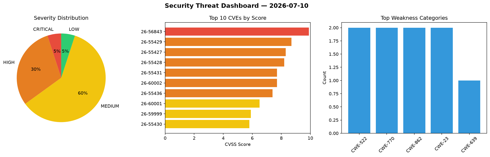
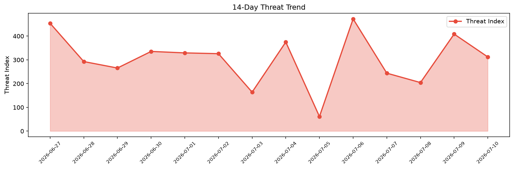

# Security Scan Report — 2026-07-10

**Scan ID:** `f1f76fff78` | **CVEs:** 20 | **Threat Index:** 312.3

## Threat Overview

| Metric | Value |
|--------|-------|
| Threat Index | 312.3 |
| Critical CVEs | 1 |
| CRITICAL | 1 |
| HIGH | 6 |
| MEDIUM | 12 |
| LOW | 1 |

## Delta vs Yesterday

| Metric | Today | Yesterday | Change |
|--------|-------|-----------|--------|
| total_cves | 20 | 20 | ➡️ 0.0% |
| threat_index | 312.3 | 408.6 | 📉 -23.6% |
| critical_count | 1 | 3 | 📉 -66.7% |

## Top Weakness Categories

| CWE | Count |
|-----|-------|
| CWE-522 | 2 |
| CWE-770 | 2 |
| CWE-862 | 2 |
| CWE-23 | 2 |
| CWE-639 | 1 |

## CVE Details

| CVE ID | Score | Severity | Description |
|--------|-------|----------|-------------|
| CVE-2026-56843 | 9.9 | CRITICAL | Incorrect authorization in the XML-RPC API of WebPros Plesk before 18.0.78.4 all... |
| CVE-2026-55429 | 8.7 | HIGH | Coder allows organizations to provision remote development environments via Terr... |
| CVE-2026-55427 | 8.3 | HIGH | Coder allows organizations to provision remote development environments via Terr... |
| CVE-2026-55428 | 8.2 | HIGH | Coder allows organizations to provision remote development environments via Terr... |
| CVE-2026-55431 | 7.7 | HIGH | Coder allows organizations to provision remote development environments via Terr... |
| CVE-2026-60002 | 7.7 | HIGH | ssh in OpenSSH before 10.4 can have a use-after-free when a server changes its h... |
| CVE-2026-55436 | 7.4 | HIGH | Coder allows organizations to provision remote development environments via Terr... |
| CVE-2026-60001 | 6.5 | MEDIUM | sshd in OpenSSH before 10.4 does not always honor the minimum authentication del... |
| CVE-2026-59999 | 5.9 | MEDIUM | In sshd in OpenSSH before 10.4, DisableForwarding=yes was supposed to take prece... |
| CVE-2026-55430 | 5.8 | MEDIUM | Coder allows organizations to provision remote development environments via Terr... |
| CVE-2026-55438 | 5.8 | MEDIUM | Coder allows organizations to provision remote development environments via Terr... |
| CVE-2026-55432 | 5.4 | MEDIUM | Coder allows organizations to provision remote development environments via Terr... |
| CVE-2026-55433 | 5.4 | MEDIUM | Coder allows organizations to provision remote development environments via Terr... |
| CVE-2026-55437 | 5.4 | MEDIUM | Coder allows organizations to provision remote development environments via Terr... |
| CVE-2026-55079 | 4.9 | MEDIUM | Coder allows organizations to provision remote development environments via Terr... |