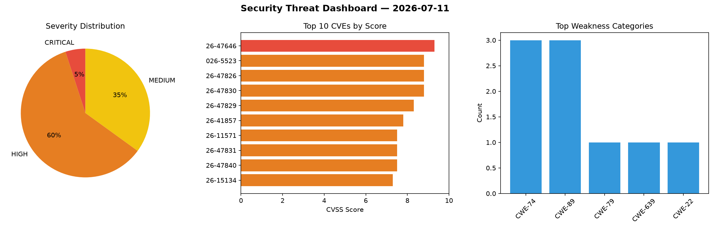
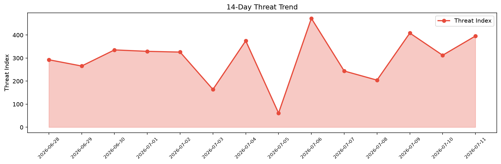

# Security Scan Report — 2026-07-11

**Scan ID:** `dd917c52bb` | **CVEs:** 20 | **Threat Index:** 395.8

## Threat Overview

| Metric | Value |
|--------|-------|
| Threat Index | 395.8 |
| Critical CVEs | 1 |
| CRITICAL | 1 |
| HIGH | 12 |
| MEDIUM | 7 |

## Delta vs Yesterday

| Metric | Today | Yesterday | Change |
|--------|-------|-----------|--------|
| total_cves | 20 | 20 | ➡️ 0.0% |
| threat_index | 395.8 | 312.3 | 📈 26.7% |
| critical_count | 1 | 1 | ➡️ 0.0% |

## Top Weakness Categories

| CWE | Count |
|-----|-------|
| CWE-74 | 3 |
| CWE-89 | 3 |
| CWE-79 | 1 |
| CWE-639 | 1 |
| CWE-22 | 1 |

## CVE Details

| CVE ID | Score | Severity | Description |
|--------|-------|----------|-------------|
| CVE-2026-47646 | 9.3 | CRITICAL | Improper neutralization of input during web page generation ('cross-site scripti... |
| CVE-2026-5523 | 8.8 | HIGH | The Divi Form Builder plugin for WordPress is vulnerable to Missing Authorizatio... |
| CVE-2026-47826 | 8.8 | HIGH | The blobs.yml path key traversal vulnerability in the BOSH CLI tool allows an at... |
| CVE-2026-47830 | 8.8 | HIGH | Incorrect Permission Assignment in BOSH.Utils.psm1 in BOSH-Ecosystem bosh-window... |
| CVE-2026-47829 | 8.3 | HIGH | Argument Injection in bosh-cli allows a compromised BOSH Director to inject arbi... |
| CVE-2026-41857 | 7.8 | HIGH | A compromised or malicious BOSH Director can execute arbitrary shell commands on... |
| CVE-2026-11571 | 7.5 | HIGH | The Everest Forms  WordPress plugin before 3.5.0 does not reliably delete tempor... |
| CVE-2026-47831 | 7.5 | HIGH | Use of a cryptographically weak random number generator in the GenerateRandomPas... |
| CVE-2026-47840 | 7.5 | HIGH | A network attacker positioned between UAA and its LDAP directory can impersonate... |
| CVE-2026-15134 | 7.3 | HIGH | A vulnerability was determined in CodeAstro Simple Online Leave Management Syste... |
| CVE-2026-15135 | 7.3 | HIGH | A security flaw has been discovered in code-projects Online Food Order System 1.... |
| CVE-2026-15137 | 7.3 | HIGH | A weakness has been identified in code-projects Interview Management System 1.0.... |
| CVE-2026-47828 | 7.1 | HIGH | During bosh create-env and bosh delete-env, the CLI uploads compiled CPI package... |
| CVE-2026-12270 | 6.5 | MEDIUM | The Everest Forms  WordPress plugin before 3.5.0 does not correctly restrict acc... |
| CVE-2026-15138 | 6.3 | MEDIUM | A security vulnerability has been detected in tumf mcp-text-editor up to 1.0.2. ... |