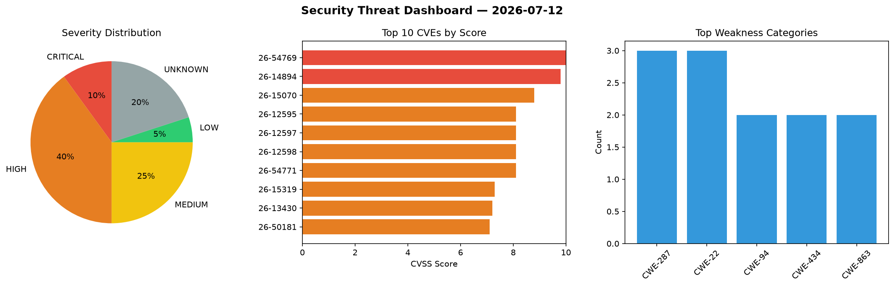
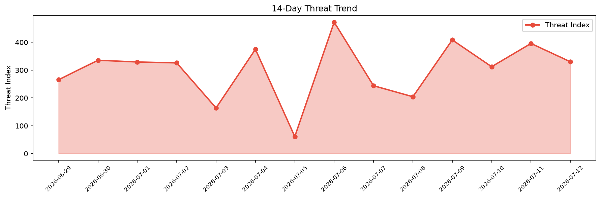

# Security Scan Report — 2026-07-12

**Scan ID:** `45744df308` | **CVEs:** 20 | **Threat Index:** 330.1

## Threat Overview

| Metric | Value |
|--------|-------|
| Threat Index | 330.1 |
| Critical CVEs | 2 |
| CRITICAL | 2 |
| HIGH | 8 |
| MEDIUM | 5 |
| LOW | 1 |
| UNKNOWN | 4 |

## Delta vs Yesterday

| Metric | Today | Yesterday | Change |
|--------|-------|-----------|--------|
| total_cves | 20 | 20 | ➡️ 0.0% |
| threat_index | 330.1 | 395.8 | 📉 -16.6% |
| critical_count | 2 | 1 | 📈 100.0% |

## Top Weakness Categories

| CWE | Count |
|-----|-------|
| CWE-287 | 3 |
| CWE-22 | 3 |
| CWE-94 | 2 |
| CWE-434 | 2 |
| CWE-863 | 2 |

## CVE Details

| CVE ID | Score | Severity | Description |
|--------|-------|----------|-------------|
| CVE-2026-54769 | 10.0 | CRITICAL | Langroid is a framework for building large-language-model-powered applications. ... |
| CVE-2026-14894 | 9.8 | CRITICAL | The Super Forms – Drag & Drop Form Builder plugin for WordPress is vulnerable to... |
| CVE-2026-15070 | 8.8 | HIGH | The Salon Booking System – Free Version plugin for WordPress is vulnerable to Cr... |
| CVE-2026-12595 | 8.1 | HIGH | The LoginPress Pro plugin for WordPress is vulnerable to Authentication Bypass v... |
| CVE-2026-12597 | 8.1 | HIGH | The LoginPress Pro plugin for WordPress is vulnerable to Authentication Bypass v... |
| CVE-2026-12598 | 8.1 | HIGH | The LoginPress Pro plugin for WordPress is vulnerable to authentication bypass i... |
| CVE-2026-54771 | 8.1 | HIGH | Langroid is a framework for building large-language-model-powered applications. ... |
| CVE-2026-15319 | 7.3 | HIGH | A security vulnerability has been detected in Sipeed PicoClaw up to 0.2.9. This ... |
| CVE-2026-13430 | 7.2 | HIGH | The Post Export Import with Media plugin for WordPress is vulnerable to Arbitrar... |
| CVE-2026-50181 | 7.1 | HIGH | Langroid is a framework for building large-language-model-powered applications. ... |
| CVE-2026-15317 | 6.3 | MEDIUM | A security flaw has been discovered in Sipeed PicoClaw up to 0.2.9. Affected by ... |
| CVE-2026-15318 | 6.3 | MEDIUM | A weakness has been identified in Sipeed PicoClaw up to 0.2.9. Affected by this ... |
| CVE-2026-11392 | 6.1 | MEDIUM | The WP Hotel Booking plugin for WordPress is vulnerable to Reflected Cross-Site ... |
| CVE-2026-15320 | 5.4 | MEDIUM | A vulnerability was detected in Sipeed PicoClaw up to 0.2.9. This vulnerability ... |
| CVE-2026-11818 | 5.4 | MEDIUM | The WPCafe – Restaurant Menu, Online Food Ordering & Table Booking System plugin... |