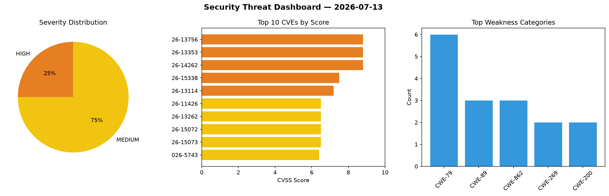
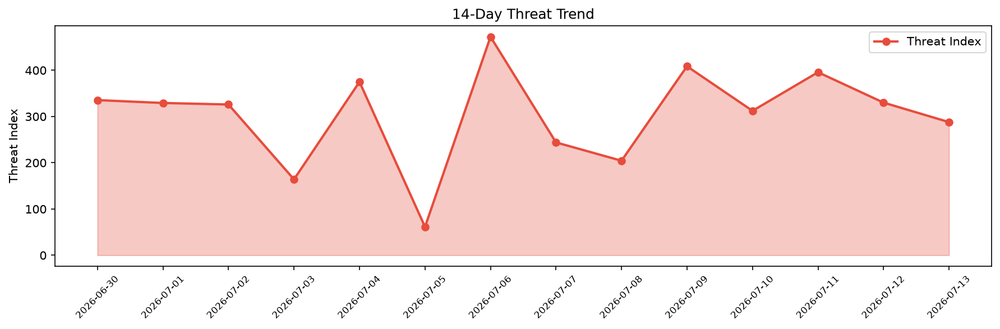

# Security Scan Report — 2026-07-13

**Scan ID:** `0489099cae` | **CVEs:** 20 | **Threat Index:** 287.9

## Threat Overview

| Metric | Value |
|--------|-------|
| Threat Index | 287.9 |
| Critical CVEs | 0 |
| HIGH | 5 |
| MEDIUM | 15 |

## Delta vs Yesterday

| Metric | Today | Yesterday | Change |
|--------|-------|-----------|--------|
| total_cves | 20 | 20 | ➡️ 0.0% |
| threat_index | 287.9 | 330.1 | 📉 -12.8% |
| critical_count | 0 | 2 | 📉 -100.0% |

## Top Weakness Categories

| CWE | Count |
|-----|-------|
| CWE-79 | 6 |
| CWE-89 | 3 |
| CWE-862 | 3 |
| CWE-269 | 2 |
| CWE-200 | 2 |

## CVE Details

| CVE ID | Score | Severity | Description |
|--------|-------|----------|-------------|
| CVE-2026-13756 | 8.8 | HIGH | The WP Grid Builder plugin for WordPress is vulnerable to Privilege Escalation i... |
| CVE-2026-13353 | 8.8 | HIGH | The WP Ultimate CSV Importer – WordPress Import & Export for CSV, XML & Excel pl... |
| CVE-2026-14262 | 8.8 | HIGH | The Simple JWT Login – Allows you to use JWT on REST endpoints. plugin for WordP... |
| CVE-2026-15338 | 7.5 | HIGH | The LA-Studio Element Kit for Elementor plugin for WordPress is vulnerable to Lo... |
| CVE-2026-13114 | 7.2 | HIGH | The Motors – Car Dealership & Classified Listings Plugin plugin for WordPress is... |
| CVE-2026-11426 | 6.5 | MEDIUM | The UnderConstructionPage PRO plugin for WordPress is vulnerable to Arbitrary Fi... |
| CVE-2026-13262 | 6.5 | MEDIUM | The Majestic Support – The Leading-Edge Help Desk & Customer Support Plugin plug... |
| CVE-2026-15072 | 6.5 | MEDIUM | The KiviCare – Clinic & Patient Management System (EHR) plugin for WordPress is ... |
| CVE-2026-15073 | 6.5 | MEDIUM | The KiviCare – Clinic & Patient Management System (EHR) plugin for WordPress is ... |
| CVE-2026-5743 | 6.4 | MEDIUM | The SimpLy Gallery Block & Lightbox plugin for WordPress is vulnerable to Stored... |
| CVE-2025-13968 | 6.4 | MEDIUM | The Starboard Suite Reservation Calendars plugin for WordPress is vulnerable to ... |
| CVE-2026-15096 | 6.4 | MEDIUM | The Themify Builder plugin for WordPress is vulnerable to Stored Cross-Site Scri... |
| CVE-2026-12426 | 5.3 | MEDIUM | The Members – Membership & User Role Editor Plugin plugin for WordPress is vulne... |
| CVE-2026-13250 | 5.3 | MEDIUM | The Solace Extra plugin for WordPress is vulnerable to authorization bypass in a... |
| CVE-2026-12141 | 4.9 | MEDIUM | The Premium Addons for Elementor – Powerful Elementor Templates & Widgets plugin... |