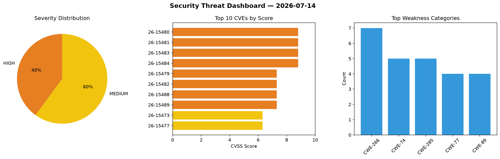
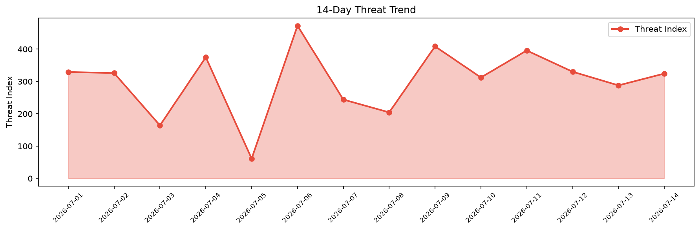

# Security Scan Report — 2026-07-14

**Scan ID:** `b355935270` | **CVEs:** 20 | **Threat Index:** 324.4

## Threat Overview

| Metric | Value |
|--------|-------|
| Threat Index | 324.4 |
| Critical CVEs | 0 |
| HIGH | 8 |
| MEDIUM | 12 |

## Delta vs Yesterday

| Metric | Today | Yesterday | Change |
|--------|-------|-----------|--------|
| total_cves | 20 | 20 | ➡️ 0.0% |
| threat_index | 324.4 | 287.9 | 📈 12.7% |
| critical_count | 0 | 0 | ➡️ 0% |

## Top Weakness Categories

| CWE | Count |
|-----|-------|
| CWE-266 | 7 |
| CWE-74 | 5 |
| CWE-285 | 5 |
| CWE-77 | 4 |
| CWE-89 | 4 |

## CVE Details

| CVE ID | Score | Severity | Description |
|--------|-------|----------|-------------|
| CVE-2026-15480 | 8.8 | HIGH | A vulnerability was identified in Trendnet TEW-635BRM up to 1.00.03. This affect... |
| CVE-2026-15481 | 8.8 | HIGH | A security flaw has been discovered in Trendnet TEW-635BRM up to 1.00.03. This v... |
| CVE-2026-15483 | 8.8 | HIGH | A security vulnerability has been detected in TRENDnet TEW-821DAP 1.12B01. Impac... |
| CVE-2026-15484 | 8.8 | HIGH | A vulnerability was detected in TRENDnet TEW-821DAP 1.12B01. The affected elemen... |
| CVE-2026-15479 | 7.3 | HIGH | A vulnerability was found in H3C NX15 V100R017. Affected by this vulnerability i... |
| CVE-2026-15482 | 7.3 | HIGH | A weakness has been identified in Aster Telecom Azcall 10/11. This issue affects... |
| CVE-2026-15488 | 7.3 | HIGH | A vulnerability was determined in hcr707305003 shiroiAdmin 1.1/1.3. Affected is ... |
| CVE-2026-15489 | 7.3 | HIGH | A vulnerability was identified in RafyMrX TOKO-ONLINE-ROTI up to ddfe1cd587be0a0... |
| CVE-2026-15473 | 6.3 | MEDIUM | A vulnerability was identified in Eleveo Call Recording Software 9.7.0. This iss... |
| CVE-2026-15477 | 6.3 | MEDIUM | A vulnerability was detected in Bahmni bahmnicore up to 0.93. This affects the f... |
| CVE-2026-15478 | 6.3 | MEDIUM | A flaw has been found in IceHRM up to 35.0.1. This impacts an unknown function o... |
| CVE-2026-15485 | 6.3 | MEDIUM | A flaw has been found in TRENDnet TEW-821DAP 1.11B03. The impacted element is th... |
| CVE-2026-15486 | 6.3 | MEDIUM | A vulnerability has been found in TRENDnet TEW-821DAP 1.11B03. This affects the ... |
| CVE-2026-15487 | 6.3 | MEDIUM | A vulnerability was found in TRENDnet TEW-821DAP 1.11B03. This impacts the funct... |
| CVE-2026-15475 | 5.3 | MEDIUM | A weakness has been identified in MiniTool Partition Wizard up to 13.6. The affe... |