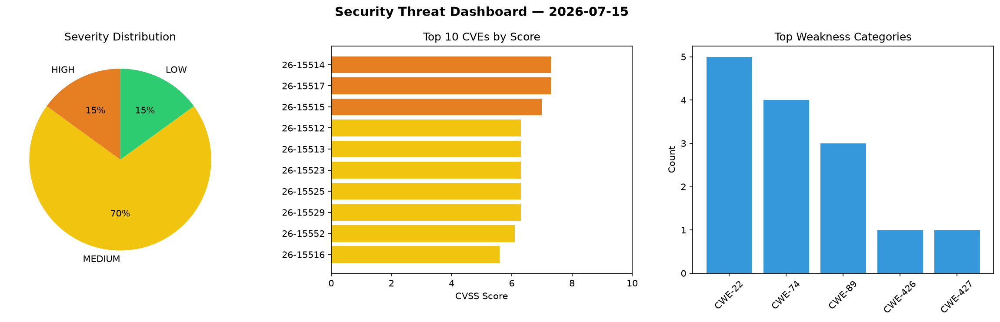
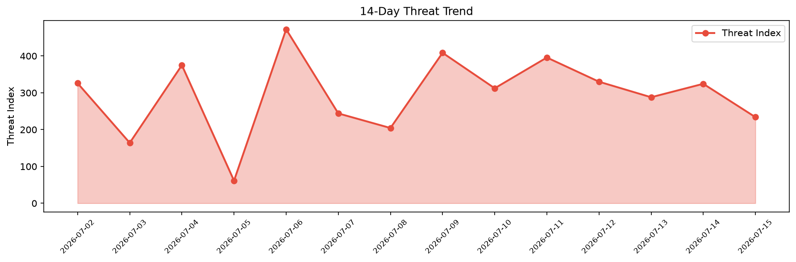

# Security Scan Report — 2026-07-15

**Scan ID:** `76f5cae52c` | **CVEs:** 20 | **Threat Index:** 233.9

## Threat Overview

| Metric | Value |
|--------|-------|
| Threat Index | 233.9 |
| Critical CVEs | 0 |
| HIGH | 3 |
| MEDIUM | 14 |
| LOW | 3 |

## Delta vs Yesterday

| Metric | Today | Yesterday | Change |
|--------|-------|-----------|--------|
| total_cves | 20 | 20 | ➡️ 0.0% |
| threat_index | 233.9 | 324.4 | 📉 -27.9% |
| critical_count | 0 | 0 | ➡️ 0% |

## Top Weakness Categories

| CWE | Count |
|-----|-------|
| CWE-22 | 5 |
| CWE-74 | 4 |
| CWE-89 | 3 |
| CWE-426 | 1 |
| CWE-427 | 1 |

## CVE Details

| CVE ID | Score | Severity | Description |
|--------|-------|----------|-------------|
| CVE-2026-15514 | 7.3 | HIGH | A weakness has been identified in Metasoft 美特软件 MetaCRM up to 6.4.0 Beta06. This... |
| CVE-2026-15517 | 7.3 | HIGH | A flaw has been found in Jinher OA 1.0. The affected element is an unknown funct... |
| CVE-2026-15515 | 7.0 | HIGH | A security vulnerability has been detected in Tencent PC Manager 18.1.30242.301.... |
| CVE-2026-15512 | 6.3 | MEDIUM | A vulnerability was identified in pig-mesh Pig up to 3.9.2. Affected by this iss... |
| CVE-2026-15513 | 6.3 | MEDIUM | A security flaw has been discovered in Wavlink WL-NU516U1 260515. This affects t... |
| CVE-2026-15523 | 6.3 | MEDIUM | A weakness has been identified in CodeAstro Simple Online Leave Management Syste... |
| CVE-2026-15525 | 6.3 | MEDIUM | A vulnerability was detected in kLOsk adloop up to 0.9.0. This vulnerability aff... |
| CVE-2026-15529 | 6.3 | MEDIUM | A vulnerability was detected in yzhao062 pyod 3.5.0/3.5.1/3.5.2. Affected is the... |
| CVE-2026-15552 | 6.1 | MEDIUM | Enterprise Cloud Database developed by Ragic has a Stored Cross-Site Scripting v... |
| CVE-2026-15516 | 5.6 | MEDIUM | A vulnerability was detected in MacCMS Pro up to 2022.1000.3005. Impacted is the... |
| CVE-2026-15551 | 5.5 | MEDIUM | Integer overflow or wraparound vulnerability in Samsung Open Source rlottie allo... |
| CVE-2026-15520 | 5.3 | MEDIUM | A vulnerability was determined in GNU LibreDWG 0.13.4-154-g0b573035. This impact... |
| CVE-2026-15521 | 5.3 | MEDIUM | A vulnerability was identified in makafeli n8n-workflow-builder up to 0.11.0. Af... |
| CVE-2026-15522 | 5.3 | MEDIUM | A security flaw has been discovered in tugcantopaloglu godot-mcp 2.0.0. Affected... |
| CVE-2026-15527 | 5.3 | MEDIUM | A vulnerability has been found in better-auth better-icons up to 1.0.5. This vul... |