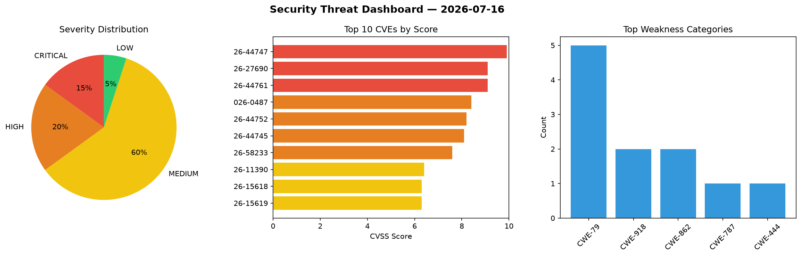
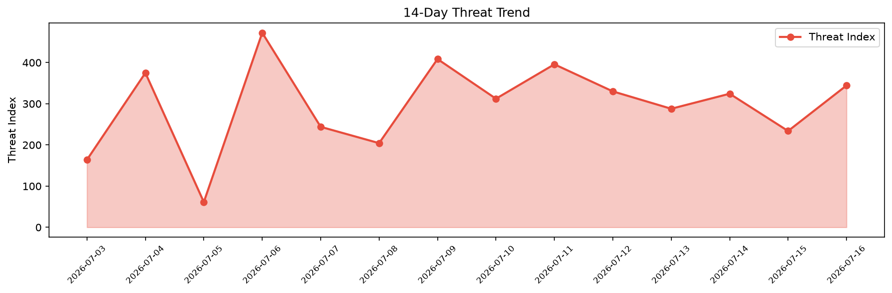

# Security Scan Report — 2026-07-16

**Scan ID:** `aca9e47249` | **CVEs:** 20 | **Threat Index:** 344.4

## Threat Overview

| Metric | Value |
|--------|-------|
| Threat Index | 344.4 |
| Critical CVEs | 3 |
| CRITICAL | 3 |
| HIGH | 4 |
| MEDIUM | 12 |
| LOW | 1 |

## Delta vs Yesterday

| Metric | Today | Yesterday | Change |
|--------|-------|-----------|--------|
| total_cves | 20 | 20 | ➡️ 0.0% |
| threat_index | 344.4 | 233.9 | 📈 47.2% |
| critical_count | 3 | 0 | ➡️ 0% |

## Top Weakness Categories

| CWE | Count |
|-----|-------|
| CWE-79 | 5 |
| CWE-918 | 2 |
| CWE-862 | 2 |
| CWE-787 | 1 |
| CWE-444 | 1 |

## CVE Details

| CVE ID | Score | Severity | Description |
|--------|-------|----------|-------------|
| CVE-2026-44747 | 9.9 | CRITICAL | SAP NetWeaver Application Server ABAP allows an authenticated attacker to levera... |
| CVE-2026-27690 | 9.1 | CRITICAL | Due to an HTTP Request Smuggling vulnerability in SAP Approuter, an unauthentica... |
| CVE-2026-44761 | 9.1 | CRITICAL | SAP Commerce Cloud could retain a sample OAuth2 client with publicly documented ... |
| CVE-2026-0487 | 8.4 | HIGH | SAProuter on Microsoft Windows allows an unauthenticated attacker to load librar... |
| CVE-2026-44752 | 8.2 | HIGH | SAP NetWeaver Application Server Java allows an unauthenticated attacker to inje... |
| CVE-2026-44745 | 8.1 | HIGH | SAP Approuter does not properly validate incoming request headers during the OAu... |
| CVE-2026-58233 | 7.6 | HIGH | SAP Change and Transport System Attach Tool (ctsattach) allows an authenticated ... |
| CVE-2026-11390 | 6.4 | MEDIUM | The News Kit Addons For Elementor plugin for WordPress is vulnerable to Stored C... |
| CVE-2026-15618 | 6.3 | MEDIUM | A security flaw has been discovered in mosaxiv clawlet up to 0.2.10. The affecte... |
| CVE-2026-15619 | 6.3 | MEDIUM | A weakness has been identified in mosaxiv clawlet up to 0.2.10. The impacted ele... |
| CVE-2026-15620 | 6.3 | MEDIUM | A security vulnerability has been detected in mosaxiv clawlet up to 0.2.10. This... |
| CVE-2026-44759 | 6.1 | MEDIUM | SAP NetWeaver Enterprise Portal allows an unauthenticated attacker to inject mal... |
| CVE-2026-44767 | 6.1 | MEDIUM | setThemeRoot() failed to enforce the sap-allowed-theme-origins allowlist. An att... |
| CVE-2026-44769 | 5.5 | MEDIUM | SAP S/4HANA application Project Management (PPM-PRO) allows an attacker with hig... |
| CVE-2026-15621 | 5.3 | MEDIUM | A vulnerability was detected in mosaxiv clawlet up to 0.2.10. This impacts the f... |