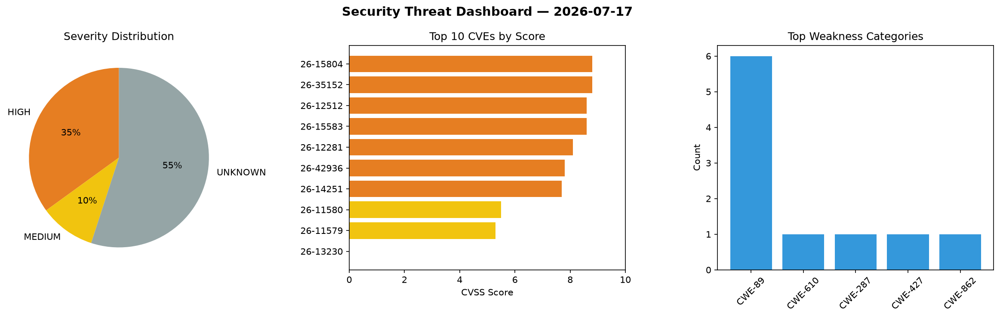
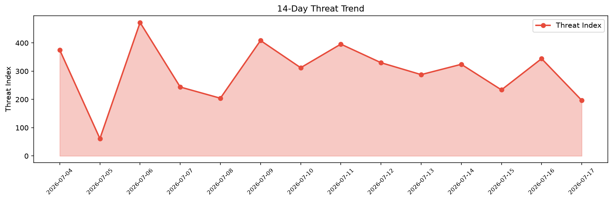

# Security Scan Report — 2026-07-17

**Scan ID:** `3bfa52c3c9` | **CVEs:** 20 | **Threat Index:** 196.8

## Threat Overview

| Metric | Value |
|--------|-------|
| Threat Index | 196.8 |
| Critical CVEs | 0 |
| HIGH | 7 |
| MEDIUM | 2 |
| UNKNOWN | 11 |

## Delta vs Yesterday

| Metric | Today | Yesterday | Change |
|--------|-------|-----------|--------|
| total_cves | 20 | 20 | ➡️ 0.0% |
| threat_index | 196.8 | 344.4 | 📉 -42.9% |
| critical_count | 0 | 3 | 📉 -100.0% |

## Top Weakness Categories

| CWE | Count |
|-----|-------|
| CWE-89 | 6 |
| CWE-610 | 1 |
| CWE-287 | 1 |
| CWE-427 | 1 |
| CWE-862 | 1 |

## CVE Details

| CVE ID | Score | Severity | Description |
|--------|-------|----------|-------------|
| CVE-2026-15804 | 8.8 | HIGH | The HCM developed by MetaGuru has a SQL Injection vulnerability. Authenticated r... |
| CVE-2026-35152 | 8.8 | HIGH | A SQL Injection vulnerability exists in Apache Fineract's Report Execution API (... |
| CVE-2026-12512 | 8.6 | HIGH | The Quotes llama WordPress plugin before 3.1.6 does not properly sanitize and es... |
| CVE-2026-15583 | 8.6 | HIGH | A confused-deputy flaw in Grafana MCP Server allows an unauthenticated remote at... |
| CVE-2026-12281 | 8.1 | HIGH | The Shibboleth WordPress plugin before 2.5.4 does not fail closed when its HTTP ... |
| CVE-2026-42936 | 7.8 | HIGH | The installer of HYPER SBI 2 insecurely loads Dynamic Link Libraries. If there i... |
| CVE-2026-14251 | 7.7 | HIGH | A flaw was found in the OpenShift GitOps operator. The ClusterRole reconciler do... |
| CVE-2026-11580 | 5.5 | MEDIUM | The Kali Forms — Contact Form & Drag-and-Drop Builder WordPress plugin before 2.... |
| CVE-2026-11579 | 5.3 | MEDIUM | The Kali Forms — Contact Form & Drag-and-Drop Builder WordPress plugin before 2.... |
| CVE-2026-13230 | 0.0 | UNKNOWN | An information disclosure vulnerability was identified in TP-Link Kasa EC70 v4 a... |
| CVE-2026-9770 | 0.0 | UNKNOWN | Kasa EC71 v4 and EC70 v4 firmware contains a static cryptographic private key st... |
| CVE-2026-11851 | 0.0 | UNKNOWN | Improper Neutralization of Special Elements used in an SQL Command ("SQL Injecti... |
| CVE-2026-13385 | 0.0 | UNKNOWN | An Improper Validation of Integrity Check Value and Improper Certificate Validat... |
| CVE-2026-13585 | 0.0 | UNKNOWN | Allocation of Resources Without Limits and Throttling and Sensitive Information ... |
| CVE-2026-15029 | 0.0 | UNKNOWN | Untrusted Pointer Dereference in ASUS System Control Interface v3, ASUS System C... |