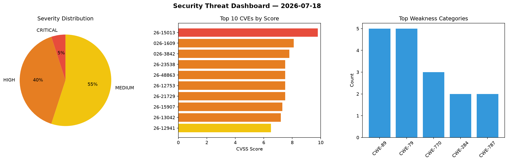
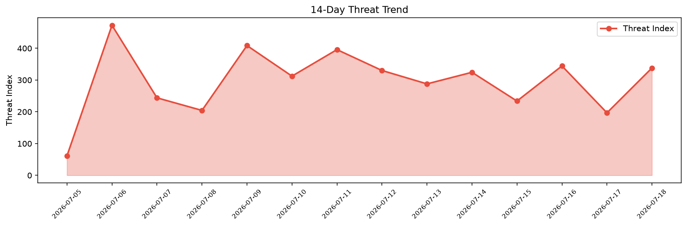

# Security Scan Report — 2026-07-18

**Scan ID:** `a5bcff23f1` | **CVEs:** 20 | **Threat Index:** 338.0

## Threat Overview

| Metric | Value |
|--------|-------|
| Threat Index | 338.0 |
| Critical CVEs | 1 |
| CRITICAL | 1 |
| HIGH | 8 |
| MEDIUM | 11 |

## Delta vs Yesterday

| Metric | Today | Yesterday | Change |
|--------|-------|-----------|--------|
| total_cves | 20 | 20 | ➡️ 0.0% |
| threat_index | 338.0 | 196.8 | 📈 71.7% |
| critical_count | 1 | 0 | ➡️ 0% |

## Top Weakness Categories

| CWE | Count |
|-----|-------|
| CWE-89 | 5 |
| CWE-79 | 5 |
| CWE-770 | 3 |
| CWE-284 | 2 |
| CWE-787 | 2 |

## CVE Details

| CVE ID | Score | Severity | Description |
|--------|-------|----------|-------------|
| CVE-2026-15013 | 9.8 | CRITICAL | The SAML Single Sign On – SSO Login plugin for WordPress is vulnerable to Authen... |
| CVE-2026-1609 | 8.1 | HIGH | A flaw was found in Keycloak. When the JSON Web Token (JWT) authorization grant ... |
| CVE-2026-3842 | 7.8 | HIGH | A flaw was found in QEMU. This vulnerability allows a local attacker within a gu... |
| CVE-2026-23538 | 7.5 | HIGH | A vulnerability was identified in the Feast Feature Server's `/ws/chat` endpoint... |
| CVE-2026-48863 | 7.5 | HIGH | A flaw was found in libsolv. A stack-based buffer overflow vulnerability exists ... |
| CVE-2026-12753 | 7.5 | HIGH | The Advance Product Search- Voice & Ajax Search for WooCommerce plugin for WordP... |
| CVE-2026-21729 | 7.5 | HIGH | Loki queries with large limits can cause large memory allocations which can impa... |
| CVE-2026-15907 | 7.3 | HIGH | A flaw has been found in H3C SecPath F1000-C8300 up to 20260522. This impacts an... |
| CVE-2026-13042 | 7.2 | HIGH | The RPB Chessboard plugin for WordPress is vulnerable to Stored Cross-Site Scrip... |
| CVE-2026-12941 | 6.5 | MEDIUM | The MultiVendorX – WooCommerce Multivendor Marketplace AI Powered Solutions plug... |
| CVE-2026-14987 | 6.4 | MEDIUM | The GiveWP – Donation Plugin and Fundraising Platform plugin for WordPress is vu... |
| CVE-2026-15652 | 6.4 | MEDIUM | The Easy Accordion – AI-Powered FAQ & Accordion Blocks, Product FAQ plugin for W... |
| CVE-2026-15909 | 6.3 | MEDIUM | A vulnerability has been found in RafyMrX TOKO-ONLINE-ROTI up to ddfe1cd587be0a0... |
| CVE-2026-15306 | 6.1 | MEDIUM | The Product Feed Manager For WooCommerce – Sell on 200+ Online Marketplaces plug... |
| CVE-2026-15445 | 4.9 | MEDIUM | The SEO Booster plugin for WordPress is vulnerable to time-based SQL Injection v... |