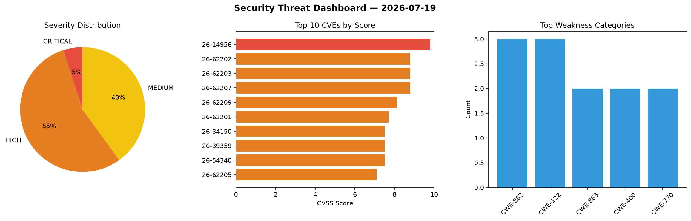
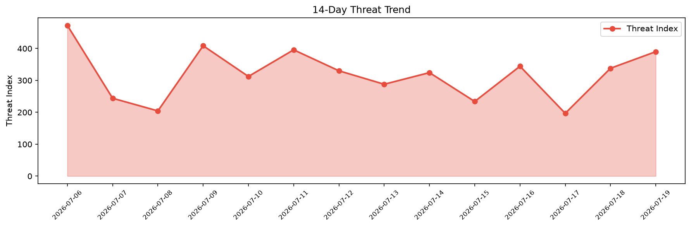

# Security Scan Report — 2026-07-19

**Scan ID:** `a6540b0a0e` | **CVEs:** 20 | **Threat Index:** 390.0

## Threat Overview

| Metric | Value |
|--------|-------|
| Threat Index | 390.0 |
| Critical CVEs | 1 |
| CRITICAL | 1 |
| HIGH | 11 |
| MEDIUM | 8 |

## Delta vs Yesterday

| Metric | Today | Yesterday | Change |
|--------|-------|-----------|--------|
| total_cves | 20 | 20 | ➡️ 0.0% |
| threat_index | 390.0 | 338.0 | 📈 15.4% |
| critical_count | 1 | 1 | ➡️ 0.0% |

## Top Weakness Categories

| CWE | Count |
|-----|-------|
| CWE-862 | 3 |
| CWE-122 | 3 |
| CWE-863 | 2 |
| CWE-400 | 2 |
| CWE-770 | 2 |

## CVE Details

| CVE ID | Score | Severity | Description |
|--------|-------|----------|-------------|
| CVE-2026-14956 | 9.8 | CRITICAL | The Bricksforge plugin for WordPress is vulnerable to Privilege Escalation in al... |
| CVE-2026-62202 | 8.8 | HIGH | OpenClaw versions 2026.6.1 before 2026.6.9 contain a privilege escalation vulner... |
| CVE-2026-62203 | 8.8 | HIGH | OpenClaw versions before 2026.6.6 contain an environment variable filtering vuln... |
| CVE-2026-62207 | 8.8 | HIGH | OpenClaw versions before 2026.6.5 contain an authentication bypass vulnerability... |
| CVE-2026-62209 | 8.1 | HIGH | OpenClaw versions 2026.5.10-beta.1 before 2026.6.5 contain an authorization bypa... |
| CVE-2026-62201 | 7.7 | HIGH | OpenClaw versions before 2026.6.6 contain a network policy bypass vulnerability ... |
| CVE-2026-34150 | 7.5 | HIGH | Wazuh is a free and open source platform used for threat prevention, detection, ... |
| CVE-2026-39359 | 7.5 | HIGH | Wazuh is a free and open source platform used for threat prevention, detection, ... |
| CVE-2026-54340 | 7.5 | HIGH | h2o is an HTTP server with support for HTTP/1.x, HTTP/2 and HTTP/3. Prior to com... |
| CVE-2026-62205 | 7.1 | HIGH | OpenClaw versions 2026.4.12-beta.1 before 2026.6.6 contain a missing-authorizati... |
| CVE-2026-62206 | 7.1 | HIGH | OpenClaw versions before 2026.6.9 contain a missing authorization vulnerability ... |
| CVE-2026-62212 | 7.1 | HIGH | OpenClaw before 2026.5.28 contains a race condition in the MS Teams safeFetch DN... |
| CVE-2026-33754 | 6.5 | MEDIUM | Wazuh is a free and open source platform used for threat prevention, detection, ... |
| CVE-2026-44251 | 6.5 | MEDIUM | Wazuh is a free and open source platform used for threat prevention, detection, ... |
| CVE-2026-62208 | 6.5 | MEDIUM | OpenClaw before 2026.6.5 could forward Authorization headers during MCP SSE redi... |