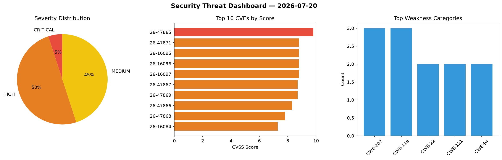
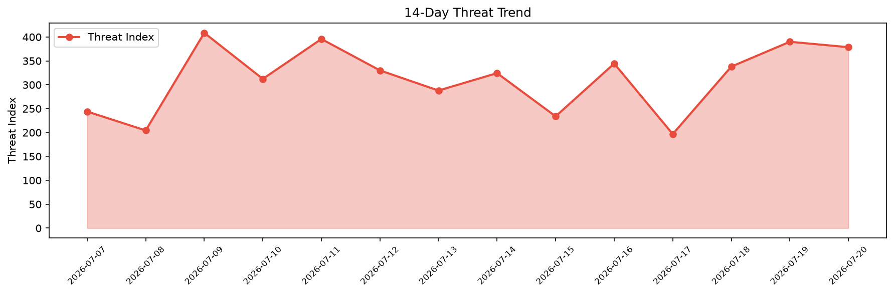

# Security Scan Report — 2026-07-20

**Scan ID:** `babf4fd8b5` | **CVEs:** 20 | **Threat Index:** 378.7

## Threat Overview

| Metric | Value |
|--------|-------|
| Threat Index | 378.7 |
| Critical CVEs | 1 |
| CRITICAL | 1 |
| HIGH | 10 |
| MEDIUM | 9 |

## Delta vs Yesterday

| Metric | Today | Yesterday | Change |
|--------|-------|-----------|--------|
| total_cves | 20 | 20 | ➡️ 0.0% |
| threat_index | 378.7 | 390.0 | 📉 -2.9% |
| critical_count | 1 | 1 | ➡️ 0.0% |

## Top Weakness Categories

| CWE | Count |
|-----|-------|
| CWE-287 | 3 |
| CWE-119 | 3 |
| CWE-22 | 2 |
| CWE-121 | 2 |
| CWE-94 | 2 |

## CVE Details

| CVE ID | Score | Severity | Description |
|--------|-------|----------|-------------|
| CVE-2026-47865 | 9.8 | CRITICAL | VMware Avi Load Balancer contains an authentication bypass vulnerability. A mali... |
| CVE-2026-47871 | 8.8 | HIGH | VMware Avi Load Balancer contains a directory traversal vulnerability. Flaws in ... |
| CVE-2026-16095 | 8.8 | HIGH | A flaw has been found in Shibby Tomato 1.28 RT-N5x MIPSR2 Build 124. Affected by... |
| CVE-2026-16096 | 8.8 | HIGH | A vulnerability has been found in Shibby Tomato 1.28 RT-N5x MIPSR2 Build 124. Th... |
| CVE-2026-16097 | 8.8 | HIGH | A vulnerability was found in Shibby Tomato 1.28. This vulnerability affects the ... |
| CVE-2026-47867 | 8.7 | HIGH | VMware Avi Load Balancer contains a remote code execution vulnerability. A malic... |
| CVE-2026-47869 | 8.7 | HIGH | VMware Avi Load Balancer contains a remote code execution vulnerability. A malic... |
| CVE-2026-47866 | 8.3 | HIGH | VMware Avi Load Balancer contains an authorization bypass vulnerability. A malic... |
| CVE-2026-47868 | 7.8 | HIGH | VMware Avi Load Balancer contains a local privilege escalation vulnerability. A ... |
| CVE-2026-16084 | 7.3 | HIGH | A weakness has been identified in Sipeed PicoClaw up to 0.2.9. This impacts the ... |
| CVE-2026-47870 | 7.1 | HIGH | VMware Avi Load Balancer contains a privilege escalation vulnerability. A malici... |
| CVE-2026-16076 | 6.3 | MEDIUM | A vulnerability has been found in AstrBotDevs AstrBot up to 4.25.5. This issue a... |
| CVE-2026-16077 | 5.3 | MEDIUM | A vulnerability was found in AstrBotDevs AstrBot up to 4.25.5. Impacted is the f... |
| CVE-2026-16082 | 5.3 | MEDIUM | A vulnerability was identified in Sipeed PicoClaw up to 0.2.9. The impacted elem... |
| CVE-2026-16083 | 5.3 | MEDIUM | A security flaw has been discovered in Sipeed PicoClaw up to 0.2.9. This affects... |