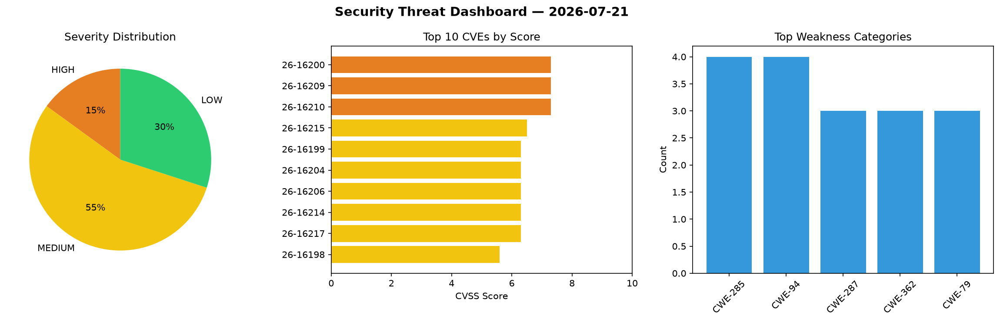
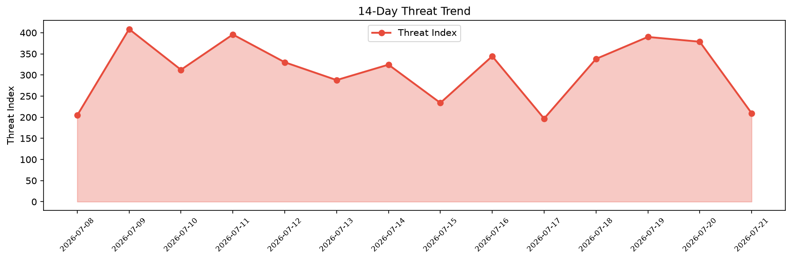

# Security Scan Report — 2026-07-21

**Scan ID:** `a7d862b382` | **CVEs:** 20 | **Threat Index:** 209.5

## Threat Overview

| Metric | Value |
|--------|-------|
| Threat Index | 209.5 |
| Critical CVEs | 0 |
| HIGH | 3 |
| MEDIUM | 11 |
| LOW | 6 |

## Delta vs Yesterday

| Metric | Today | Yesterday | Change |
|--------|-------|-----------|--------|
| total_cves | 20 | 20 | ➡️ 0.0% |
| threat_index | 209.5 | 378.7 | 📉 -44.7% |
| critical_count | 0 | 1 | 📉 -100.0% |

## Top Weakness Categories

| CWE | Count |
|-----|-------|
| CWE-285 | 4 |
| CWE-94 | 4 |
| CWE-287 | 3 |
| CWE-362 | 3 |
| CWE-79 | 3 |

## CVE Details

| CVE ID | Score | Severity | Description |
|--------|-------|----------|-------------|
| CVE-2026-16200 | 7.3 | HIGH | A vulnerability has been found in zevorn rt-claw up to 0.2.0. This impacts the f... |
| CVE-2026-16209 | 7.3 | HIGH | A vulnerability has been found in Gerapy up to 0.9.13. The impacted element is a... |
| CVE-2026-16210 | 7.3 | HIGH | A vulnerability was found in newpanjing simpleui 2026.01.13. This affects the fu... |
| CVE-2026-16215 | 6.5 | MEDIUM | A security flaw has been discovered in geex-arts django-jet up to 1.0.8. This im... |
| CVE-2026-16199 | 6.3 | MEDIUM | A flaw has been found in nextlevelbuilder GoClaw up to 3.13.3-beta.3. This affec... |
| CVE-2026-16204 | 6.3 | MEDIUM | A security flaw has been discovered in zevorn rt-claw up to 0.2.0. This affects ... |
| CVE-2026-16206 | 6.3 | MEDIUM | A security vulnerability has been detected in django-oauth django-oauth-toolkit ... |
| CVE-2026-16214 | 6.3 | MEDIUM | A vulnerability was identified in geex-arts django-jet up to 1.0.8. This affects... |
| CVE-2026-16217 | 6.3 | MEDIUM | A security vulnerability has been detected in guohongze adminset up to 0.61. Aff... |
| CVE-2026-16198 | 5.6 | MEDIUM | A vulnerability was detected in Sipeed PicoClaw up to 0.2.9. The impacted elemen... |
| CVE-2026-16201 | 5.3 | MEDIUM | A vulnerability was found in zevorn rt-claw up to 0.2.0. Affected is the functio... |
| CVE-2026-16208 | 5.0 | MEDIUM | A flaw has been found in django-tastypie up to 0.15.1. The affected element is t... |
| CVE-2026-16216 | 4.3 | MEDIUM | A weakness has been identified in geex-arts django-jet up to 1.0.8. Affected is ... |
| CVE-2026-16212 | 4.2 | MEDIUM | A vulnerability was identified in awesto django-shop up to 1.2.4. Affected is an... |
| CVE-2026-16207 | 3.7 | LOW | A vulnerability was detected in django-tastypie up to 0.15.1. Impacted is the fu... |