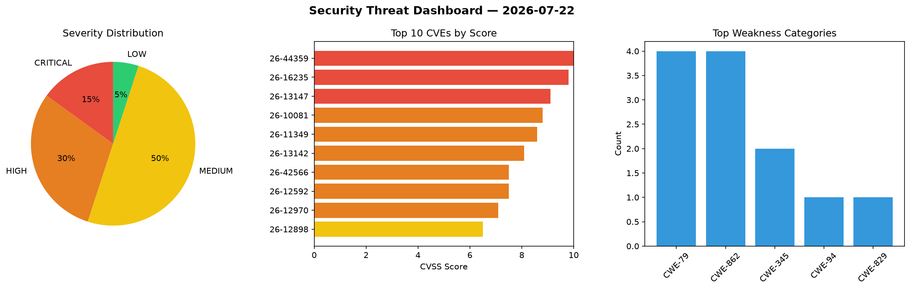
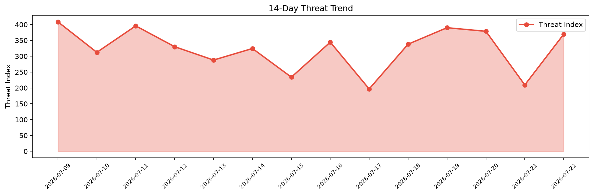

# Security Scan Report — 2026-07-22

**Scan ID:** `5064519064` | **CVEs:** 20 | **Threat Index:** 369.5

## Threat Overview

| Metric | Value |
|--------|-------|
| Threat Index | 369.5 |
| Critical CVEs | 3 |
| CRITICAL | 3 |
| HIGH | 6 |
| MEDIUM | 10 |
| LOW | 1 |

## Delta vs Yesterday

| Metric | Today | Yesterday | Change |
|--------|-------|-----------|--------|
| total_cves | 20 | 20 | ➡️ 0.0% |
| threat_index | 369.5 | 209.5 | 📈 76.4% |
| critical_count | 3 | 0 | ➡️ 0% |

## Top Weakness Categories

| CWE | Count |
|-----|-------|
| CWE-79 | 4 |
| CWE-862 | 4 |
| CWE-345 | 2 |
| CWE-94 | 1 |
| CWE-829 | 1 |

## CVE Details

| CVE ID | Score | Severity | Description |
|--------|-------|----------|-------------|
| CVE-2026-44359 | 10.0 | CRITICAL | Meshtastic is an open source mesh networking solution. Prior to version 2.7.21.1... |
| CVE-2026-16235 | 9.8 | CRITICAL | Crypt::Password versions through 0.28 for Perl generate insecure random values f... |
| CVE-2026-13147 | 9.1 | CRITICAL | The Kirki  WordPress plugin before 6.0.12 does not validate a user-supplied URL ... |
| CVE-2026-10081 | 8.8 | HIGH | The Unlimited Elements For Elementor WordPress plugin before 2.0.11 does not san... |
| CVE-2026-11349 | 8.6 | HIGH | The Modern Event Calendar Pro WordPress plugin before 7.34.0, Modern Events Cale... |
| CVE-2026-13142 | 8.1 | HIGH | The Social Login, Passkeys, Magic Link & Email OTP  WordPress plugin before 1.4.... |
| CVE-2026-42566 | 7.5 | HIGH | Meshtastic is an open source mesh networking solution. Prior to version 2.7.23.b... |
| CVE-2026-12592 | 7.5 | HIGH | The SlimStat Analytics WordPress plugin before 5.5.0 does not escape a visitor-c... |
| CVE-2026-12970 | 7.1 | HIGH | The LearnPress  WordPress plugin before 4.4.1 does not escape a search parameter... |
| CVE-2026-12898 | 6.5 | MEDIUM | The All-in-One WP Migration and Backup WordPress plugin before 7.106 does not pr... |
| CVE-2026-12973 | 6.5 | MEDIUM | The PayPlus Payment Gateway WordPress plugin before 8.2.2 does not perform autho... |
| CVE-2026-45138 | 5.4 | MEDIUM | CI4MS is a CodeIgniter 4-based content management system skeleton. Prior to vers... |
| CVE-2026-13156 | 5.4 | MEDIUM | The MailerSend  WordPress plugin before 1.0.8 does not perform a nonce check on ... |
| CVE-2026-13432 | 5.4 | MEDIUM | The ThumbPress  WordPress plugin before 6.2.2 does not perform a capability chec... |
| CVE-2026-11868 | 5.3 | MEDIUM | The WP Travel  WordPress plugin before 11.7.1 does not perform capability or own... |