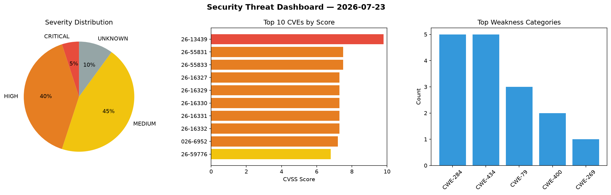
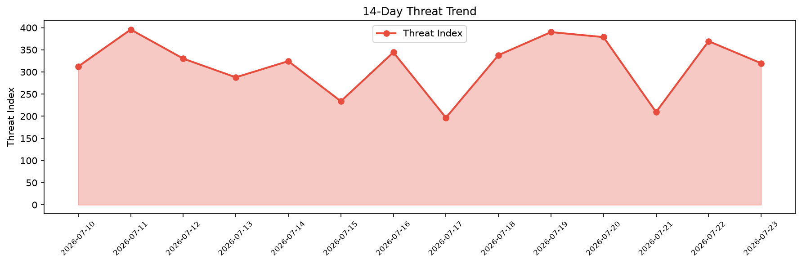

# Security Scan Report — 2026-07-23

**Scan ID:** `1b9b255349` | **CVEs:** 20 | **Threat Index:** 319.7

## Threat Overview

| Metric | Value |
|--------|-------|
| Threat Index | 319.7 |
| Critical CVEs | 1 |
| CRITICAL | 1 |
| HIGH | 8 |
| MEDIUM | 9 |
| UNKNOWN | 2 |

## Delta vs Yesterday

| Metric | Today | Yesterday | Change |
|--------|-------|-----------|--------|
| total_cves | 20 | 20 | ➡️ 0.0% |
| threat_index | 319.7 | 369.5 | 📉 -13.5% |
| critical_count | 1 | 3 | 📉 -66.7% |

## Top Weakness Categories

| CWE | Count |
|-----|-------|
| CWE-284 | 5 |
| CWE-434 | 5 |
| CWE-79 | 3 |
| CWE-400 | 2 |
| CWE-269 | 1 |

## CVE Details

| CVE ID | Score | Severity | Description |
|--------|-------|----------|-------------|
| CVE-2026-13439 | 9.8 | CRITICAL | The Easy Form Builder by WhiteStudio plugin for WordPress is vulnerable to Unaut... |
| CVE-2026-55831 | 7.5 | HIGH | Netty is a network application framework for development of protocol servers and... |
| CVE-2026-55833 | 7.5 | HIGH | Netty is a network application framework for development of protocol servers and... |
| CVE-2026-16327 | 7.3 | HIGH | A vulnerability was determined in D-Link DNS-320 1.0.2. This issue affects some ... |
| CVE-2026-16329 | 7.3 | HIGH | A vulnerability was identified in D-Link DNS-320 1.0.2. Impacted is an unknown f... |
| CVE-2026-16330 | 7.3 | HIGH | A weakness has been identified in D-Link DNS-320 1.0.2. The impacted element is ... |
| CVE-2026-16331 | 7.3 | HIGH | A security vulnerability has been detected in D-Link DNS-320 1.0.2. This affects... |
| CVE-2026-16332 | 7.3 | HIGH | A vulnerability was detected in D-Link DNS-320 1.0.2. This impacts an unknown fu... |
| CVE-2026-6952 | 7.2 | HIGH | A post-authentication command injection vulnerability in the "LogServer" field o... |
| CVE-2026-59776 | 6.8 | MEDIUM | Missing Cryptographic Step (CWE-325) vulnerability exists in certain FeliCa IC c... |
| CVE-2026-63729 | 6.6 | MEDIUM | The SyncTeX parser (synctex_parser.c) shipped with TeX Live and embedded by down... |
| CVE-2026-15156 | 6.4 | MEDIUM | The Essential Addons for Elementor – Popular Elementor Templates & Widgets plugi... |
| CVE-2026-63728 | 6.3 | MEDIUM | Gitleaks prior to 8.30.1 contains a template injection vulnerability that allows... |
| CVE-2026-16334 | 6.3 | MEDIUM | A vulnerability was identified in itsourcecode Hospital Management System 1.0. T... |
| CVE-2026-15811 | 5.8 | MEDIUM | A vulnerability was found in kronosnet's (version <=1.34) cryptographic configur... |