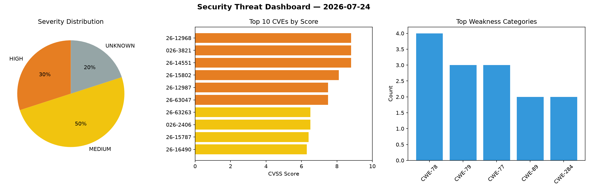
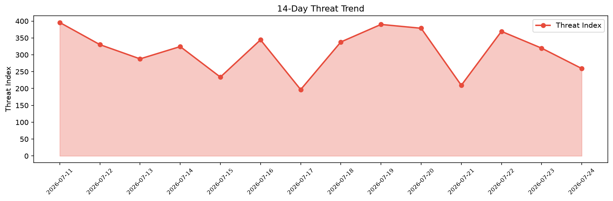

# Security Scan Report — 2026-07-24

**Scan ID:** `46cfa83909` | **CVEs:** 20 | **Threat Index:** 259.3

## Threat Overview

| Metric | Value |
|--------|-------|
| Threat Index | 259.3 |
| Critical CVEs | 0 |
| HIGH | 6 |
| MEDIUM | 10 |
| UNKNOWN | 4 |

## Delta vs Yesterday

| Metric | Today | Yesterday | Change |
|--------|-------|-----------|--------|
| total_cves | 20 | 20 | ➡️ 0.0% |
| threat_index | 259.3 | 319.7 | 📉 -18.9% |
| critical_count | 0 | 1 | 📉 -100.0% |

## Top Weakness Categories

| CWE | Count |
|-----|-------|
| CWE-78 | 4 |
| CWE-79 | 3 |
| CWE-77 | 3 |
| CWE-89 | 2 |
| CWE-284 | 2 |

## CVE Details

| CVE ID | Score | Severity | Description |
|--------|-------|----------|-------------|
| CVE-2026-12968 | 8.8 | HIGH | The Product Addons and Product Options With Custom Fields  WordPress plugin befo... |
| CVE-2026-3821 | 8.8 | HIGH | Supermicro (SMC) SMASH services contain an Arbitrary code execution issue in X14... |
| CVE-2026-14551 | 8.8 | HIGH | The servereye client (also known as sensorhub, technically ClientAgentContainerS... |
| CVE-2026-15802 | 8.1 | HIGH | The WP Foodbakery plugin for WordPress is vulnerable to arbitrary file deletion ... |
| CVE-2026-12987 | 7.5 | HIGH | The Events Manager  WordPress plugin before 7.3.7 does not safely handle booking... |
| CVE-2026-63047 | 7.5 | HIGH | Joomla Extension - joomdonation.com - Invoice data exfiltration via incorrect AC... |
| CVE-2026-63263 | 6.5 | MEDIUM | Uncontrolled Resource Consumption (CWE-400) in Elasticsearch can lead to denial ... |
| CVE-2026-2406 | 6.5 | MEDIUM | Authorization bypass through User-Controlled key vulnerability in Universe Softw... |
| CVE-2026-15787 | 6.4 | MEDIUM | The Ultimate Addons for Elementor plugin for WordPress is vulnerable to Stored C... |
| CVE-2026-16490 | 6.3 | MEDIUM | A security flaw has been discovered in itsourcecode Hospital Management System 1... |
| CVE-2026-16492 | 5.5 | MEDIUM | A weakness has been identified in umijs umi up to 4.6.63. The affected element i... |
| CVE-2026-16489 | 5.3 | MEDIUM | A vulnerability was identified in jsforce up to 3.10.16. This issue affects the ... |
| CVE-2026-14322 | 5.3 | MEDIUM | The Timetics  WordPress plugin before 1.0.57 does not enforce a pending or unpai... |
| CVE-2026-16488 | 5.0 | MEDIUM | A vulnerability was determined in QUSETIONS MiniCode-Python 0.1.0. This vulnerab... |
| CVE-2026-63262 | 4.3 | MEDIUM | Missing Authorization (CWE-862) in Kibana can lead to unauthorized cross-space i... |