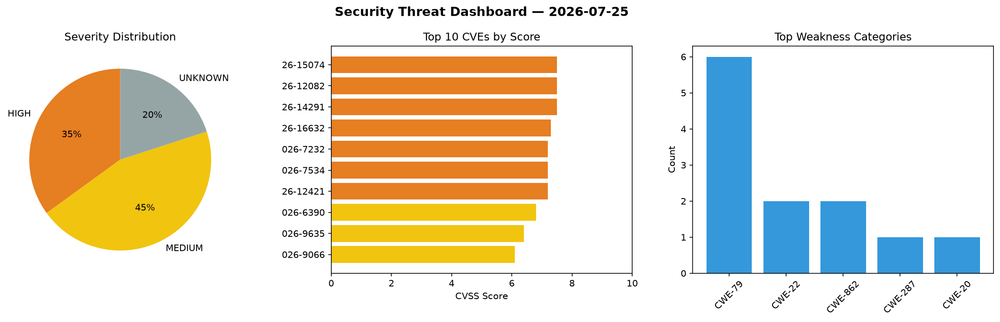
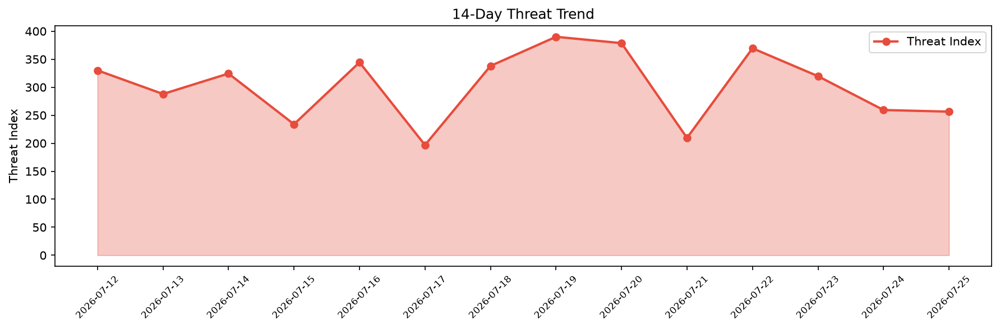

# Security Scan Report — 2026-07-25

**Scan ID:** `d0eb8397cc` | **CVEs:** 20 | **Threat Index:** 256.4

## Threat Overview

| Metric | Value |
|--------|-------|
| Threat Index | 256.4 |
| Critical CVEs | 0 |
| HIGH | 7 |
| MEDIUM | 9 |
| UNKNOWN | 4 |

## Delta vs Yesterday

| Metric | Today | Yesterday | Change |
|--------|-------|-----------|--------|
| total_cves | 20 | 20 | ➡️ 0.0% |
| threat_index | 256.4 | 259.3 | 📉 -1.1% |
| critical_count | 0 | 0 | ➡️ 0% |

## Top Weakness Categories

| CWE | Count |
|-----|-------|
| CWE-79 | 6 |
| CWE-22 | 2 |
| CWE-862 | 2 |
| CWE-287 | 1 |
| CWE-20 | 1 |

## CVE Details

| CVE ID | Score | Severity | Description |
|--------|-------|----------|-------------|
| CVE-2026-15074 | 7.5 | HIGH | @fastify/static up to and including version 10.1.0 fails to reject dot-dot path ... |
| CVE-2026-12082 | 7.5 | HIGH | The Praison AI SEO WordPress plugin before 5.0.7 does not perform authorization ... |
| CVE-2026-14291 | 7.5 | HIGH | The security-ninja-premium WordPress plugin before 5.290 does not verify the sec... |
| CVE-2026-16632 | 7.3 | HIGH | A flaw has been found in boazsegev facil.io up to 0.7.4. Affected is the functio... |
| CVE-2026-7232 | 7.2 | HIGH | The FormCraft plugin for WordPress is vulnerable to Stored Cross-Site Scripting ... |
| CVE-2026-7534 | 7.2 | HIGH | The SUMO Reward Points plugin for WordPress is vulnerable to Unauthenticated Sto... |
| CVE-2026-12421 | 7.2 | HIGH | The ARforms plugin for WordPress is vulnerable to Stored Cross-Site Scripting vi... |
| CVE-2026-6390 | 6.8 | MEDIUM | A flaw was found in GNU nano's multi-buffer error message handling. When a user ... |
| CVE-2026-9635 | 6.4 | MEDIUM | The WP Shortcode by MyThemeShop plugin for WordPress is vulnerable to Stored Cro... |
| CVE-2026-9066 | 6.1 | MEDIUM | The WP Compress  WordPress plugin before 7.10.04 does not validate the value of ... |
| CVE-2026-63226 | 5.8 | MEDIUM | Printers and Multifunction Printers (MFPs) provided by Ricoh Company, Ltd. do no... |
| CVE-2026-16631 | 5.3 | MEDIUM | A vulnerability was detected in publint up to 0.1.4. This impacts the function c... |
| CVE-2026-16653 | 5.3 | MEDIUM | A security flaw has been discovered in boazsegev facil.io up to 0.7.58. This aff... |
| CVE-2026-21723 | 5.3 | MEDIUM | The alertmanager templates test endpoint (/api/alertmanager/grafana/config/api/v... |
| CVE-2026-7120 | 5.3 | MEDIUM | @fastify/static evaluates the allowedPath callback before normalizing dot segmen... |