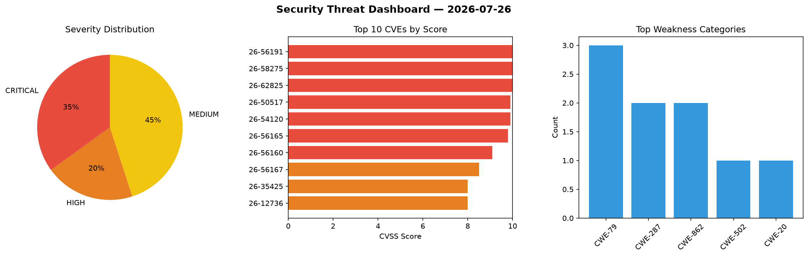
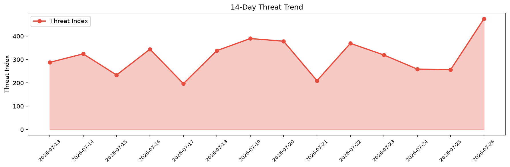

# Security Scan Report — 2026-07-26

**Scan ID:** `5088761041` | **CVEs:** 20 | **Threat Index:** 475.1

## Threat Overview

| Metric | Value |
|--------|-------|
| Threat Index | 475.1 |
| Critical CVEs | 7 |
| CRITICAL | 7 |
| HIGH | 4 |
| MEDIUM | 9 |

## Delta vs Yesterday

| Metric | Today | Yesterday | Change |
|--------|-------|-----------|--------|
| total_cves | 20 | 20 | ➡️ 0.0% |
| threat_index | 475.1 | 256.4 | 📈 85.3% |
| critical_count | 7 | 0 | ➡️ 0% |

## Top Weakness Categories

| CWE | Count |
|-----|-------|
| CWE-79 | 3 |
| CWE-287 | 2 |
| CWE-862 | 2 |
| CWE-502 | 1 |
| CWE-20 | 1 |

## CVE Details

| CVE ID | Score | Severity | Description |
|--------|-------|----------|-------------|
| CVE-2026-56191 | 10.0 | CRITICAL | Improper authentication in Microsoft Exchange Online allows an unauthorized atta... |
| CVE-2026-58275 | 10.0 | CRITICAL | Missing authorization in Azure DNS allows an unauthorized attacker to elevate pr... |
| CVE-2026-62825 | 10.0 | CRITICAL | Improper authentication in Azure Key Vault allows an unauthorized attacker to el... |
| CVE-2026-50517 | 9.9 | CRITICAL | Deserialization of untrusted data in M365 Copilot allows an authorized attacker ... |
| CVE-2026-54120 | 9.9 | CRITICAL | Improper input validation in Microsoft Surface allows an authorized attacker to ... |
| CVE-2026-56165 | 9.8 | CRITICAL | Heap-based buffer overflow in Microsoft Account allows an unauthorized attacker ... |
| CVE-2026-56160 | 9.1 | CRITICAL | Improper authorization in Azure Red Hat OpenShift (ARO) allows an authorized att... |
| CVE-2026-56167 | 8.5 | HIGH | Server-side request forgery (ssrf) in Azure AI Search allows an authorized attac... |
| CVE-2026-35425 | 8.0 | HIGH | Improper access control in Azure API Management (APIM) allows an authorized atta... |
| CVE-2026-12736 | 8.0 | HIGH | The Wpify Woo plugin for WordPress is vulnerable to Privilege Escalation in vers... |
| CVE-2026-66138 | 7.2 | HIGH | In OpenStack Ironic Python Agent through 11.6.0, a project-scoped user with the ... |
| CVE-2026-49159 | 6.5 | MEDIUM | Exposure of sensitive information to an unauthorized actor in Microsoft Graph al... |
| CVE-2026-11922 | 6.5 | MEDIUM | A vulnerability in zenml-io/zenml versions 0.57.0 through 0.94.2 allows an attac... |
| CVE-2025-9205 | 6.4 | MEDIUM | The MapSVG plugin for WordPress is vulnerable to Stored Cross-Site Scripting in ... |
| CVE-2026-15100 | 6.4 | MEDIUM | The Post Grid Gutenberg Blocks – PostX plugin for WordPress is vulnerable to Sto... |