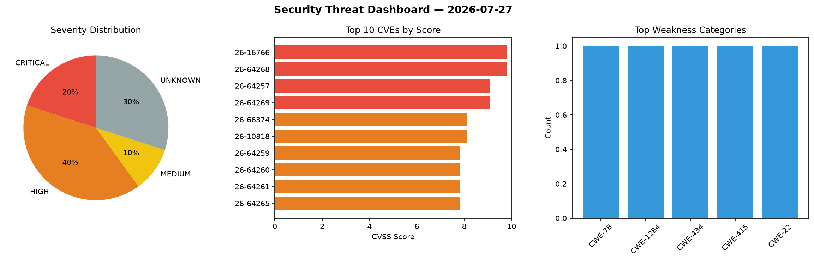
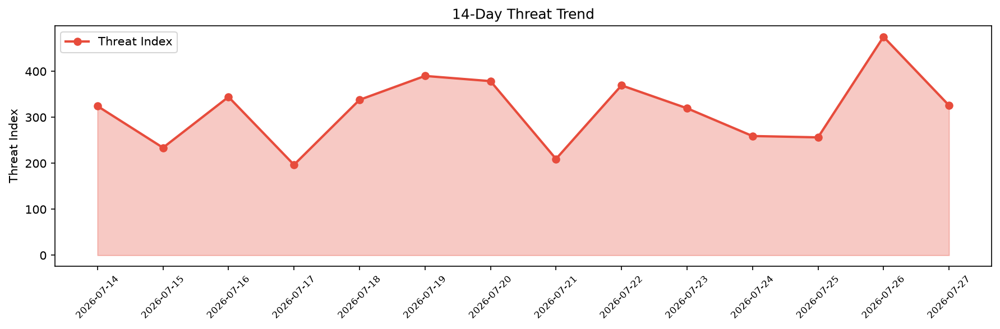

# Security Scan Report — 2026-07-27

**Scan ID:** `de0a7aa073` | **CVEs:** 20 | **Threat Index:** 325.9

## Threat Overview

| Metric | Value |
|--------|-------|
| Threat Index | 325.9 |
| Critical CVEs | 3 |
| CRITICAL | 3 |
| HIGH | 8 |
| MEDIUM | 2 |
| UNKNOWN | 7 |

## Delta vs Yesterday

| Metric | Today | Yesterday | Change |
|--------|-------|-----------|--------|
| total_cves | 20 | 20 | ➡️ 0.0% |
| threat_index | 325.9 | 475.1 | 📉 -31.4% |
| critical_count | 3 | 7 | 📉 -57.1% |

## Top Weakness Categories

| CWE | Count |
|-----|-------|
| CWE-1284 | 1 |
| CWE-434 | 1 |
| CWE-415 | 1 |
| CWE-22 | 1 |
| CWE-79 | 1 |

## CVE Details

| CVE ID | Score | Severity | Description |
|--------|-------|----------|-------------|
| CVE-2026-64268 | 9.8 | CRITICAL | In the Linux kernel, the following vulnerability has been resolved:

RDMA/siw: b... |
| CVE-2026-64257 | 9.1 | CRITICAL | In the Linux kernel, the following vulnerability has been resolved:

smb: client... |
| CVE-2026-64269 | 9.1 | CRITICAL | In the Linux kernel, the following vulnerability has been resolved:

RDMA/rtrs-s... |
| CVE-2026-66374 | 8.1 | HIGH | Knot Resolver before 6.4.1 allows remote code execution via a heap-based buffer ... |
| CVE-2026-10818 | 8.1 | HIGH | The WPForms Pro plugin for WordPress is vulnerable to Arbitrary File Upload in a... |
| CVE-2026-64259 | 7.8 | HIGH | In the Linux kernel, the following vulnerability has been resolved:

fuse-uring:... |
| CVE-2026-64260 | 7.8 | HIGH | In the Linux kernel, the following vulnerability has been resolved:

fuse-uring:... |
| CVE-2026-64261 | 7.8 | HIGH | In the Linux kernel, the following vulnerability has been resolved:

fuse-uring:... |
| CVE-2026-64265 | 7.8 | HIGH | In the Linux kernel, the following vulnerability has been resolved:

fuse: clear... |
| CVE-2026-64266 | 7.8 | HIGH | In the Linux kernel, the following vulnerability has been resolved:

fuse: re-lo... |
| CVE-2026-66373 | 7.5 | HIGH | Redis before 8.8.0, in the unusual case where an authenticated attacker can exec... |
| CVE-2026-14955 | 6.5 | MEDIUM | The Checkout Field Editor for WooCommerce (Pro) plugin for WordPress is vulnerab... |
| CVE-2026-15425 | 6.4 | MEDIUM | The Yoast SEO – Advanced SEO with real-time guidance and built-in AI plugin for ... |
| CVE-2026-16766 | 0.0 | UNKNOWN | Catalyst::View::Wkhtmltopdf versions before 0.6.1 for Perl allow shell command i... |
| CVE-2026-64256 | 0.0 | UNKNOWN | In the Linux kernel, the following vulnerability has been resolved:

xfs: don't ... |