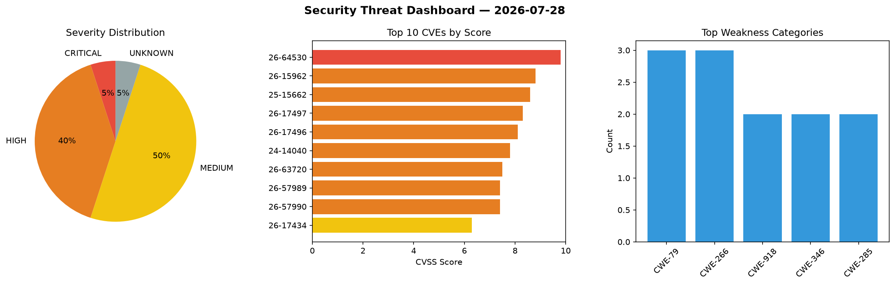
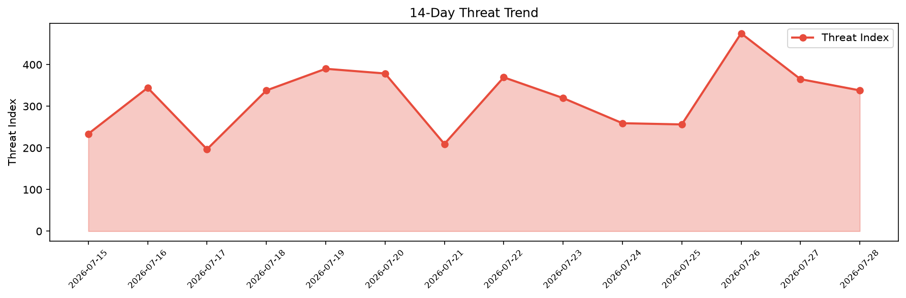

# Security Scan Report — 2026-07-28

**Scan ID:** `ba96085783` | **CVEs:** 20 | **Threat Index:** 338.1

## Threat Overview

| Metric | Value |
|--------|-------|
| Threat Index | 338.1 |
| Critical CVEs | 1 |
| CRITICAL | 1 |
| HIGH | 8 |
| MEDIUM | 10 |
| UNKNOWN | 1 |

## Delta vs Yesterday

| Metric | Today | Yesterday | Change |
|--------|-------|-----------|--------|
| total_cves | 20 | 20 | ➡️ 0.0% |
| threat_index | 338.1 | 365.1 | 📉 -7.4% |
| critical_count | 1 | 4 | 📉 -75.0% |

## Top Weakness Categories

| CWE | Count |
|-----|-------|
| CWE-79 | 3 |
| CWE-266 | 3 |
| CWE-918 | 2 |
| CWE-346 | 2 |
| CWE-285 | 2 |

## CVE Details

| CVE ID | Score | Severity | Description |
|--------|-------|----------|-------------|
| CVE-2026-64530 | 9.8 | CRITICAL | In the Linux kernel, the following vulnerability has been resolved:

net/sched: ... |
| CVE-2026-15962 | 8.8 | HIGH | The Fluent Forms Pro Add On Pack plugin for WordPress is vulnerable to PHP Objec... |
| CVE-2025-15662 | 8.6 | HIGH | The Printcart Web to Print Product Designer for WooCommerce WordPress plugin bef... |
| CVE-2026-17497 | 8.3 | HIGH | NoteGen before 0.32.0 grants the Tauri shell plugin shell:allow-execute capabili... |
| CVE-2026-17496 | 8.1 | HIGH | NoteGen before 0.32.0 renders AI chat responses with markdown-it configured with... |
| CVE-2024-14040 | 7.8 | HIGH | In the Linux kernel, the following vulnerability has been resolved:

net: nextho... |
| CVE-2026-63720 | 7.5 | HIGH | datamodel-code-generator prior to version 0.70.0 contains a code injection vulne... |
| CVE-2026-57989 | 7.4 | HIGH | Origin validation error in Microsoft Edge (Chromium-based) allows an unauthorize... |
| CVE-2026-57990 | 7.4 | HIGH | Files or directories accessible to external parties in Microsoft Edge (Chromium-... |
| CVE-2026-17434 | 6.3 | MEDIUM | A flaw has been found in nanocoai NanoClaw up to 2.0.64. Affected is the functio... |
| CVE-2026-17458 | 6.3 | MEDIUM | A vulnerability was found in mf-yang openclaw-cn up to 0.2.1. This affects the f... |
| CVE-2026-10082 | 6.1 | MEDIUM | The Advanced Ads  WordPress plugin before 2.0.23 does not sanitize and escape a ... |
| CVE-2026-57978 | 5.4 | MEDIUM | Origin validation error in Microsoft Edge (Chromium-based) allows an unauthorize... |
| CVE-2026-17433 | 5.3 | MEDIUM | A vulnerability was detected in nanocoai NanoClaw up to 2.0.64. This impacts the... |
| CVE-2026-17500 | 5.3 | MEDIUM | A vulnerability was detected in ggml-org llama.cpp d006858/e15efe0. This affects... |