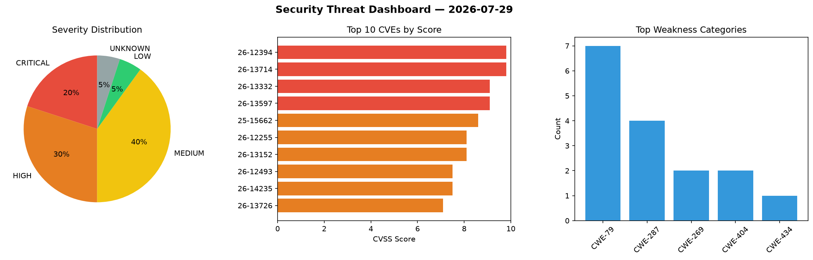
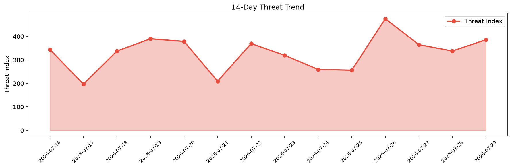

# Security Scan Report — 2026-07-29

**Scan ID:** `47aee082ac` | **CVEs:** 20 | **Threat Index:** 385.9

## Threat Overview

| Metric | Value |
|--------|-------|
| Threat Index | 385.9 |
| Critical CVEs | 4 |
| CRITICAL | 4 |
| HIGH | 6 |
| MEDIUM | 8 |
| LOW | 1 |
| UNKNOWN | 1 |

## Delta vs Yesterday

| Metric | Today | Yesterday | Change |
|--------|-------|-----------|--------|
| total_cves | 20 | 20 | ➡️ 0.0% |
| threat_index | 385.9 | 338.1 | 📈 14.1% |
| critical_count | 4 | 1 | 📈 300.0% |

## Top Weakness Categories

| CWE | Count |
|-----|-------|
| CWE-79 | 7 |
| CWE-287 | 4 |
| CWE-269 | 2 |
| CWE-404 | 2 |
| CWE-434 | 1 |

## CVE Details

| CVE ID | Score | Severity | Description |
|--------|-------|----------|-------------|
| CVE-2026-12394 | 9.8 | CRITICAL | The MemberGlut  WordPress plugin before 1.1.5 does not validate the role chosen ... |
| CVE-2026-13714 | 9.8 | CRITICAL | The Realtyna Organic IDX plugin + WPL Real Estate WordPress plugin before 5.3.0 ... |
| CVE-2026-13332 | 9.1 | CRITICAL | The Masteriyo LMS  WordPress plugin before 2.3.1 does not correctly verify autho... |
| CVE-2026-13597 | 9.1 | CRITICAL | The 微信二维码登陆 WordPress plugin through 1.3 does not properly validate WeChat webho... |
| CVE-2025-15662 | 8.6 | HIGH | The Printcart Web to Print Product Designer for WooCommerce WordPress plugin bef... |
| CVE-2026-12255 | 8.1 | HIGH | The MainWP Child  WordPress plugin before 6.1.2 does not verify the requester's ... |
| CVE-2026-13152 | 8.1 | HIGH | The Custom Fields Account Registration For Woocommerce WordPress plugin before 1... |
| CVE-2026-12493 | 7.5 | HIGH | The Clover Payment Gateway by Zaytech for WooCommerce WordPress plugin before 1.... |
| CVE-2026-14235 | 7.5 | HIGH | The Download Manager WordPress plugin before 3.3.62 does not bind its temporary ... |
| CVE-2026-13726 | 7.1 | HIGH | The MPG  WordPress plugin before 4.1.8 does not sanitise and escape a parameter ... |
| CVE-2026-10082 | 6.1 | MEDIUM | The Advanced Ads  WordPress plugin before 2.0.23 does not sanitize and escape a ... |
| CVE-2026-12982 | 6.1 | MEDIUM | The Document Gallery WordPress plugin before 5.1.1 does not properly sanitise an... |
| CVE-2026-13400 | 6.1 | MEDIUM | Simply Schedule Appointments is vulnerable to unauthenticated Stored Cross-Site ... |
| CVE-2026-14190 | 6.1 | MEDIUM | The Sina Extension for Elementor WordPress plugin before 3.10.2 does not escape ... |
| CVE-2026-17500 | 5.3 | MEDIUM | A vulnerability was detected in ggml-org llama.cpp d006858/e15efe0. This affects... |