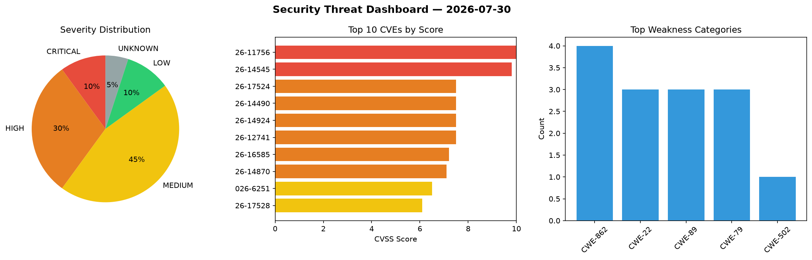
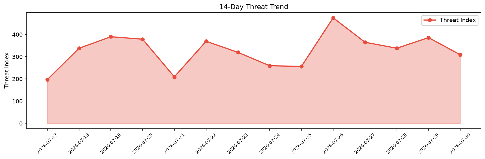

# Security Scan Report — 2026-07-30

**Scan ID:** `1a39764a24` | **CVEs:** 20 | **Threat Index:** 308.7

## Threat Overview

| Metric | Value |
|--------|-------|
| Threat Index | 308.7 |
| Critical CVEs | 2 |
| CRITICAL | 2 |
| HIGH | 6 |
| MEDIUM | 9 |
| LOW | 2 |
| UNKNOWN | 1 |

## Delta vs Yesterday

| Metric | Today | Yesterday | Change |
|--------|-------|-----------|--------|
| total_cves | 20 | 20 | ➡️ 0.0% |
| threat_index | 308.7 | 385.9 | 📉 -20.0% |
| critical_count | 2 | 4 | 📉 -50.0% |

## Top Weakness Categories

| CWE | Count |
|-----|-------|
| CWE-862 | 4 |
| CWE-22 | 3 |
| CWE-89 | 3 |
| CWE-79 | 3 |
| CWE-502 | 1 |

## CVE Details

| CVE ID | Score | Severity | Description |
|--------|-------|----------|-------------|
| CVE-2026-11756 | 10.0 | CRITICAL | A Deserialization of Untrusted Data vulnerability affecting Station Launcher App... |
| CVE-2026-14545 | 9.8 | CRITICAL | The TrueBooker  WordPress plugin before 1.2.4 does not validate account ownershi... |
| CVE-2026-17524 | 7.5 | HIGH | Versions of the package zip-lib before 1.1.0 are vulnerable to Directory Travers... |
| CVE-2026-14490 | 7.5 | HIGH | The Demi – One Click Demo Import, WP Backup & Site Migration plugin for WordPres... |
| CVE-2026-14924 | 7.5 | HIGH | The Tablesome Table  WordPress plugin before 1.1.31 does not perform any authent... |
| CVE-2026-12741 | 7.5 | HIGH | The WP Fast Total Search – The Power of Indexed Search plugin for WordPress is v... |
| CVE-2026-16585 | 7.2 | HIGH | The Better Messages – Chat Rooms, Group Chat, Private Messages & AI Chat Bots pl... |
| CVE-2026-14870 | 7.1 | HIGH | The Database for Contact Form 7, WPforms, Elementor forms WordPress plugin befor... |
| CVE-2026-6251 | 6.5 | MEDIUM | The Chaty Pro plugin for WordPress is vulnerable to Authenticated Time-Based Bli... |
| CVE-2026-17528 | 6.1 | MEDIUM | Versions of the package nice-select2 before 2.4.1 are vulnerable to Cross-site S... |
| CVE-2026-12124 | 5.3 | MEDIUM | The PDFDraft – Drag & Drop PDF Builder, PDF Viewer, Embed & Download PDF, Certif... |
| CVE-2026-15012 | 5.3 | MEDIUM | The Demi – One Click Demo Import, WP Backup & Site Migration plugin for WordPres... |
| CVE-2026-16811 | 4.9 | MEDIUM | The ShopLentor – All-in-One WooCommerce Growth & Store Enhancement Plugin plugin... |
| CVE-2026-15136 | 4.3 | MEDIUM | The Cookie Banner for GDPR / CCPA – WPLP Cookie Consent plugin for WordPress is ... |
| CVE-2026-16587 | 4.3 | MEDIUM | The Advanced Form Integration — Connect Forms to 200+ Apps plugin for WordPress ... |