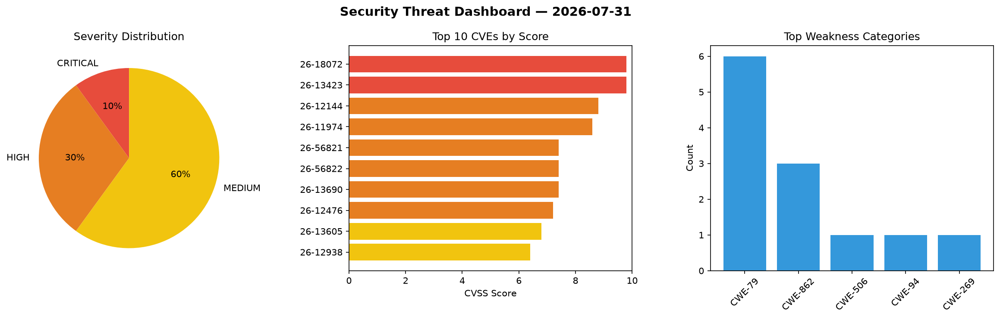
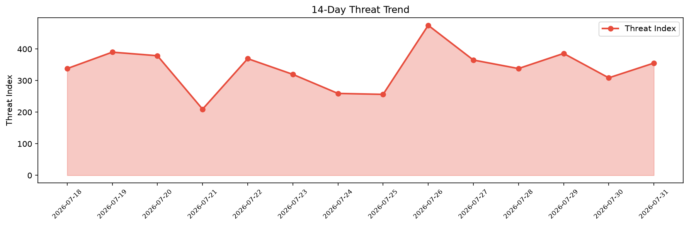

# Security Scan Report — 2026-07-31

**Scan ID:** `134757dd4f` | **CVEs:** 20 | **Threat Index:** 355.4

## Threat Overview

| Metric | Value |
|--------|-------|
| Threat Index | 355.4 |
| Critical CVEs | 2 |
| CRITICAL | 2 |
| HIGH | 6 |
| MEDIUM | 12 |

## Delta vs Yesterday

| Metric | Today | Yesterday | Change |
|--------|-------|-----------|--------|
| total_cves | 20 | 20 | ➡️ 0.0% |
| threat_index | 355.4 | 308.7 | 📈 15.1% |
| critical_count | 2 | 2 | ➡️ 0.0% |

## Top Weakness Categories

| CWE | Count |
|-----|-------|
| CWE-79 | 6 |
| CWE-862 | 3 |
| CWE-506 | 1 |
| CWE-94 | 1 |
| CWE-269 | 1 |

## CVE Details

| CVE ID | Score | Severity | Description |
|--------|-------|----------|-------------|
| CVE-2026-18072 | 9.8 | CRITICAL | The Advanced Responsive Video Embedder for Rumble, Odysee, YouTube, Vimeo, Kick ... |
| CVE-2026-13423 | 9.8 | CRITICAL | The Streamit WordPress theme through 4.5.0 does not perform any authorization or... |
| CVE-2026-12144 | 8.8 | HIGH | The Wholesale for WooCommerce plugin for WordPress is vulnerable to Privilege Es... |
| CVE-2026-11974 | 8.6 | HIGH | The wp-media-folder-addon WordPress plugin through 4.1.6 does not validate a use... |
| CVE-2026-56821 | 7.4 | HIGH | Netty is an asynchronous, event-driven network application framework. Prior to v... |
| CVE-2026-56822 | 7.4 | HIGH | Netty is an asynchronous, event-driven network application framework. Prior to v... |
| CVE-2026-13690 | 7.4 | HIGH | The UsersWP  WordPress plugin before 1.2.67 does not validate the selected authe... |
| CVE-2026-12476 | 7.2 | HIGH | The Easy Digital Downloads plugin for WordPress is vulnerable to Arbitrary File ... |
| CVE-2026-13605 | 6.8 | MEDIUM | The PhotoSwipe WordPress plugin through 4.1.1.1 uses the title attribute of auth... |
| CVE-2026-12938 | 6.4 | MEDIUM | The Newsletters Lite plugin for WordPress is vulnerable to Stored Cross-Site Scr... |
| CVE-2026-12939 | 6.4 | MEDIUM | The Newsletters Lite plugin for WordPress is vulnerable to Stored Cross-Site Scr... |
| CVE-2026-15735 | 6.4 | MEDIUM | The Contact Form to Any API plugin for WordPress is vulnerable to Stored Cross-S... |
| CVE-2026-17161 | 6.4 | MEDIUM | The WowStore – Store Builder & Product Blocks for WooCommerce plugin for WordPre... |
| CVE-2026-17162 | 6.4 | MEDIUM | The WowStore – Store Builder & Product Blocks for WooCommerce plugin for WordPre... |
| CVE-2026-14224 | 5.4 | MEDIUM | The Easy Appointments WordPress plugin through 3.12.26 does not verify that the ... |