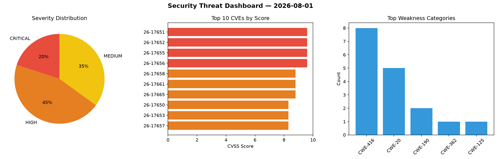
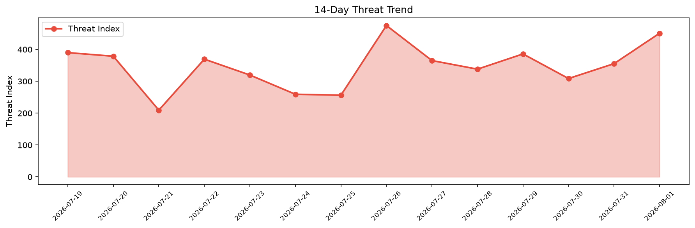

# Security Scan Report — 2026-08-01

**Scan ID:** `483c518a71` | **CVEs:** 20 | **Threat Index:** 450.9

## Threat Overview

| Metric | Value |
|--------|-------|
| Threat Index | 450.9 |
| Critical CVEs | 4 |
| CRITICAL | 4 |
| HIGH | 9 |
| MEDIUM | 7 |

## Delta vs Yesterday

| Metric | Today | Yesterday | Change |
|--------|-------|-----------|--------|
| total_cves | 20 | 20 | ➡️ 0.0% |
| threat_index | 450.9 | 355.4 | 📈 26.9% |
| critical_count | 4 | 2 | 📈 100.0% |

## Top Weakness Categories

| CWE | Count |
|-----|-------|
| CWE-416 | 8 |
| CWE-20 | 5 |
| CWE-190 | 2 |
| CWE-362 | 1 |
| CWE-125 | 1 |

## CVE Details

| CVE ID | Score | Severity | Description |
|--------|-------|----------|-------------|
| CVE-2026-17651 | 9.6 | CRITICAL | Insufficient validation of untrusted input in Dawn in Google Chrome on Android p... |
| CVE-2026-17652 | 9.6 | CRITICAL | Use after free in Views in Google Chrome prior to 151.0.7922.72 allowed a remote... |
| CVE-2026-17655 | 9.6 | CRITICAL | Insufficient validation of untrusted input in ANGLE in Google Chrome prior to 15... |
| CVE-2026-17656 | 9.6 | CRITICAL | Use after free in Ozone in Google Chrome prior to 151.0.7922.72 allowed a remote... |
| CVE-2026-17658 | 8.8 | HIGH | Use after free in V8 in Google Chrome prior to 151.0.7922.72 allowed a remote at... |
| CVE-2026-17661 | 8.8 | HIGH | Use after free in Loader in Google Chrome prior to 151.0.7922.72 allowed a remot... |
| CVE-2026-17665 | 8.8 | HIGH | Use after free in V8 in Google Chrome prior to 151.0.7922.72 allowed a remote at... |
| CVE-2026-17650 | 8.3 | HIGH | Use after free in Compositing in Google Chrome prior to 151.0.7922.72 allowed a ... |
| CVE-2026-17653 | 8.3 | HIGH | Use after free in Skia in Google Chrome prior to 151.0.7922.72 allowed a remote ... |
| CVE-2026-17657 | 8.3 | HIGH | Use after free in Navigation in Google Chrome prior to 151.0.7922.72 allowed a r... |
| CVE-2026-17660 | 8.3 | HIGH | Insufficient validation of untrusted input in Network in Google Chrome prior to ... |
| CVE-2026-17663 | 8.3 | HIGH | Insufficient validation of untrusted input in GPU in Google Chrome on Android pr... |
| CVE-2026-17654 | 7.8 | HIGH | Race in Updater in Google Chrome on Mac prior to 151.0.7922.72 allowed a local a... |
| CVE-2026-17664 | 6.5 | MEDIUM | Insufficient validation of untrusted input in Loader in Google Chrome prior to 1... |
| CVE-2026-64685 | 5.3 | MEDIUM | ImageMagick is free and open-source software used for editing and manipulating d... |