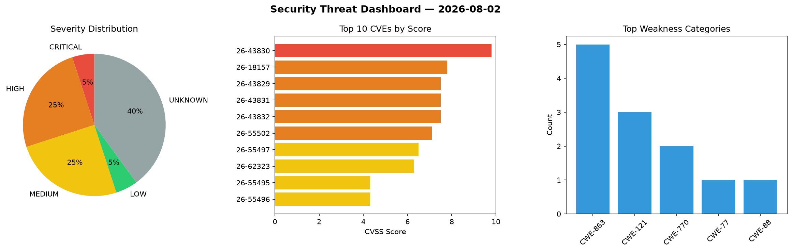
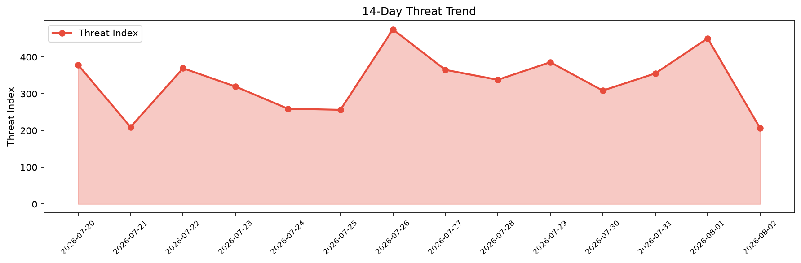

# Security Scan Report — 2026-08-02

**Scan ID:** `8ce1e03464` | **CVEs:** 20 | **Threat Index:** 206.1

## Threat Overview

| Metric | Value |
|--------|-------|
| Threat Index | 206.1 |
| Critical CVEs | 1 |
| CRITICAL | 1 |
| HIGH | 5 |
| MEDIUM | 5 |
| LOW | 1 |
| UNKNOWN | 8 |

## Delta vs Yesterday

| Metric | Today | Yesterday | Change |
|--------|-------|-----------|--------|
| total_cves | 20 | 20 | ➡️ 0.0% |
| threat_index | 206.1 | 450.9 | 📉 -54.3% |
| critical_count | 1 | 4 | 📉 -75.0% |

## Top Weakness Categories

| CWE | Count |
|-----|-------|
| CWE-863 | 5 |
| CWE-121 | 3 |
| CWE-770 | 2 |
| CWE-77 | 1 |
| CWE-88 | 1 |

## CVE Details

| CVE ID | Score | Severity | Description |
|--------|-------|----------|-------------|
| CVE-2026-43830 | 9.8 | CRITICAL | Full details and mitigation steps are currently restricted and will be published... |
| CVE-2026-18157 | 7.8 | HIGH | A flaw was found in yggdrasil-worker-package-manager. A local attacker with exis... |
| CVE-2026-43829 | 7.5 | HIGH | Full details and mitigation steps are currently restricted and will be published... |
| CVE-2026-43831 | 7.5 | HIGH | Full details and mitigation steps are currently restricted and will be published... |
| CVE-2026-43832 | 7.5 | HIGH | Full details and mitigation steps are currently restricted and will be published... |
| CVE-2026-55502 | 7.1 | HIGH | Cloudreve is a self-hosted file management and sharing system. Prior to 4.17.0, ... |
| CVE-2026-55497 | 6.5 | MEDIUM | Cloudreve is a self-hosted file management and sharing system. Prior to 4.17.0, ... |
| CVE-2026-62323 | 6.3 | MEDIUM | Cloudreve is a self-hosted file management and sharing system. Prior to 4.17.0, ... |
| CVE-2026-55495 | 4.3 | MEDIUM | Cloudreve is a self-hosted file management and sharing system. Prior to 4.17.0, ... |
| CVE-2026-55496 | 4.3 | MEDIUM | Cloudreve is a self-hosted file management and sharing system. Prior to 4.17.0, ... |
| CVE-2026-55499 | 4.3 | MEDIUM | Cloudreve is a self-hosted file management and sharing system. Prior to 4.17.0, ... |
| CVE-2026-58039 | 3.3 | LOW | A flaw in Node.js Permission Model enforcement allows process.report writes (and... |
| CVE-2026-14537 | 0.0 | UNKNOWN | Incorrect Authorization in the direct HTTP API tool invocation endpoint in Googl... |
| CVE-2026-14538 | 0.0 | UNKNOWN | An improper authorization and security-boundary bypass vulnerability in the bigq... |
| CVE-2026-14539 | 0.0 | UNKNOWN | An allocation of resources without limits vulnerability in the HTTP handler comp... |