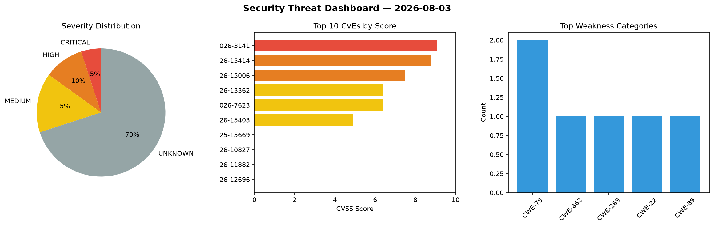
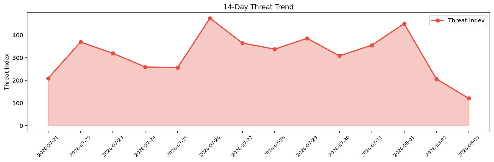

# Security Scan Report — 2026-08-03

**Scan ID:** `9e8d9d4166` | **CVEs:** 20 | **Threat Index:** 120.7

## Threat Overview

| Metric | Value |
|--------|-------|
| Threat Index | 120.7 |
| Critical CVEs | 1 |
| CRITICAL | 1 |
| HIGH | 2 |
| MEDIUM | 3 |
| UNKNOWN | 14 |

## Delta vs Yesterday

| Metric | Today | Yesterday | Change |
|--------|-------|-----------|--------|
| total_cves | 20 | 20 | ➡️ 0.0% |
| threat_index | 120.7 | 206.1 | 📉 -41.4% |
| critical_count | 1 | 1 | ➡️ 0.0% |

## Top Weakness Categories

| CWE | Count |
|-----|-------|
| CWE-79 | 2 |
| CWE-862 | 1 |
| CWE-269 | 1 |
| CWE-22 | 1 |
| CWE-89 | 1 |

## CVE Details

| CVE ID | Score | Severity | Description |
|--------|-------|----------|-------------|
| CVE-2026-3141 | 9.1 | CRITICAL | The FormGent plugin for WordPress is vulnerable to unauthorized arbitrary file d... |
| CVE-2026-15414 | 8.8 | HIGH | The Subscriptions for WooCommerce plugin for WordPress is vulnerable to Privileg... |
| CVE-2026-15006 | 7.5 | HIGH | The Bit integrations – Form Integration, Webhook, Spreadsheets, CRM, LMS & Email... |
| CVE-2026-13362 | 6.4 | MEDIUM | The SendPulse Email Marketing Newsletter plugin for WordPress is vulnerable to S... |
| CVE-2026-7623 | 6.4 | MEDIUM | The SureForms – Contact Form, Payment Form & Other Custom Form Builder plugin fo... |
| CVE-2026-15403 | 4.9 | MEDIUM | The Pinpoint Booking System – Version 2 plugin for WordPress is vulnerable to bl... |
| CVE-2025-15669 | 0.0 | UNKNOWN | The Bit Form  WordPress plugin before 3.1.4 does not sanitise one of its convers... |
| CVE-2026-10827 | 0.0 | UNKNOWN | The Spectra Legacy  WordPress plugin before 2.20.0 does not validate or escape s... |
| CVE-2026-11882 | 0.0 | UNKNOWN | The Builderall for WordPress plugin before 3.0.2 does not bind the state value o... |
| CVE-2026-12696 | 0.0 | UNKNOWN | The wpForo Forum WordPress plugin before 3.1.2 does not sanitize and escape a us... |
| CVE-2026-12966 | 0.0 | UNKNOWN | The Direct Payments for WooCommerce  WordPress plugin before 2.5.3 does not veri... |
| CVE-2026-13157 | 0.0 | UNKNOWN | The  Demo Import WordPress plugin through 1.1.3 does not validate the type of fi... |
| CVE-2026-13158 | 0.0 | UNKNOWN | The Everest Toolkit WordPress plugin through 1.2.3 does not validate the type of... |
| CVE-2026-13329 | 0.0 | UNKNOWN | The Buckaroo Woocommerce Payments Plugin WordPress plugin before 4.9.0 does not ... |
| CVE-2026-13596 | 0.0 | UNKNOWN | The Participants Database WordPress plugin before 2.7.8.4 does not properly sani... |