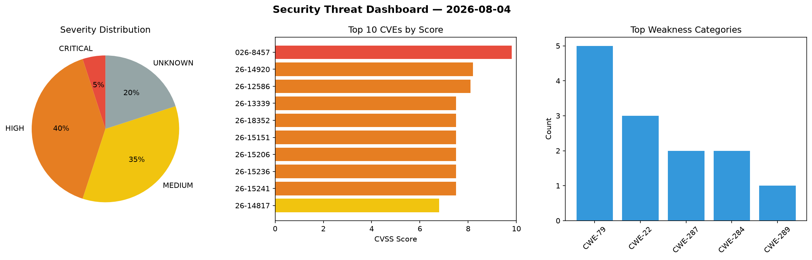
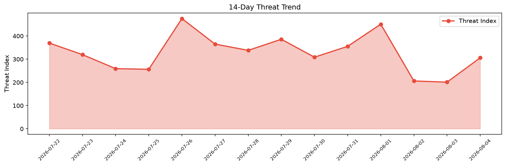

# Security Scan Report — 2026-08-04

**Scan ID:** `37d9594cf7` | **CVEs:** 20 | **Threat Index:** 306.1

## Threat Overview

| Metric | Value |
|--------|-------|
| Threat Index | 306.1 |
| Critical CVEs | 1 |
| CRITICAL | 1 |
| HIGH | 8 |
| MEDIUM | 7 |
| UNKNOWN | 4 |

## Delta vs Yesterday

| Metric | Today | Yesterday | Change |
|--------|-------|-----------|--------|
| total_cves | 20 | 20 | ➡️ 0.0% |
| threat_index | 306.1 | 201.1 | 📈 52.2% |
| critical_count | 1 | 2 | 📉 -50.0% |

## Top Weakness Categories

| CWE | Count |
|-----|-------|
| CWE-79 | 5 |
| CWE-22 | 3 |
| CWE-287 | 2 |
| CWE-284 | 2 |
| CWE-289 | 1 |

## CVE Details

| CVE ID | Score | Severity | Description |
|--------|-------|----------|-------------|
| CVE-2026-8457 | 9.8 | CRITICAL | The WooCommerce - Social Login plugin for WordPress is vulnerable to Authenticat... |
| CVE-2026-14920 | 8.2 | HIGH | ## Summary... |
| CVE-2026-12586 | 8.1 | HIGH | The Lenxel WP WordPress theme through 1.0.31 does not perform any authorization ... |
| CVE-2026-13339 | 7.5 | HIGH | The CubeWP Framework plugin for WordPress is vulnerable to Directory Traversal i... |
| CVE-2026-18352 | 7.5 | HIGH | The User Access Manager plugin for WordPress is vulnerable to Directory Traversa... |
| CVE-2026-15151 | 7.5 | HIGH | The Five Star Restaurant Reservations  WordPress plugin before 2.7.23 does not p... |
| CVE-2026-15206 | 7.5 | HIGH | The SMS Alert  WordPress plugin before 3.9.8 does not bind its "mobile verified"... |
| CVE-2026-15236 | 7.5 | HIGH | The Gallery for Google Photos  WordPress plugin before 1.2.1 does not properly r... |
| CVE-2026-15241 | 7.5 | HIGH | The AI ChatBot for WooCommerce  WordPress plugin before 4.8.4 does not perform a... |
| CVE-2026-14817 | 6.8 | MEDIUM | The Element Pack Addons for Elementor  WordPress plugin before 8.7.13 does not s... |
| CVE-2026-9335 | 6.5 | MEDIUM | A vulnerability in keras-team/keras versions <= 3.14.0 allows arbitrary local HD... |
| CVE-2026-13389 | 6.5 | MEDIUM | The webtoffee-cookie-consent WordPress plugin before 3.5.3 does not perform auth... |
| CVE-2026-14841 | 6.1 | MEDIUM | The King Addons for Elementor  WordPress plugin before 51.1.76 does not escape a... |
| CVE-2026-14864 | 5.4 | MEDIUM | The JetEngine WordPress plugin before 3.8.12 does not escape a post meta value b... |
| CVE-2026-15385 | 5.4 | MEDIUM | The RT Mega Menu  WordPress plugin before 1.5.2 does not perform a capability ch... |