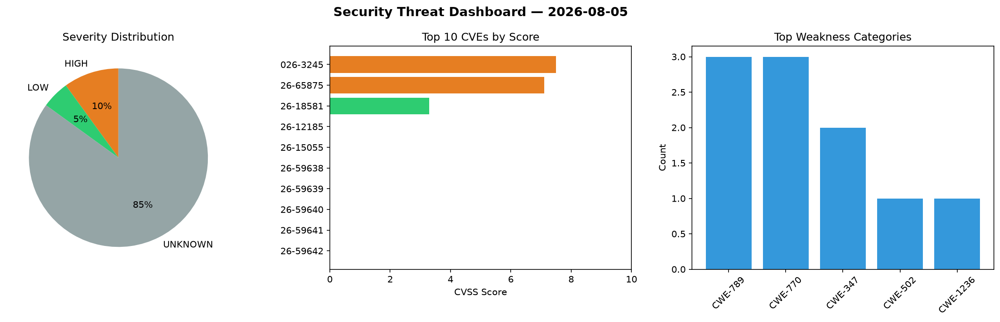
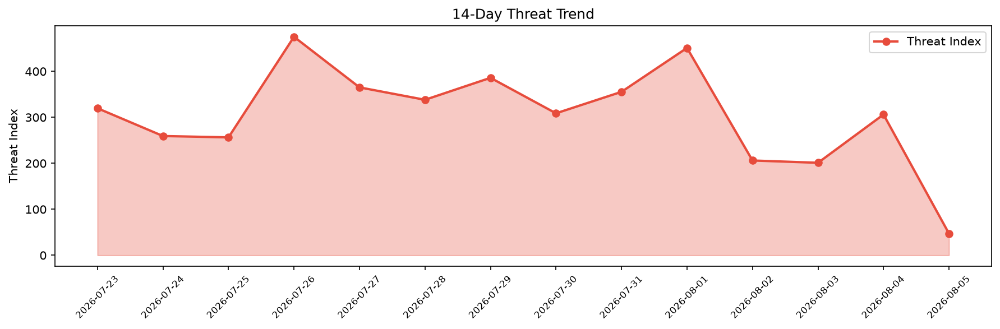

# Security Scan Report — 2026-08-05

**Scan ID:** `942491d829` | **CVEs:** 20 | **Threat Index:** 47.1

## Threat Overview

| Metric | Value |
|--------|-------|
| Threat Index | 47.1 |
| Critical CVEs | 0 |
| HIGH | 2 |
| LOW | 1 |
| UNKNOWN | 17 |

## Delta vs Yesterday

| Metric | Today | Yesterday | Change |
|--------|-------|-----------|--------|
| total_cves | 20 | 20 | ➡️ 0.0% |
| threat_index | 47.1 | 306.1 | 📉 -84.6% |
| critical_count | 0 | 1 | 📉 -100.0% |

## Top Weakness Categories

| CWE | Count |
|-----|-------|
| CWE-789 | 3 |
| CWE-770 | 3 |
| CWE-347 | 2 |
| CWE-502 | 1 |
| CWE-1236 | 1 |

## CVE Details

| CVE ID | Score | Severity | Description |
|--------|-------|----------|-------------|
| CVE-2026-3245 | 7.5 | HIGH | A deserialization vulnerability in PRISMAproduction Version 6.5 or earlier that ... |
| CVE-2026-65875 | 7.1 | HIGH | BaserCMS provided by baserCMS Users Community contains a CSV file injection vuln... |
| CVE-2026-18581 | 3.3 | LOW | A vulnerability was determined in ggml-org llama.cpp e15efe0. Affected by this i... |
| CVE-2026-12185 | 0.0 | UNKNOWN | In Bouncy Castle for Java before 1.85, BKS/UBER keystore allocates from untruste... |
| CVE-2026-15055 | 0.0 | UNKNOWN | In Bouncy Castle for Java before 1.85, PKCS#8 / PBES2 decryptors honour unbounde... |
| CVE-2026-59638 | 0.0 | UNKNOWN | In Bouncy Castle for Java before 1.85, JSSE hostname verifier CN-fallback enable... |
| CVE-2026-59639 | 0.0 | UNKNOWN | In Bouncy Castle for Java before 1.85, CMS verifySignatures returns true for Sig... |
| CVE-2026-59640 | 0.0 | UNKNOWN | In Bouncy Castle for Java before 1.85, OpenPGP CFB quick-check oracle active on ... |
| CVE-2026-59641 | 0.0 | UNKNOWN | In Bouncy Castle for Java before 1.85, S/MIME validator trusts signer-asserted s... |
| CVE-2026-59642 | 0.0 | UNKNOWN | In Bouncy Castle for Java before 1.85, CMS AuthenticatedData content not bound t... |
| CVE-2026-59643 | 0.0 | UNKNOWN | In Bouncy Castle for Java before 1.85, OpenPGP inline-signature policy failures ... |
| CVE-2026-59644 | 0.0 | UNKNOWN | In Bouncy Castle for Java before 1.85, MLS hash-ratchet honours arbitrary 32-bit... |
| CVE-2026-59645 | 0.0 | UNKNOWN | In Bouncy Castle for Java before 1.85, OER parser recurses without depth limit o... |
| CVE-2026-59646 | 0.0 | UNKNOWN | In Bouncy Castle for Java before 1.85, DTLS handshake reassembler allocates buff... |
| CVE-2026-59647 | 0.0 | UNKNOWN | In Bouncy Castle for Java before 1.85, CRMF/CMP password-MAC honours unbounded i... |