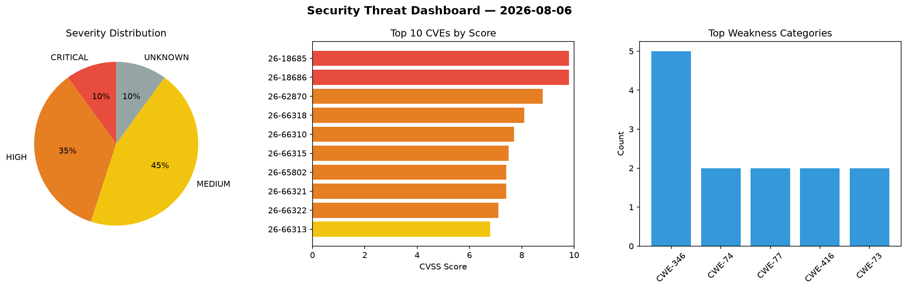
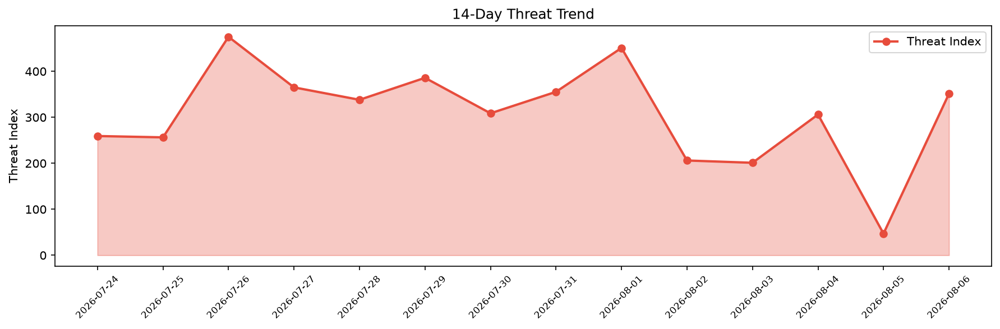

# Security Scan Report — 2026-08-06

**Scan ID:** `7c3efe2c1e` | **CVEs:** 20 | **Threat Index:** 351.4

## Threat Overview

| Metric | Value |
|--------|-------|
| Threat Index | 351.4 |
| Critical CVEs | 2 |
| CRITICAL | 2 |
| HIGH | 7 |
| MEDIUM | 9 |
| UNKNOWN | 2 |

## Delta vs Yesterday

| Metric | Today | Yesterday | Change |
|--------|-------|-----------|--------|
| total_cves | 20 | 20 | ➡️ 0.0% |
| threat_index | 351.4 | 47.1 | 📈 646.1% |
| critical_count | 2 | 0 | ➡️ 0% |

## Top Weakness Categories

| CWE | Count |
|-----|-------|
| CWE-346 | 5 |
| CWE-74 | 2 |
| CWE-77 | 2 |
| CWE-416 | 2 |
| CWE-73 | 2 |

## CVE Details

| CVE ID | Score | Severity | Description |
|--------|-------|----------|-------------|
| CVE-2026-18685 | 9.8 | CRITICAL | A security vulnerability has been detected in GL.iNet GL-MT3000 up to 4.4.5. Imp... |
| CVE-2026-18686 | 9.8 | CRITICAL | A vulnerability was detected in GL.iNet GL-MT3000 up to 4.4.5. The affected elem... |
| CVE-2026-62870 | 8.8 | HIGH | Use after free in Microsoft Office Excel allows an unauthorized attacker to exec... |
| CVE-2026-66318 | 8.1 | HIGH | Origin validation error in Microsoft Edge (Chromium-based) allows an unauthorize... |
| CVE-2026-66310 | 7.7 | HIGH | External control of file name or path in Microsoft Edge for Android allows an un... |
| CVE-2026-66315 | 7.5 | HIGH | Use after free in Microsoft Edge (Chromium-based) allows an unauthorized attacke... |
| CVE-2026-65802 | 7.4 | HIGH | External control of file name or path in Microsoft Edge for Android allows an un... |
| CVE-2026-66321 | 7.4 | HIGH | Access of resource using incompatible type ('type confusion') in Microsoft Edge ... |
| CVE-2026-66322 | 7.1 | HIGH | Origin validation error in Microsoft Edge (Chromium-based) allows an unauthorize... |
| CVE-2026-66313 | 6.8 | MEDIUM | Origin validation error in Microsoft Edge (Chromium-based) allows an unauthorize... |
| CVE-2026-66312 | 6.5 | MEDIUM | Buffer over-read in Microsoft Edge (Chromium-based) allows an authorized attacke... |
| CVE-2026-66314 | 6.5 | MEDIUM | Time-of-check time-of-use (toctou) race condition in Microsoft Edge (Chromium-ba... |
| CVE-2026-66326 | 6.5 | MEDIUM | Missing authorization in Microsoft Edge (Chromium-based) allows an unauthorized ... |
| CVE-2026-66311 | 6.2 | MEDIUM | Missing authorization in Microsoft Edge (Chromium-based) allows an unauthorized ... |
| CVE-2026-65804 | 6.1 | MEDIUM | Improper control of generation of code ('code injection') in Microsoft Edge (Chr... |