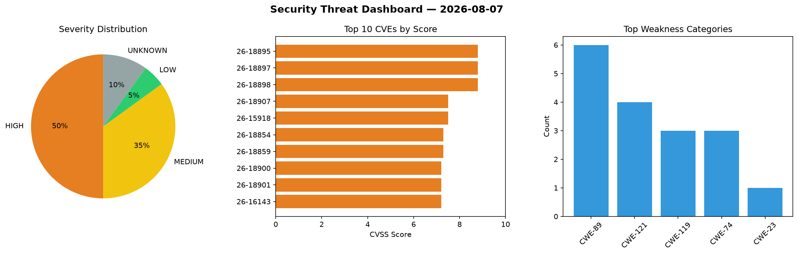
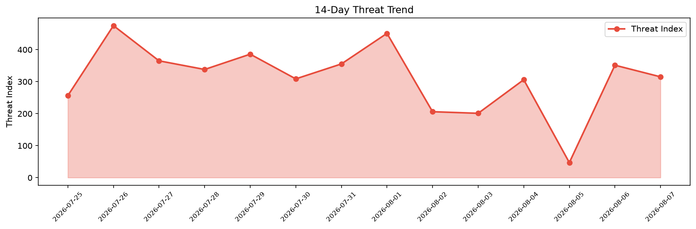

# Security Scan Report — 2026-08-07

**Scan ID:** `5de54f4701` | **CVEs:** 20 | **Threat Index:** 315.1

## Threat Overview

| Metric | Value |
|--------|-------|
| Threat Index | 315.1 |
| Critical CVEs | 0 |
| HIGH | 10 |
| MEDIUM | 7 |
| LOW | 1 |
| UNKNOWN | 2 |

## Delta vs Yesterday

| Metric | Today | Yesterday | Change |
|--------|-------|-----------|--------|
| total_cves | 20 | 20 | ➡️ 0.0% |
| threat_index | 315.1 | 351.4 | 📉 -10.3% |
| critical_count | 0 | 2 | 📉 -100.0% |

## Top Weakness Categories

| CWE | Count |
|-----|-------|
| CWE-89 | 6 |
| CWE-121 | 4 |
| CWE-119 | 3 |
| CWE-74 | 3 |
| CWE-23 | 1 |

## CVE Details

| CVE ID | Score | Severity | Description |
|--------|-------|----------|-------------|
| CVE-2026-18895 | 8.8 | HIGH | A vulnerability was found in UTT HiPER 1250GW up to 3.2.7-210907-180535. Impacte... |
| CVE-2026-18897 | 8.8 | HIGH | A vulnerability was identified in UTT HiPER 1250GW up to v3.2.7-210907-180535. T... |
| CVE-2026-18898 | 8.8 | HIGH | A security flaw has been discovered in UTT HiPER 1200GW up to v2.5.3-170306. Thi... |
| CVE-2026-18907 | 7.5 | HIGH | Path Traversal in Download File Feature in com.talpa.hibrowser 2.23.1.1 on Andro... |
| CVE-2026-15918 | 7.5 | HIGH | VikAppointments Service Booking Calendar wordpress plugin is vulnerable to unaut... |
| CVE-2026-18854 | 7.3 | HIGH | A vulnerability has been found in Shandong Hoteam PDM Product Data Management Sy... |
| CVE-2026-18859 | 7.3 | HIGH | A vulnerability was identified in ESAFENET CDG up to 20260615. Affected is an un... |
| CVE-2026-18900 | 7.2 | HIGH | A weakness has been identified in H3C NX15 V100R017. This impacts the function f... |
| CVE-2026-18901 | 7.2 | HIGH | A security vulnerability has been detected in H3C NX15 V100R017. Affected is the... |
| CVE-2026-16143 | 7.2 | HIGH | The VikRentItems – Flexible Rental Management System plugin for WordPress is vul... |
| CVE-2026-11421 | 6.5 | MEDIUM | The ERP: Complete HR, Accounting & CRM Suite with WooCommerce CRM Support plugin... |
| CVE-2026-15941 | 6.5 | MEDIUM | The plugin provides an Admin Search page that allows users with the `edit_posts`... |
| CVE-2026-18896 | 6.3 | MEDIUM | A vulnerability was determined in lavkush-maurya Student-Registration-System 1.0... |
| CVE-2026-18853 | 5.3 | MEDIUM | A security vulnerability has been detected in ZomboDroid Meme Generator App 4.68... |
| CVE-2026-45705 | 5.3 | MEDIUM | OpenSIPS is a Session Initiation Protocol (SIP) server implementation. In versio... |