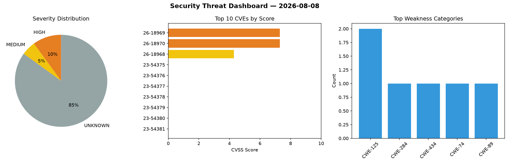
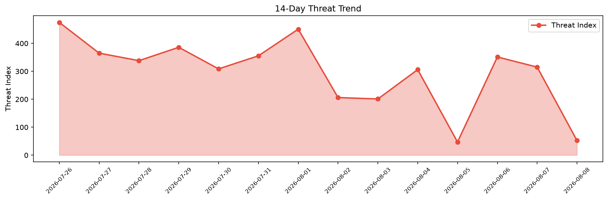

# Security Scan Report — 2026-08-08

**Scan ID:** `85ed1a25d3` | **CVEs:** 20 | **Threat Index:** 52.4

## Threat Overview

| Metric | Value |
|--------|-------|
| Threat Index | 52.4 |
| Critical CVEs | 0 |
| HIGH | 2 |
| MEDIUM | 1 |
| UNKNOWN | 17 |

## Delta vs Yesterday

| Metric | Today | Yesterday | Change |
|--------|-------|-----------|--------|
| total_cves | 20 | 20 | ➡️ 0.0% |
| threat_index | 52.4 | 315.1 | 📉 -83.4% |
| critical_count | 0 | 0 | ➡️ 0% |

## Top Weakness Categories

| CWE | Count |
|-----|-------|
| CWE-125 | 2 |
| CWE-284 | 1 |
| CWE-434 | 1 |
| CWE-74 | 1 |
| CWE-89 | 1 |

## CVE Details

| CVE ID | Score | Severity | Description |
|--------|-------|----------|-------------|
| CVE-2026-18969 | 7.3 | HIGH | A vulnerability was detected in Rongzhitong Visual Integrated Command and Dispat... |
| CVE-2026-18970 | 7.3 | HIGH | A flaw has been found in Rongzhitong Visual Integrated Command and Dispatch Plat... |
| CVE-2026-18968 | 4.3 | MEDIUM | A security vulnerability has been detected in ttttonyhe OBlog up to 3ca6a45a2fcc... |
| CVE-2023-54375 | 0.0 | UNKNOWN | Rejected reason: Erroneously reserved under wrong year by automation defect; sup... |
| CVE-2023-54376 | 0.0 | UNKNOWN | Rejected reason: Erroneously reserved under wrong year by automation defect; sup... |
| CVE-2023-54377 | 0.0 | UNKNOWN | Rejected reason: Erroneously reserved under wrong year by automation defect; sup... |
| CVE-2023-54378 | 0.0 | UNKNOWN | Rejected reason: Erroneously reserved under wrong year by automation defect; sup... |
| CVE-2023-54379 | 0.0 | UNKNOWN | Rejected reason: Erroneously reserved under wrong year by automation defect; sup... |
| CVE-2023-54380 | 0.0 | UNKNOWN | Rejected reason: Erroneously reserved under wrong year by automation defect; sup... |
| CVE-2023-54381 | 0.0 | UNKNOWN | Rejected reason: Erroneously reserved under wrong year by automation defect; sup... |
| CVE-2023-54382 | 0.0 | UNKNOWN | Rejected reason: Erroneously reserved under wrong year by automation defect; sup... |
| CVE-2023-54383 | 0.0 | UNKNOWN | Rejected reason: Erroneously reserved under wrong year by automation defect; nev... |
| CVE-2023-54384 | 0.0 | UNKNOWN | Rejected reason: Erroneously reserved under wrong year by automation defect; nev... |
| CVE-2023-54385 | 0.0 | UNKNOWN | Rejected reason: Erroneously reserved under wrong year by automation defect; nev... |
| CVE-2023-54386 | 0.0 | UNKNOWN | Rejected reason: Erroneously reserved under wrong year by automation defect; nev... |